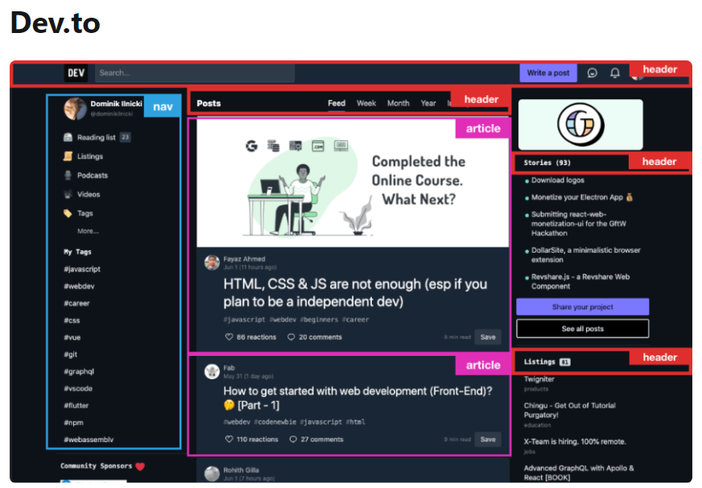
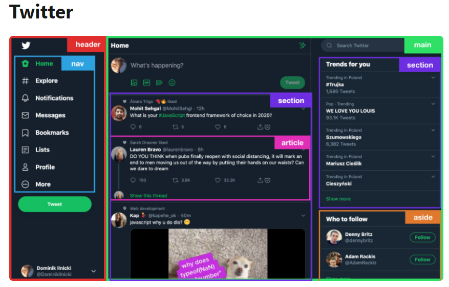
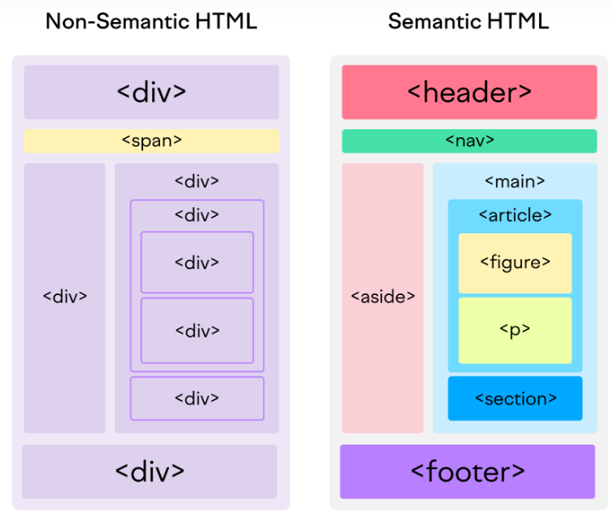

# [Document and website structure](https://developer.mozilla.org/en-US/docs/Learn/HTML/Introduction_to_HTML/Document_and_website_structure)
웹페이지는 서로 많이 다르게 보일 수 있지만, 페이지가 전체화면 비디오 혹은 게임이거나 예술 프로젝트, 좋지 않은 구조를 가지고 있지 않은 이상에는 대부분 유사한 구성 요소를 가지고 있습니다.

---

---

---
## header
- `<header>`
> 일반적으로 큰 제목과 로고 등이 있는 큰 띠, 한 웹페이지에서 주요 정보가 있는 곳입니다.

## main content
- `<main>` with various content subsetions represented by `<article>`, `<section>`, and `
` elements.
> 웹 페이지에서 가장 독특한 컨텐츠를 포함하고 있는 중심의 큰 부분으로 예를 들어, 당신이 보고 싶어하는 비디오, 당신이 읽고 있는 주요 이야기, 당신이 보고 싶어하는 지도, 또는 누스 헤드라인 등이 있습니다. 물론 이 부분은 각 페이지마다 다른 웹 사이트의 한 부분입니다.

---
## navigation bar
- `<nav>`
> 홈 페이지의 메인 섹션으로 연결합니다. 대부분 메뉴 버튼이나 링크, 탭으로 표현됩니다. 헤더와 같이, 이 항목은 대부분 한 페이지로부터 다른 페이지로 넘어가도 구성으로 남아있습니다.    

> 웹 사이트에서 일반적이지 못한 네이게이션을 사용할 경우 방문자는 복잡함과 불만족스러움을 느낄 것입니다. 많은 웹 디자이너들은 네비게이션 바를 개별적인 구성 요소로 사용하기 보다 hearder bar의 일부로 다루지만 이는 필수 사항은 아닙니다. 사실 일부 사람들은 접근성을 위해서는 두 개로 나누는 것이 좋다고 주장하는데, 나뉜 경우 스크린 리더들이 두 특징들을 더 잘 읽을 수 있기 때문입니다.

---
## sidebar
- `<aside>` often placed inside `<main>`
> 주변의 정보, 링크, 인용 부호, 광고 등입니다. 일반적으로 이는 메인 켄텐츠에 무엇이 포함되어 있느냐에 따라 다릅니다. (예를 들어 기사 페이지에서, sidebar는 작성자의 소개, 또는 관련 기사 링크를 포함할 것입니다.) 그러나 보조 navigation system으로서 되풀이되는 요소를 사용하는 경우도 찾아볼 수 있습니다.

## footer
- `<footer>`
> 페이지 바닥의 줄로 일반적으로 작은 정보, 저작권 정보, 또는 연락처 등을 포함하고 있습니다.(header와 같이) 일반적인 정보를 담고 있는 부분이지만 보통 중요하지 않거나 웹 사이트 자체에 부차적인 정보입니다. Footer는 또 가끔 [SEO](https://developer.mozilla.org/ko/docs/Glossary/SEO) 목적으로 사용되는데, 인기 컨텐츠 바로가기 링크를 제공합니다.

---
# [Semantic elements in HTML](https://developer.mozilla.org/en-US/docs/Glossary/Semantics)
시멘틱 요소는 자신의 의미를 브라우저와 개발자 모두에게 명확하게 설명한다.
- non-semantic 요소들(<`div>,  등`)은 자신의 컨텐츠에 대해 아무것도 설명해주지 않는다.
- semantic 요소들(`<form>, <table>, <article> 등`)은 자신의 컨텐츠를 명확하게 정의한다.

---
## 주요 시멘틱 요소들
- [`<header>`](https://developer.mozilla.org/en-US/docs/Web/HTML/Element/header) represents a group of introductory content. If it is a child of [`<body>`](https://developer.mozilla.org/en-US/docs/Web/HTML/Element/body) it defines the global header of a webpage, but if it's a child of an `<article>` or `<section>` it defines a specific header for that section (try not to confuse this with [`<head>`](https://developer.mozilla.org/en-US/docs/Learn/HTML/Introduction_to_HTML/The_head_metadata_in_HTML))

- [`<main>`](https://developer.mozilla.org/en-US/docs/Web/HTML/Element/main) is for content unique to this page. Use `<main>` only once per page, and put it directly inside [`<body>`](https://developer.mozilla.org/en-US/docs/Web/HTML/Element/body) Ideally this shouldn't be nested within other elements.

- [`<article>`](https://developer.mozilla.org/en-US/docs/Web/HTML/Element/article) encloses a block of related content that makes sense on its own without the rest of the page(e.g., a single blog post).

---
- [`<section>`](https://developer.mozilla.org/en-US/docs/Web/HTML/Element/section) is similar to `<article>`, but it is more for grouping together a single part of the page that constitutes one single piece of functionality (e.g., a mini pam, or a set of article headlines and summaries), or a theme. It's considered best practice to begin each section with a heading

- [`<aside>`](https://developer.mozilla.org/en-US/docs/Web/HTML/Element/aside) contains content that is not directly related to the main content but can provide additional information indirectly related to it (glossary entries, author biography, related links, etc).

- [`<nav>`](https://developer.mozilla.org/en-US/docs/Web/HTML/Element/nav) contains the main navigation functionality for the page. Secondary links, etc., would not go in the navigation.
- [`<footer>`](https://developer.mozilla.org/en-US/docs/Web/HTML/Element/footer) represents a group of end content for a page.

