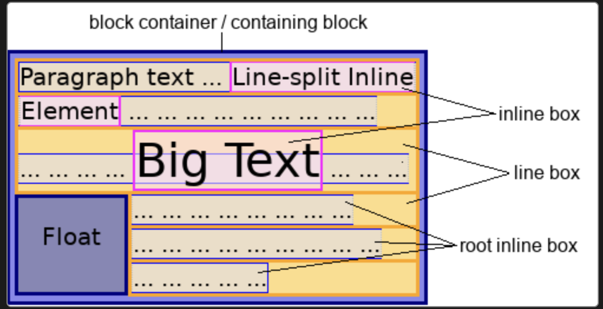

# [HTML Element](https://developer.mozilla.org/en-US/docs/Learn/HTML/Introduction_to_HTML/Getting_started)


---
## Box elements & Item elements
### [Item elements]((https://developer.mozilla.org/en-US/docs/Web/HTML/Inline_elements))
브라우저에 컨텐츠가 없어도 보이는 태그 또는 컨텐츠를 꾸며주는 태그
- a, video, button, audio, input, map, label, canvas, img, table 등

```html
<p>
  This span is an <span class="highlight">inline-level element</span>; its
  background has been colored to display both the beginning and end of the
  element's influence. Input elements, like <input type="radio" /> and
  <input type="checkbox" />, are also inline-level content.
</p>
```

---
### [Box elements](https://developer.mozilla.org/en-US/docs/Web/HTML/Block-level_elements)
브라우저에 컨텐츠가 없으면 보이지 않는 태그 또는 영역이나 의미를 정의하는 태그
- header, section, footer, article, nav, div, aside, span, main, form, h1 등

```html
<div>
  <p>
    This the first paragraph. The background color of these paragraphs have been
    colored to distinguish them from their parent element.
  </p>
  <p>This is the second paragraph.</p>
</div>

```


