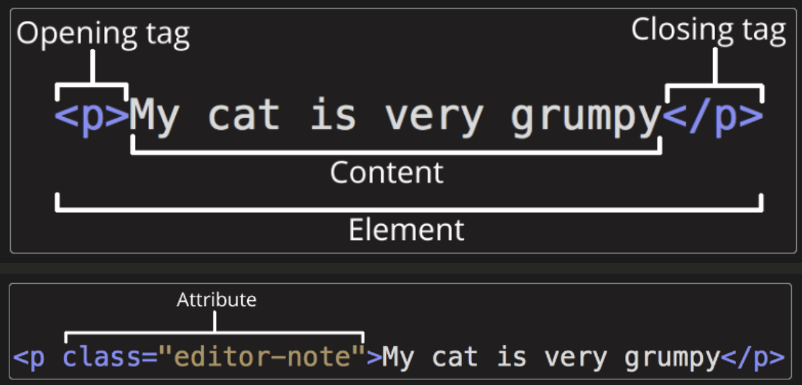
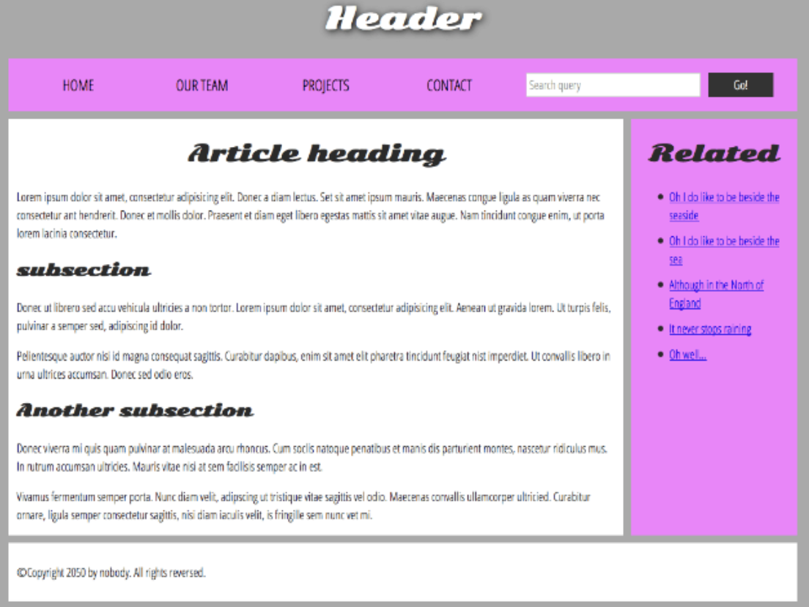
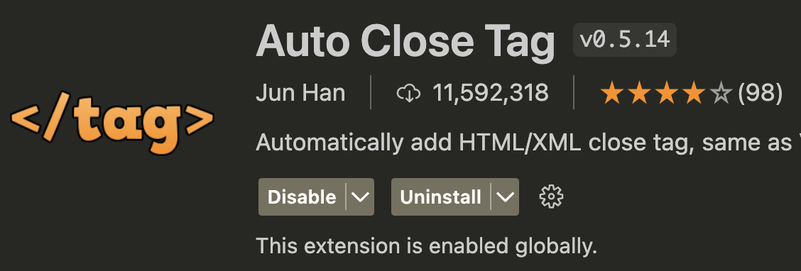
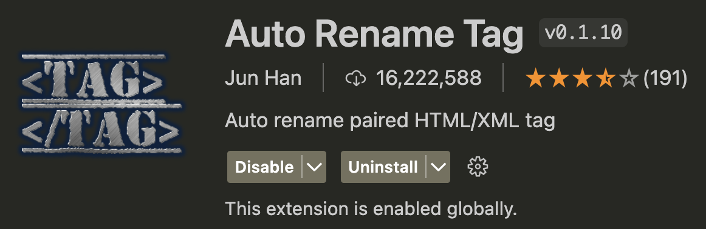
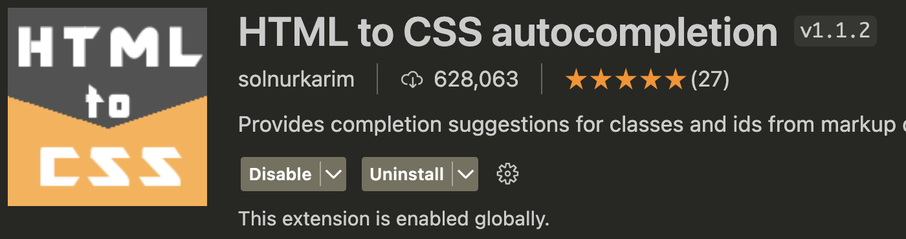
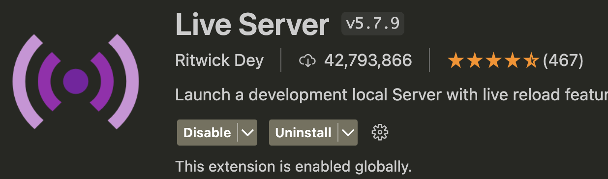

# [HTML Element](./HTML%20Element.md)

---
# [Document and website structure](./Document%20and%20website%20structure.md)
웹페이지는 서로 많이 다르게 보일 수 있지만, 페이지가 전체화면 비디오 혹은 게임이거나 예술 프로젝트, 좋지 않은 구조를 가지고 있지 않은 이상에는 대부분 유사한 구성 요소를 가지고 있습니다.

---
# 강의예제
- sample 폴더 

---
# VSCode 익스텐션 추가 

---

---

---

