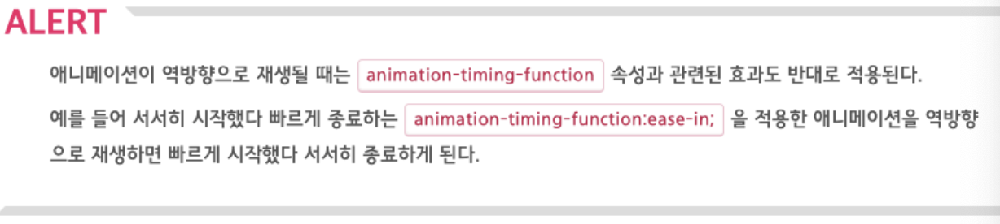
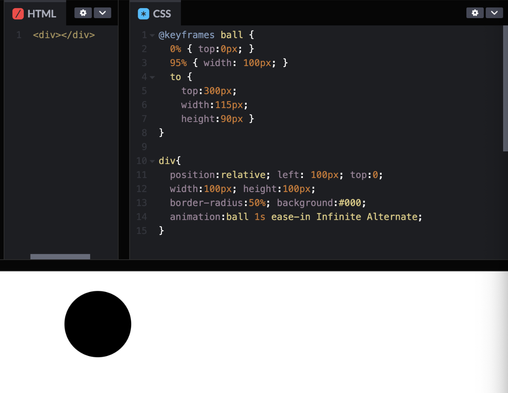

# [Animation](https://webclub.tistory.com/621)
## animation-name
- animation-name 속성은 @keyframes 규칙으로 생성한 애니메애션 이름을 지정하여 해당 애니메이션이 실행되도록 하는 속성입니다.
- 이때 실행하고자 하는 애니메이션이 여러 개인 경우 애니메이션 이름을 콤마(,)로 구분하여 지정할 수 있습니다.

```css
/* 예시 */
div { animation-name : mainAni ; }
```


---
## @keyframes
- @keyframes는 animation 속성에 적용할 키프레임을 생성하기 위한 규칙입니다.
- 키프레임이란, 애니메이션을 구현할 때 기준이 되는 특정 시점으로, 각 키프레임 사이의 애니메이션은 자동으로 구현됩니다.

```css
/* @keyframes 형식 */
@keyframes 애니메이션 이름 {
  from {
    [ CSS 속성 : 값 ; ]
  }
  [percentage]{
    [ CSS 속성 : 값 ; ]
  }
  to {
    [ CSS 속성 : 값 ; ]
  }
}
```

---
## animation-duration
- animation-duration은 animation-name 속성으로, 실행된 애니메이션 진행 시간을 지정하는 속성입니다.
- 지정할 수 있는 속성 값인 time은 초 단위(s)로 1회 진행 시간을 의미합니다.

```css
/* 예시 */
div {
 animation-name : mainAni ;
 animation-duration : 5s ;
}
```

---
## animation-delay
animation-delay는 애니메이션이 실행되기 전 지연 시간을 초 단위(s)로 지정하는 속성입니다.

```css
/* 예시 */
div {
 animation-name : mainAni ;
 animation-duration : 5s ;
 animation-delay: 5s ;
}
```

---
## animation-direction
animation-direction은 애니메이션의 진행 방향을 지정하는 속성으로, 기본 값은 normal이며, normal은 순방향으로 진행됩니다.
- `normal` : 애니메이션을 순방향으로 재생한다(기본값). 재생이 한 번 끝나면 첫 번째 프레임부터 다시 시작한다.
- `alternate` : 순방향으로 애니메이션을 시작해 역방향과 순방향으로 번갈아 애니메이션을 재생한다. 홀수 번째로 재생할 때는 순방향으로 재생하고, 짝수 번째로 재생할 때는 역방향으로 재생한다.
- `reverse` : 애니메이션을 역방향으로 재생한다. 재생이 한 번 끝나면 마지막 프레임부터 다시 시작한다.
- `alternate-reverse` : 역방향으로 애니메이션을 시작해 순방향과 역방향으로 번갈아 애니메이션을 재생한다. 홀수 번째로 재생할 때는 역방향으로 재생하고, 짝수 번째로 재생할 때는 순방향으로 재생한다.

---
```css
/* 예시 */
div {
 animation-name : mainAni ;
 animation-duration : 5s ;
 animation-iteration-count : 5 ;
 animation-direction : alternate ;
}
```


---
## animation-iteration-count
- animation-iteration-count는 애니메이션의 반복 횟수를 지정하는 속성입니다.
- infinite를 지정한 경우 애니메이션이 무한 반복되며, number 값으로 직접 반복 횟수를 지정할 수 있습니다.

```css
/* 예시 */
div {
 animation-name : mainAni ;
 animation-duration : 5s ;
 animation-iteration-count : infinite ;
}
```

---
## animation-play-state
animation-paly-state는 애니메이션의 진행 및 정지 상태를 지정하는 속성으로, running과 paused 값을 사용할 수 있습니다.
- running은 애니메이션이 진행된 상태대로 표시하는 것을 말하며,
- paused는 애니메이션이 정지된 상태대로 표시하는 것을 의미합니다.

```css
/* 예시 */
div {
 animation-name : mainAni ;
 animation-duration : 5s ;
 animation-play-state : running ;
}
```

---
## animation-timing-function
animation-timing-function 속성은 애니메이션 진행 속도의 변화 형태를 지정하는 속성입니다.
- `ease`: 기본 값으로 변환 시 진행 속도가 빠르게 시작되어 후반으로 갈수록 느려지는 형태
- `linear`: 전 구간을 동일한 속도로 변환하는 형태
- `ease-in`: 후반부로 갈수록 변환 시 진행 속도가 증가되는 형태
- `ease-out`: 후반부로 갈수록 변환되는 진행 속도가 감소되는 형태
- `ease-in-out`: 변환이 진행되는 전반부의 형태는 "easein"과 같고, 후반부는 "ease-out"과 함께 진행하는 형태

```css
/* 예시 */
div {
 animation-name : mainAni ;
 animation-duration : 5s ;
 animation-timing-function : ease-in-out ;
}
```

---
# 예제 



