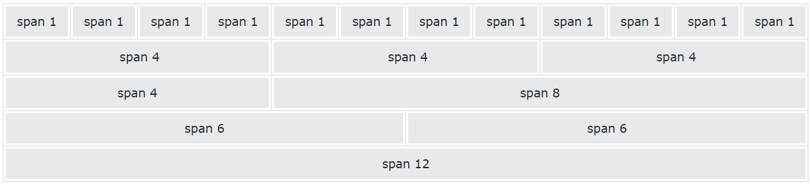
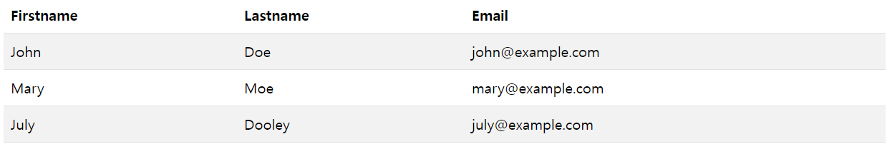
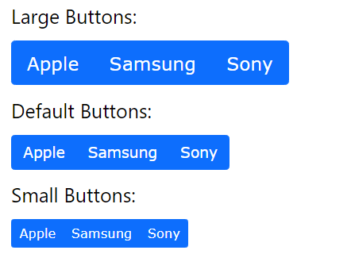
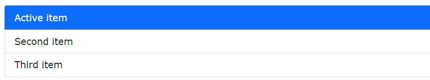
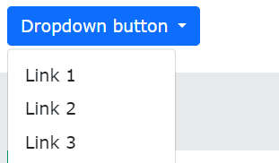
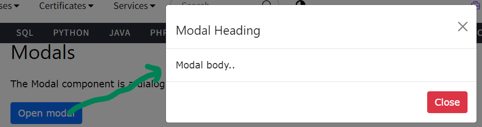

# [Bootstrap](https://getbootstrap.kr/)
### [Samples](https://getbootstrap.kr/docs/5.3/examples/)
### 설치방법
1. CDN  
```html
<link href="https://cdn.jsdelivr.net/npm/bootstrap@5.3.1/dist/css/bootstrap.min.css" rel="stylesheet" integrity="sha384-4bw+/aepP/YC94hEpVNVgiZdgIC5+VKNBQNGCHeKRQN+PtmoHDEXuppvnDJzQIu9" crossorigin="anonymous">
```
```html
<script src="https://cdn.jsdelivr.net/npm/bootstrap@5.3.1/dist/js/bootstrap.bundle.min.js" integrity="sha384-HwwvtgBNo3bZJJLYd8oVXjrBZt8cqVSpeBNS5n7C8IVInixGAoxmnlMuBnhbgrkm" crossorigin="anonymous"></script>
```

2. npm 
```shell
npm install bootstrap@5.3.1
```
```shell
gem install bootstrap -v 5.3.1
```

---
# [Tutorial](https://www.w3schools.com/bootstrap5/index.php)
### [Containers](https://www.w3schools.com/bootstrap5/bootstrap_containers.php)
- The `.container` class provides a responsive fixed width container
- The `.container-fluid` class provides a full width container, spanning the entire width of the viewport


---
### [Grids](https://www.w3schools.com/bootstrap5/bootstrap_grid_basic.php)
- Bootstrap's grid system is built with flexbox and allows up to 12 columns across the page.
- If you do not want to use all 12 columns individually, you can group the columns together to create wider columns:



---
### [Colors](https://www.w3schools.com/bootstrap5/bootstrap_colors.php)
- The classes for background colors are: `.bg-primary`, `.bg-success`, `.bg-info`, `.bg-warning`, `.bg-danger`, `.bg-secondary`, `.bg-dark` and `.bg-light`.


---
### [Tables](https://www.w3schools.com/bootstrap5/bootstrap_tables.php)
- The `.table-striped` class adds zebra-stripes to a table:



---
### [Images](https://www.w3schools.com/bootstrap5/bootstrap_images.php)
```html
<!-- Rounded Corners -->

<!-- Circle -->

<!-- Thumbnail -->

```


---
### [Button](https://www.w3schools.com/bootstrap5/bootstrap_button_groups.php)
```html
<div class="btn-group btn-group-lg">
  <button type="button" class="btn btn-primary">Apple</button>
  <button type="button" class="btn btn-primary">Samsung</button>
  <button type="button" class="btn btn-primary">Sony</button>
</div>
```



---
### [List Groups](https://www.w3schools.com/bootstrap5/bootstrap_list_groups.php)
```html
<ul class="list-group">
  <li class="list-group-item active">Active item</li>
  <li class="list-group-item">Second item</li>
  <li class="list-group-item">Third item</li>
</ul>
```



---
### [Dropdowns](https://www.w3schools.com/bootstrap5/bootstrap_dropdowns.php)
```html
<div class="dropdown">
  <button type="button" class="btn btn-primary dropdown-toggle" data-bs-toggle="dropdown">
    Dropdown button
  </button>
  <ul class="dropdown-menu">
    <li><a class="dropdown-item" href="#">Link 1</a></li>
    <li><a class="dropdown-item" href="#">Link 2</a></li>
    <li><a class="dropdown-item" href="#">Link 3</a></li>
  </ul>
</div>
```



---
### [Collapse](https://www.w3schools.com/bootstrap5/bootstrap_collapse.php)
```html
<button data-bs-toggle="collapse" data-bs-target="#demo">Collapsible</button>

<div id="demo" class="collapse">
Lorem ipsum dolor text....
</div>
```


---
### [Modal](https://www.w3schools.com/bootstrap5/bootstrap_modal.php)
```html
<!-- Button to Open the Modal -->
<button type="button" class="btn btn-primary" data-bs-toggle="modal" data-bs-target="#myModal">
  Open modal
</button>

<!-- The Modal -->
<div class="modal" id="myModal">
  <!-- 생략 -->
</div>
```



