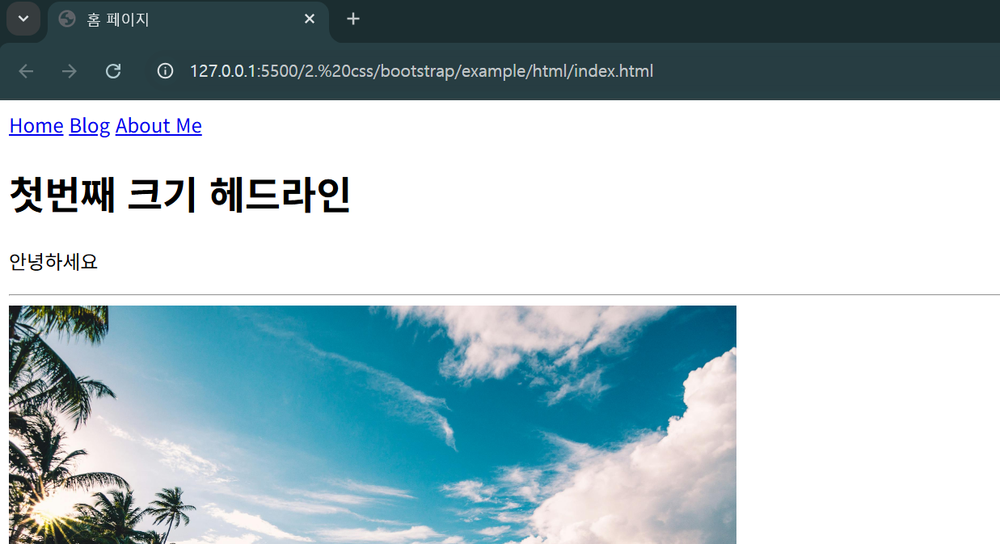

# 블로그 html 만들기 
- html 폴더 참고 

---
## index.html

---
### 단계1: html 만들기 
```html
<!DOCTYPE html>
<html lang="ko">
  <head>
    <title>홈 페이지</title>
    <meta charset="utf-8">
  </head>
  <body>
    
  </body>
</html>
```
---
### 단계2: 내용 채우기 
```html
  ...
  <body>
    <nav>
      <a href="./index.html">Home</a>
      <a href="./blog_list.html">Blog</a>
      <a href="./about_me.html">About Me</a>
    </nav>

    <h1>첫번째 크기 헤드라인</h1>
    <p>안녕하세요</p>
    <hr/>
    
  </body>
</html>
```
---
### 단계3: Live Server 설치  


---
### 단계4: index.html 실행 


---


---
## about_me.html

---
### 단계1: html 만들기 


---
### 단계2: 실행


---
## blog_list.html

---
### 단계1: html 만들기 


---
### 단계2: 실행


