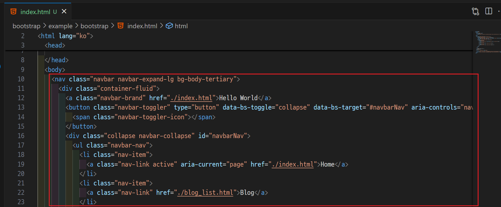
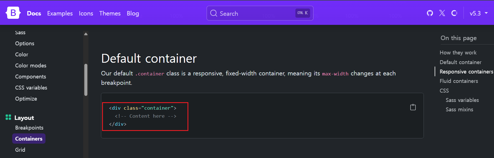
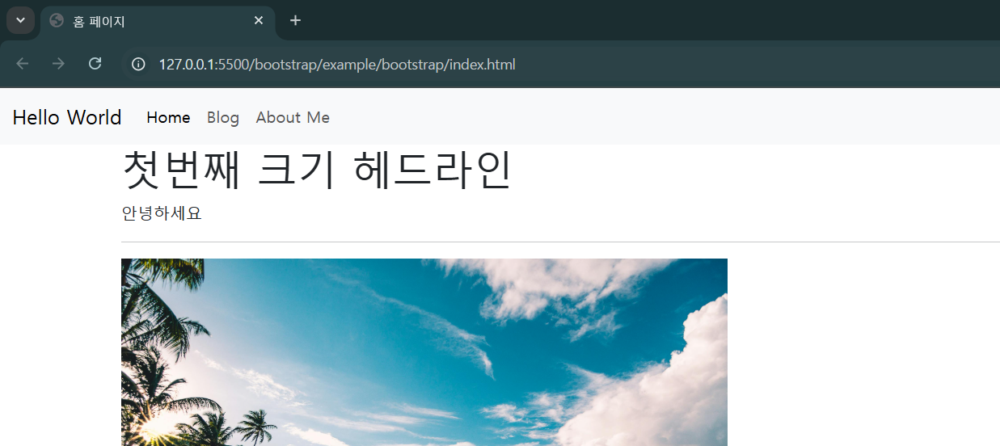
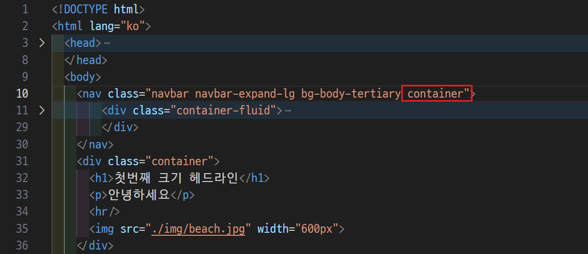
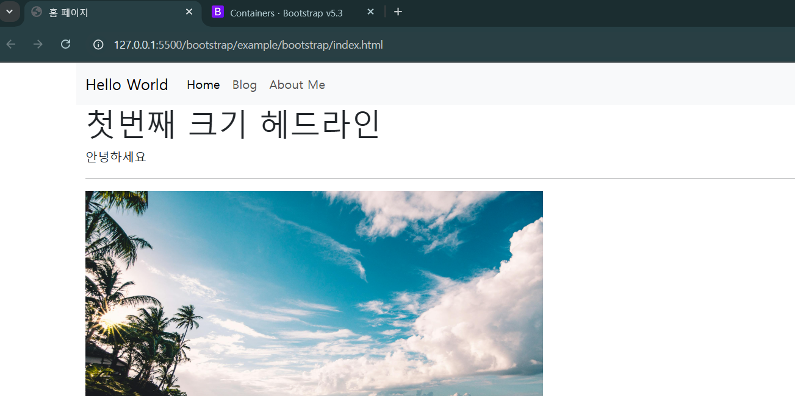

# 블로그에 Bootstrap 적용하기 
- bootstrap 폴더 참고 

---
## 모든 html 파일에 적용 

---
### [단계1: Bootstrap CDN link 적용](https://getbootstrap.com/docs/5.3/getting-started/introduction/) 

---

---
### [단계2: Bootstrap > Navbar 적용](https://getbootstrap.com/docs/5.3/components/navbar/)

---

---

---

---
### [단계3: Bootstrap > Container 적용](https://getbootstrap.com/docs/5.3/layout/containers/)

---

---

---

---
### 단계4: Bootstrap > Navbar에 Container 적용

---

---

