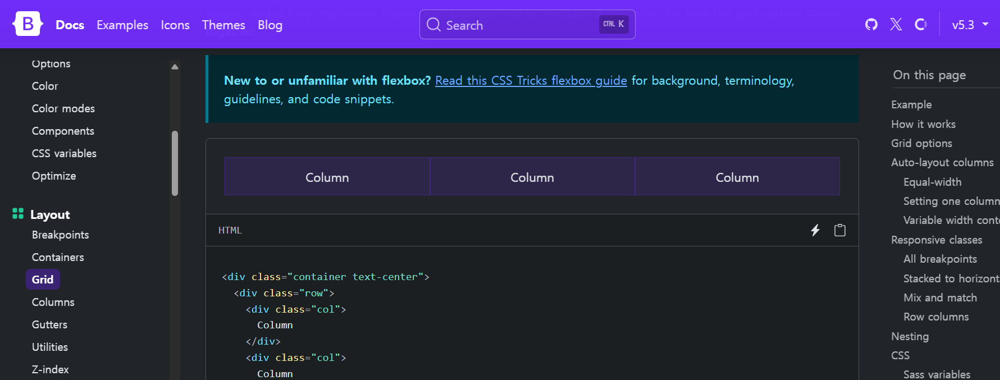
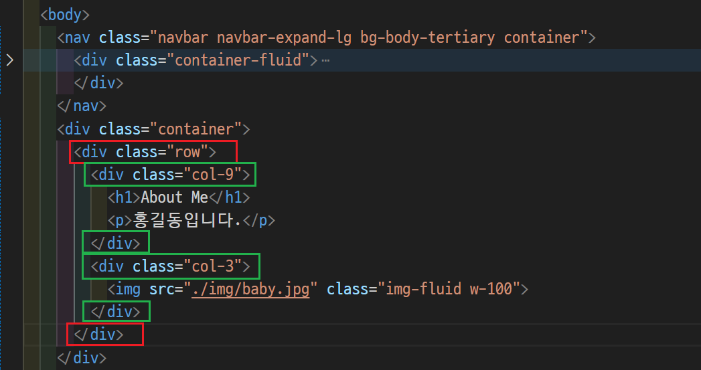
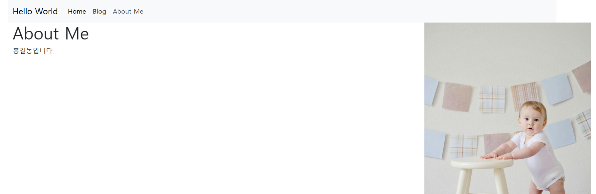
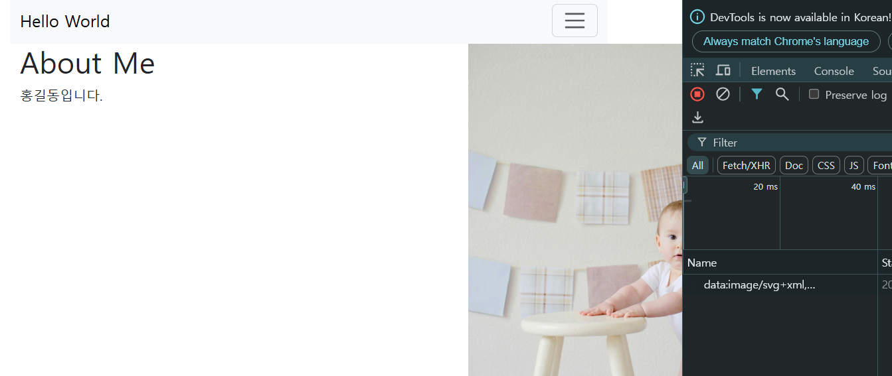
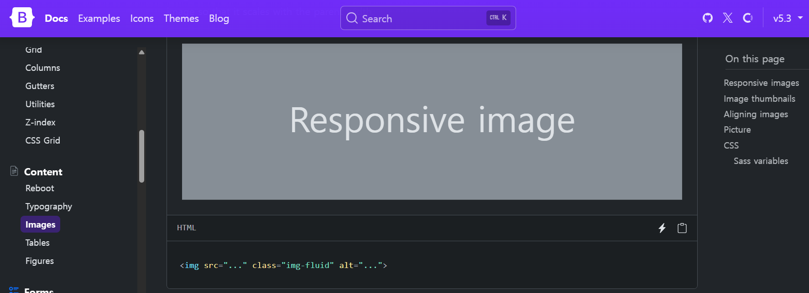
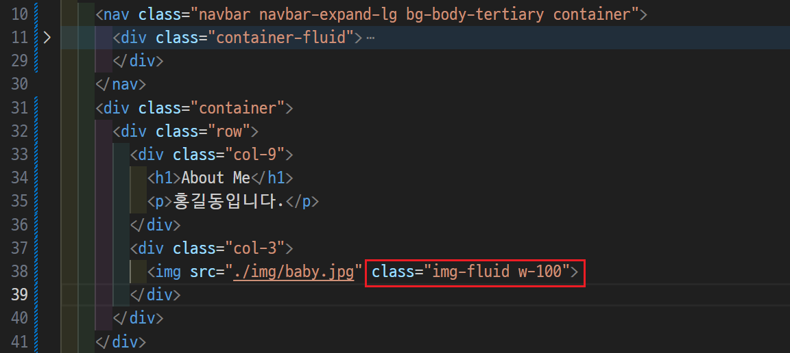
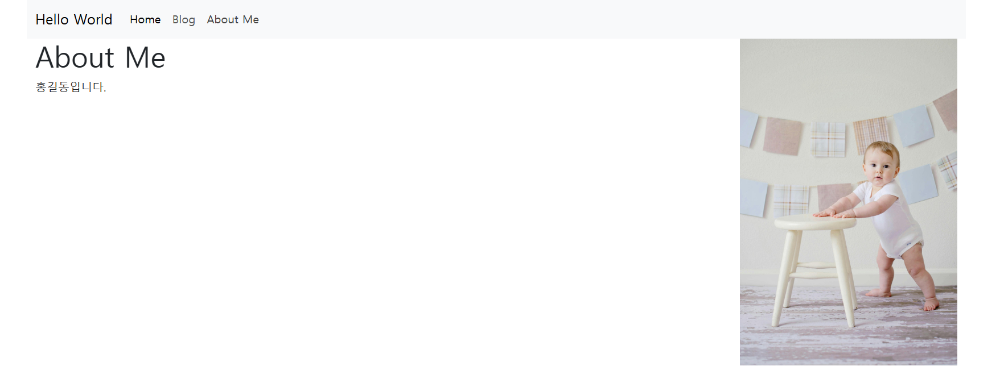
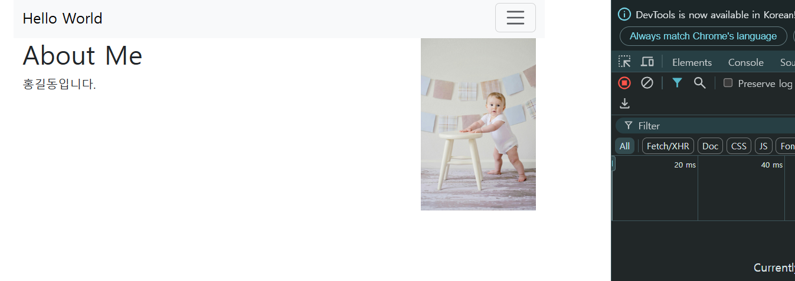
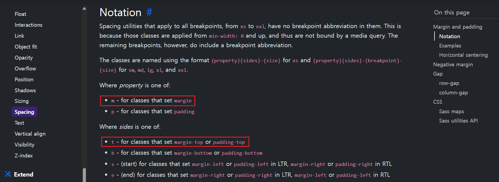
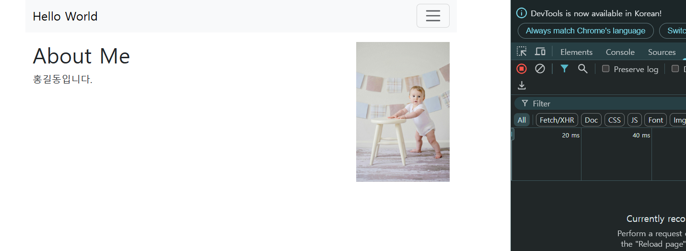

# 블로그에 Bootstrap 적용하기 
- bootstrap 폴더 참고 

---
### [단계1: Grid 적용하기](https://getbootstrap.com/docs/5.3/layout/grid/)

---

---

---

---
### [단계2: image 적용하기](https://getbootstrap.com/docs/5.3/content/images/#responsive-images)

---

---

---

---
### [단계3: margin 적용하기](https://getbootstrap.com/docs/5.3/utilities/spacing/#notation)

---

