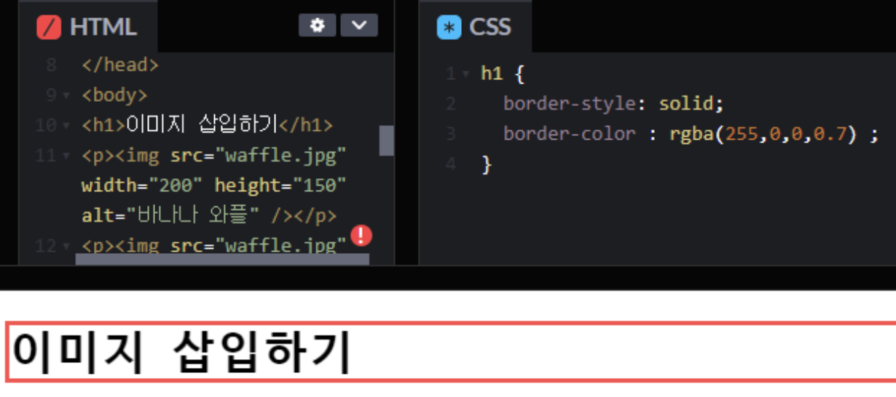
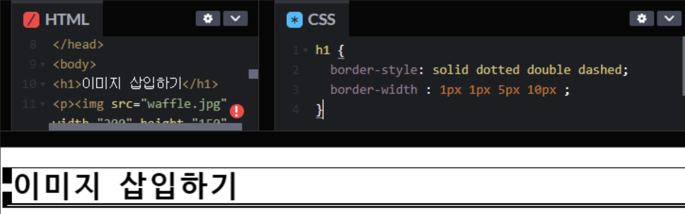
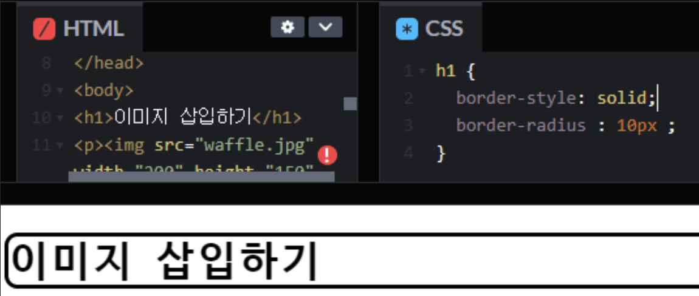
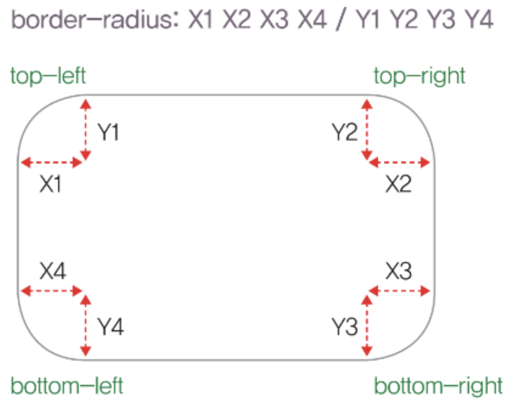

# border-style 속성
- border-style은 요소 박스 테두리의 선 스타일을 지정하는 속성입니다.
- border-style 속성값은 1개에서 4개까지 지정할 수 있으며, 값의 개수별로 적용되는 방향이 다릅니다.
- 세부 속성인 border-[방향]-style을 적용하면 각 방향별로도 지정할 수 있습니다.

---
```css
/* 예시 */
div { border-style : solid ; }
div { border-style : solid dotted double dashed ; }
```


---
# border–color 속성
```css
/* 예시 */
div { border-color : rgba(255,0,0,0.7) ; }
div { border-color : #f00 #0f0 #00f #000 ; }
```


---
# border-width 속성
- border-width는 요소 박스 테두리의 선 굵기를 지정하는 속성입니다.
- border-width 속성 역시 굵기에 해당하는 속성 값을 1개에서 4개까지 지정할 수 있으며, 세부 속성인 border-[방향]-width를 적용하면 각 방향별로도 지정할 수 있습니다.
```css
/* 예시 */
div { border-width : 1em ; }
div { border-width : 5px 10px 10px 5px ; }
```


---
# border-radius 속성
- border-radius는 요소 박스의 테두리 선을 둥근 모서리 형태로 지정하는 속성입니다.
- 이때 둥근 모서리의 길이는 가로 방향과 세로 방향의 값을 "슬래시(/)"로 구분하여 지정할 수 있으며, 각 방향별로 값을 1개에서 4개까지 지정할 수 있습니다.
- 세부 속성인 border-[세로 방향]-[가로 방향]-radius를 적용하면 방향 별로 각각 둥근 형태를 지정할 수 있습니다.

---
```css
/* 예시 */
div { border-radius : 10px ; }
div { border-radius : 5px 10px 15px 20px ; }
div { border-radius : 5px 10px 15px 20px / 10px 5px 5px 10px ; }
```


---


