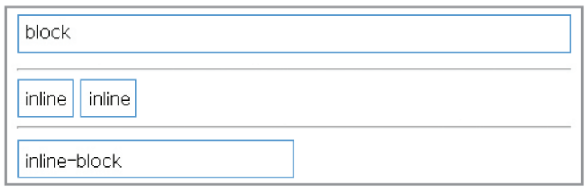
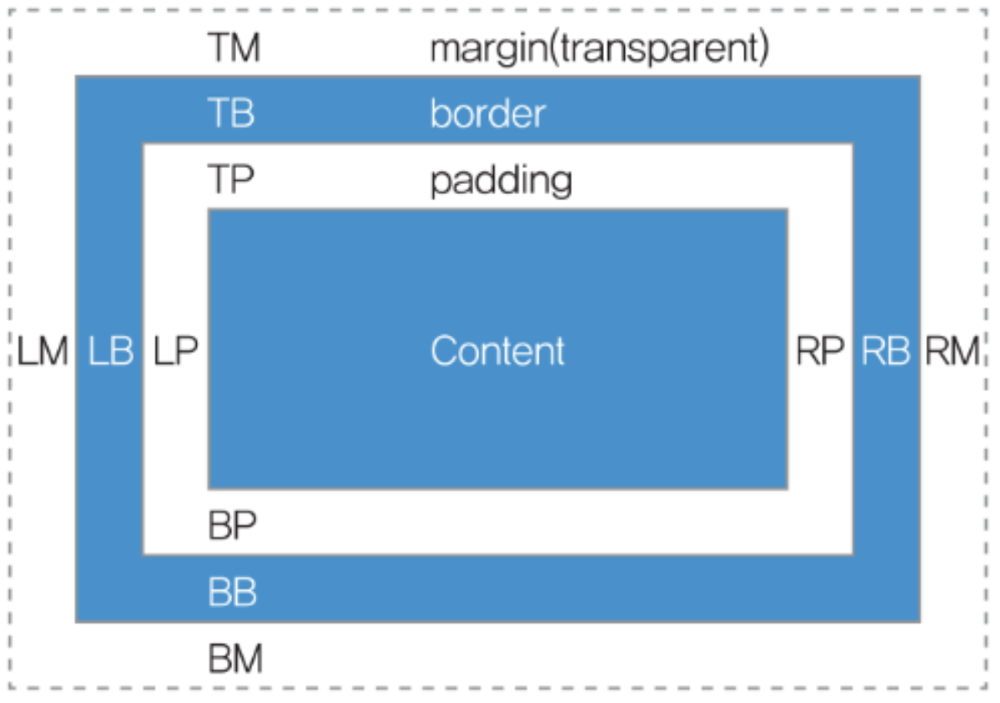
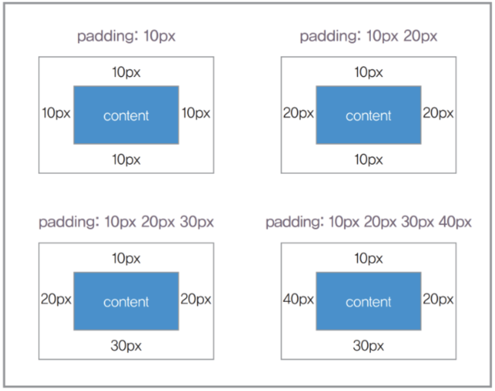
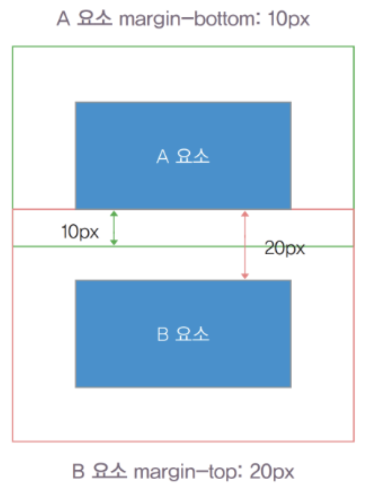

# [display](https://ofcourse.kr/css-course/display-%EC%86%8D%EC%84%B1)
display 속성은 요소를 어떻게 보여줄지를 결정합니다.
주로 4가지 속성값이 쓰이는데, 태그마다 기본값이 다릅니다.
- none : 보이지 않음
> 요소를 렌더링하지 않도록 설정합니다. visibility 속성을 hidden으로 설정한 것과 달리, 영역도 차지하지 않습니다.
- block : 블록 박스
> 기본적으로 가로 영역을 모두 채우며, block 요소 다음에 등장하는 태그는 줄바꿈이 된 것처럼 보입니다

---
- inline : 인라인 박스
> block 과 달리 줄 바꿈이 되지 않고, width와 height를 지정 할 수 없습니다.

- inline-block : block과 inline의 중간 형태
> block과 inline의 중간 형태라고 볼 수 있는데, 줄 바꿈이 되지 않지만 크기를 지정 할 수 있습니다.

---
```css
span { display : block ; }
div { display : inline ; }
span { display : inline-block ; }
```


---
대부분의 HTML 요소는 display 속성의 기본값으로 다음 두 가지 값 중 하나의 값을 가집니다.
- Block
  - display 속성값이 블록(block)인 요소는 언제나 새로운 라인(line)에서 시작하며, 해당 라인의 모든 너비를 차지한다.
  - `<div>, <h1>, <p>, <ul>, <form>` 등 
- inline
  - display 속성값이 인라인(inline)인 요소는 새로운 라인(line)에서 시작하지 않습니다.
  - 또한 요소의 너비는 내용(content)만큼만 차지합니다.
  - `<span><a>` 등 

---
# [visibility](https://ofcourse.kr/css-course/visibility-%EC%86%8D%EC%84%B1)
visibility 속성은 태그의 가시성을 결정합니다. 아래의 4가지 값을 가지며, 기본 값은 inherit 입니다.
- visible: 보임
- hidden: 숨김 (자신의 영역은 계속 차지)
- collapse: 겹치도록 지정(테이블의 행과 열 요소만 지정할 수 있으며, 그 외 요소의 지정하면 hidden으로 해석)
- inherit: 부모 요소의 값을 상속

`visibility:hidden은 화면상에 요소를 표시하지 않는 display:none과 달리 요소의 원래 영역은 유지하게 됩니다.`
```css
#box1 { visibility: hidden; }
```

---
# 박스가 실제 화면에서 차지하는 크기를 결정하는 요인
- content : 요소의 콘텐츠가 표시되는 영역
- padding : content 영역과 border 사이의 안쪽 여백
- border : padding 영역과 margin 사이의 테두리
- margin : border를 기준으로 다른 요소와의 바깥쪽 여백

---


---
## padding
padding은 content 영역과 border 사이의 안쪽 여백을 지정하는 속성으로, 속성 값은 1에서 4개까지 입력할 수 있으며, 입력 값의 개수에 따라 적용되는 방향이 다릅니다.

```css
/* - 예시 */
div { padding : 10px ; }
div { padding : 10px 20px ; }
div { padding : 10px 20px 30px ; }
div { padding : 10px 20px 30px 40px ; }
div {
 padding-top : 10px ;
 padding-right : 20px ;
 padding-bottom : 30px ;
 padding-left : 40px ;
}
```

---


---
## border
- border는 요소 박스의 테두리를 지정하는 속성입니다.
- border 속성은 border-[방향] 등으로 박스의 특정 위치만을 지정할 수 있습니다.
- 또한 border-style, border-width, border-color 등의 세부 속성을 사용하여 테두리 선의 모양과 굵기 및 색상을 지정할 수도 있습니다.

```css
/* - 예시 */
div { border : 1px solid #ccc ; }
div { border-width : 1px ; }
div { border-style : solid ; }
div { border-color : #ccc ; }
```

---
## margin
margin 속성은 border를 기준으로 다른 요소와의 바깥쪽 여백을 지정하는 속성으로 padding 속성과 사용 방법이 동일합니다.

```css
/* - 예시 */
div { margin : 10px ; }
div { margin : 10px 20px ; }
div { margin : 10px 20px 30px ; }
div { margin : 10px 20px 30px 40px ; }
div {
 margin-top : 10px ;
 margin-right : 20px ;
 margin-bottom : 30px ;
 margin-left : 40px ;
}
```

---
margin의 특성 중에 상하로 인접한 박스의 display 속성 값이 "block"인 경우, 마진 겹침(Margin Collapsing) 현상이 발생합니다.


---
## width, height
width와 height는 요소의 너비와 높이를 지정하는 속성입니다. `display 속성 값이 "inline"인 요소에는 적용되지 않습니다.`

- `auto :` 기본 값으로 display 속성 값이 "block"인 경우 width 속성은 기본적으로 화면 너비 전체를 차지하며, height 속성은 콘텐츠 높이에 따라 자동으로 조절됩니다.

---
- `length :` 길이 단위 값으로 적용되는 방식은 box-sizing 속성 값에 따릅니다. height 속성의 경우 콘텐츠 높이가 지정된 값보다 크더라도 요소의 높이는 변경되지 않으며, 음수 값은 지정할 수 없습니다(box-sizing 속성은 User Interface 파트 참조)
- `percentage :` 자신을 포함한 요소의 값을 참조하여 비율로 결정합니다. height 속성의 경우 length처럼 콘텐츠 높이로 계산된 값이 지정된 값보다 크더라도 요소의 높이는 변경되지 않으며, 음수 값은 지정할 수 없습니다.

```css
/* - 예시 */
div { width : 100px ; }
div { width : 50% ; }
div { height : 100px ; }
div { height : 20% ; }
```

---
min-width, min-height, max-width, max-height 속성은 요소의 최소 및 최대 너비와 높이를 지정하는 속성입니다. width 및 height 속성과 사용 값이 동일합니다.

```css
/* - 예시 */
div { min-width : 200px ; }
div { max-width : 50% ; }
div { min-height : 200px ; }
div { max-height : 50% ; }
```


