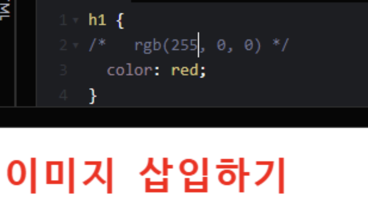
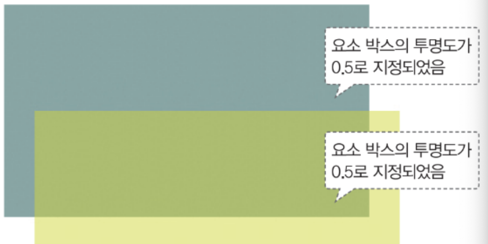
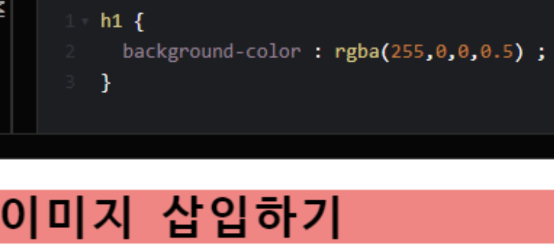
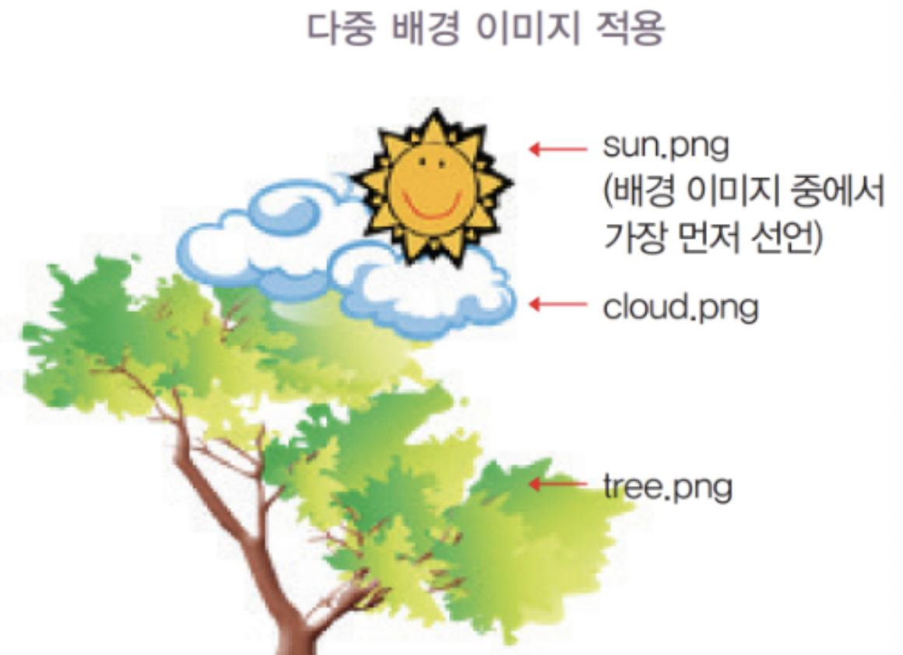
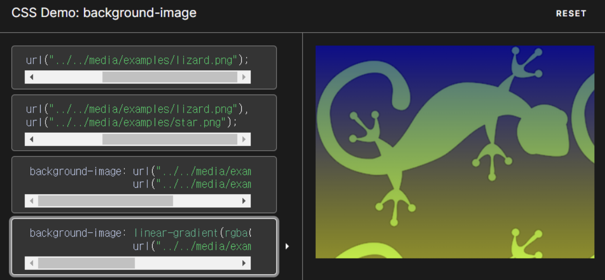

# color 속성 
요소의 컨텐츠의 색상을 지정하는 속성입니다.
```css
/* rgb: 빨강(red), 초록(green), 파랑(blue) */
div { color : rgb(255,0,0) ; }
/* rgb: 빨강(red), 초록(green), 파랑(blue), 투명도(alpha) */
div { color : rgba(255,0,0,0.5) ; }
/* hsla: 색상(hue), 채도(saturation), 명도(lightness), 투명도(alpha) */
div { color : hsla(27,88%,58%,0.7) ; }
```


---
# opacity 속성
- 요소 박스의 투명도를 지정하는 속성입니다.
- opacity 속성 값은 "0"에서 "1" 사이의 값을 가지며, "0"은 투명, "1"은 불투명을 의미합니다.
- opacity 속성은 요소 전체에 적용되며, 속성이 상속되기 때문에 포함하는 자식 요소들에게도 영향을 끼칩니다.

```css
/* 예시 */
div { opacity : 0.5 ; }
```


---
# backgroud-color 속성

```css
/* 예시 */
div { background-color : rgba(255,0,0,0.5) ; }
```


---
# [background–image 속성](https://developer.mozilla.org/en-US/docs/Web/CSS/background-image)
- background-image는 요소 박스에 배경 이미지를 지정하는 속성입니다.
- CSS3에서는 배경 이미지의 속성 값에 콤마(,)로 구분하여 여러 개의 이미지를 지정함으로써 하나의 요소에 다중 배경 이미지를 지정할 수 있게 되었습니다.
- 또한 여러 개의 배경 이미지를 지정할 때 배경 이미지의 겹치는 순서는 가장 먼저 지정한 이미지가 가장 위쪽에 위치합니다.

```css
div {
  background-image: url("../../media/examples/lizard.png"), url("../../media/examples/star.png");
}
```

---


---
## linear-gradient()
Gradient 효과 중 linear-gradient를 사용하면, 선형 그레이디언트 효과를 지정할 수 있습니다.
- linear-gradient 지정 시 angle은 ‘각도’를 의미합니다.
- "deg" 단위의 값이나 "to [키워드]" 또는 0%[백분율]와 같은 형식으로 지정할 수 있습니다.
- 키워드 "top", "bottom", "left", "right"로 "to top right"와 같이 상하 방향과 좌우 방향을 조합하여 사용할 수도 있습니다.

```css
div {
background-image: linear-gradient(rgba(0, 0, 255, 0.5), rgba(255, 255, 0, 0.5)), url("../../media/examples/lizard.png");
}
```

---



