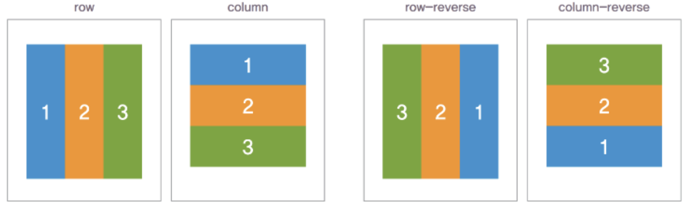
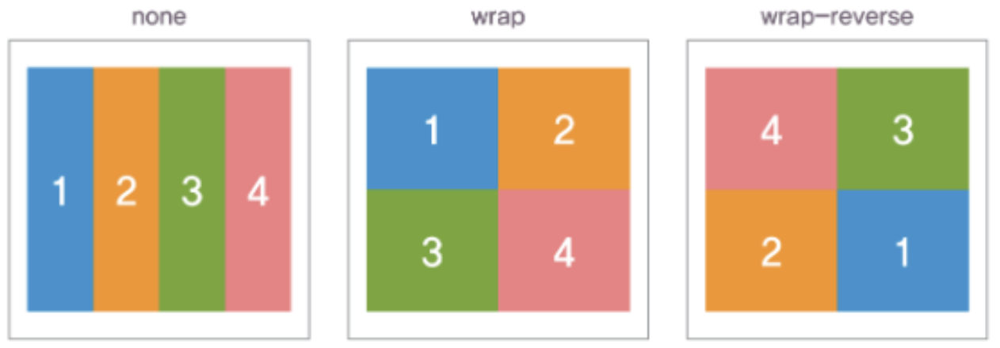
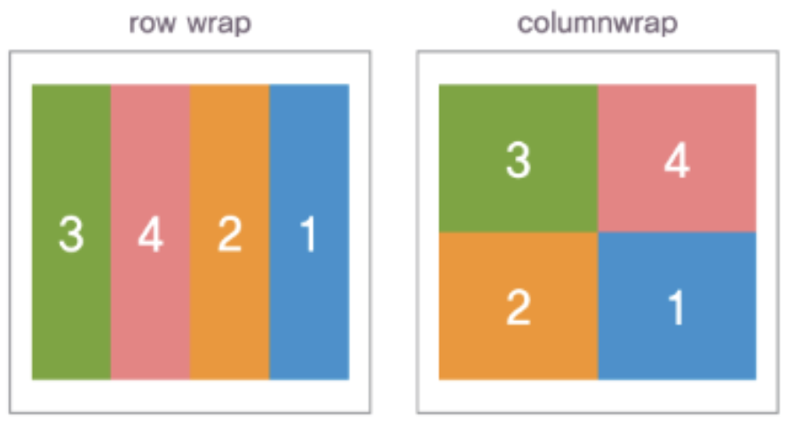
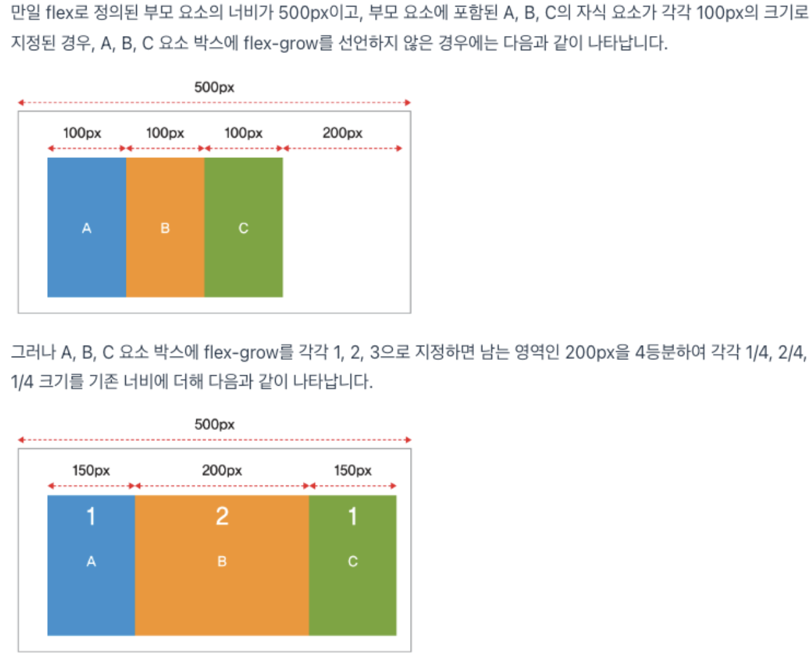
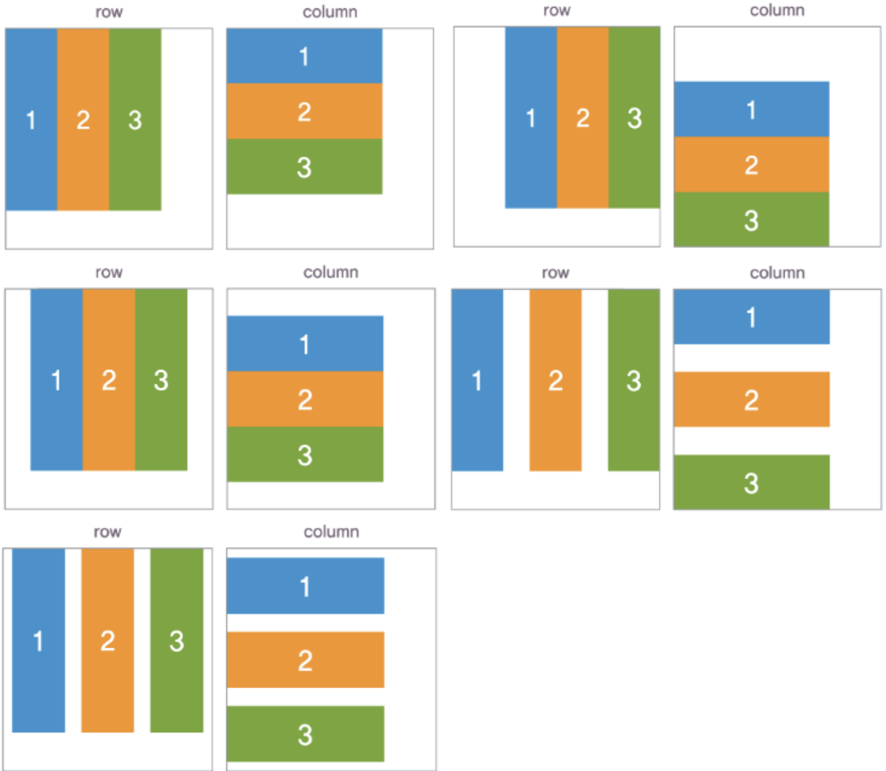
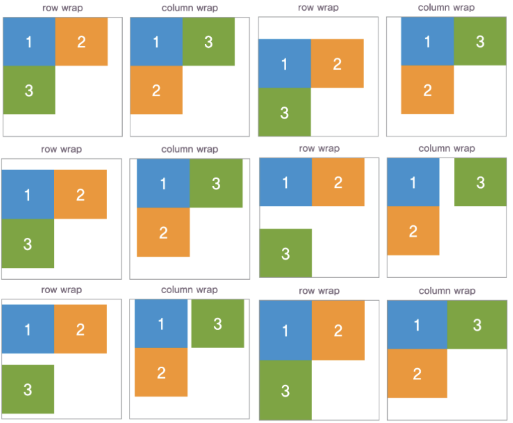
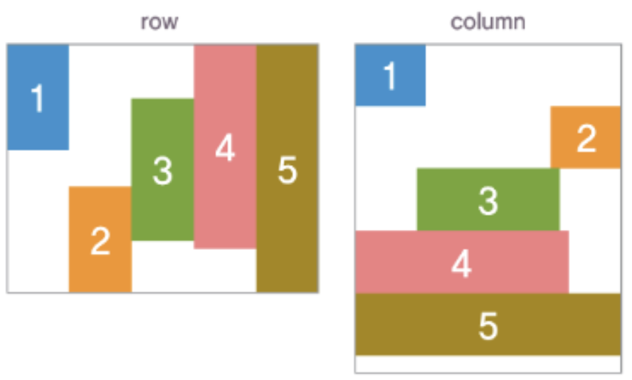

# [flex](https://studiomeal.com/archives/197)
[flex 연습용 게임](https://flexboxfroggy.com/#ko)

- Flex(플렉스)는 Flexible Box, Flexbox라고 부르기도 합니다.
- Flex는 레이아웃 배치 전용 기능으로 고안되었습니다. 그래서 레이아웃을 만들 때 딱히 사용할게 없어서 쓰던 float나 inline-block 등을 이용한 기존 방식보다 훨씬 강력하고 편리한 기능들이 많아요.

---
# flex, inline-flex
- CSS3에 추가된 유연한 박스 레이아웃을 사용하려면 가장 먼저 기존에 사용했던 display 속성에 추가된 새로운 값인 flex 또는 inline-flex를 지정해야 합니다.
- 두 값의 차이점은 블록 수준의 유연한 박스를 생성할 것인지, 인라인 수준의 유연한 박스를 생성할 것인지를 결정할 수 있다는 것에 있습니다.

```css
/* 예시 */
div { display : flex ; }
```

---
# flex-direction
- flex-direction은 요소 박스의 배치 방향을 지정하는 속성입니다.
- flex-direction 속성은 요소 박스가 반드시 display 속성 값으로 flex 또는 inline-flex로 지정되어 있어야 합니다.
- row, column, rowreverse, column-reverse 등의 속성 값을 지정하여 flex 박스에 포함된 자식 요소 박스를 가로 또는 세로 방향이나 역방향으로 표시합니다.

```css
/* 예시 */
div {
 display : flex ;
 flex-direction : row ;
}
```

---


---
# flex-wrap
- flew-wrap은 flex로 지정된 요소에 포함된 자식 요소 박스가 한 줄 또는 여러 줄로 배치될 것인지를 지정하는 속성
- 초기값 none은 모든 자식 요소를 하나의 단일 행이나 열에 표시합니다.
- 만약 flex-wrap 속성 값을 wrap으로 지정할 경우, 모든 자식 요소는 여러 줄로 배치됩니다.
- wrap-reverse는 역방향으로 여러 줄을 배치합니다.

```css
/* 예시 */
div {
 display : flex ;
 flex-direction : row ;
 flex-wrap : wrap ;
}
```

---


---
# order
- order는 요소 박스의 배치 순서를 지정하기 위한 속성입니다.
- 속성 값에 지정된 숫자 중 가장 낮은 번호의 요소가 가장 먼저 배치됩니다.
- 만약 요소 박스의 order 값이 동일하게 지정된 경우에는 일반적인 흐름에 따라 먼저 배치된 요소가 우선합니다.

```css
/* 예시 */
div {
 display : flex ;
 flex-direction : row ;
 flex-wrap : wrap ;
}
.box1 { order : 1 ; }
.box4 { order : -1 ; }
```
---


---
# flex-grow
- flex-grow 속성은 flex로 정의된 부모 요소가 자식 요소보다 크거나 작을 경우, 자식 요소의 크기를 조정하는 방법으로 자식 요소에 확대 비율을 지정하여 부모 요소의 크기에 맞게 자동으로 크기를 조정합니다.
- 이때 속성 값에는 음수 값을 사용할 수 없습니다.

```css
/* 예시 */
div {
 display : flex ;
 flex-direction : row ;
}
.box1 { flex-grow : 1 ; }
.box2 { flex-grow : 2 ; }
.box3 { flex-grow : 1 ; }
```
---


---
# justify-content
justify-content는 flex로 지정된 부모 요소 내에서 자식 요소의 정렬 방식을 지정하기 위한 속성입니다.

```css
/* 예시 */
div {
 display : flex ;
 flex-direction : row ;
 justify-content : space-between ;
}
```
---


---
# align-content
align-content는 flex로 지정된 부모 요소 내에서 여러 개의 행이나 열로 구성된 요소 박스의 정렬을 지정하기 위한 속성입니다.

```css
/* 예시 */
div {
 display : flex ;
 flex-direction : row ;
 align-content : center ;
}
```
---


---
# align-items, align-self
- align-items, align-self 속성은 라인 박스의 높이에 따라 배치되는 요소 박스에 배치에 영향을 주는 교차축(cross axis)을 지정하는 속성입니다.
- flex-direction 속성 값은 row 또는 column에 따라 요소 박스가 배치되는데, 이때 요소 박스의 너비나 높이가 기준 축으로 정해집니다.

전체 요소의 기준축을 동일하게 지정할 때는 `align-items` 속성을 flex가 정의된 부모 요소에 지정해야 합니다. 만약 자식 요소마다 기준 축을 지정해야 할 경우에는 `align-self` 속성으로 지정할 수 있습니다.

---
### align-items
```css
/* 예시 */
div {
 display : flex ;
 flex-direction : row ;
 align-items : center ;
}
```

### align-self
```css
/* 예시 */
div {
 display : flex ;
 flex-direction : row ;
}
.box1 { align-self : flex-start ; }
.box2 { align-self : flex-end ; }
.box3 { align-self : center ; }
.box4 { align-self : baseline ; }
.box5 { align-self : stretch ; }
```
---



