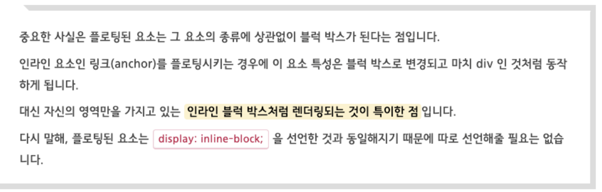
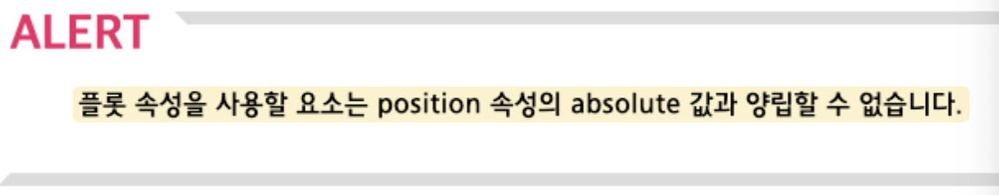
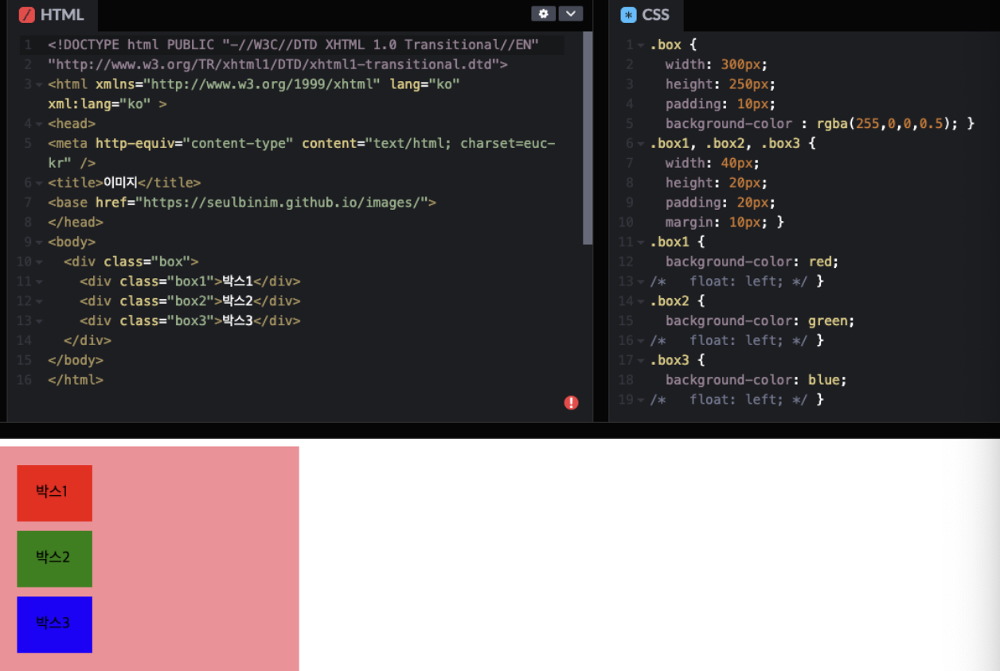
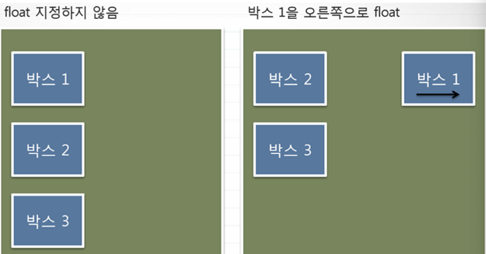
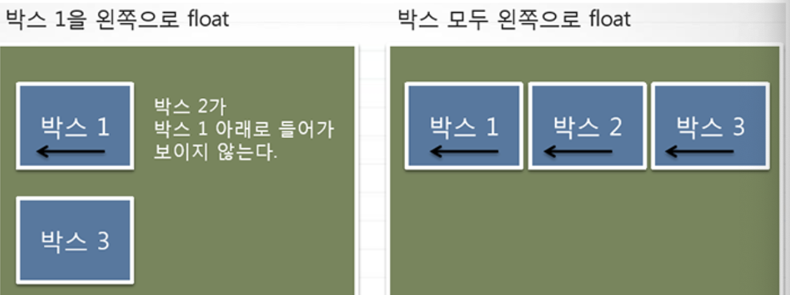
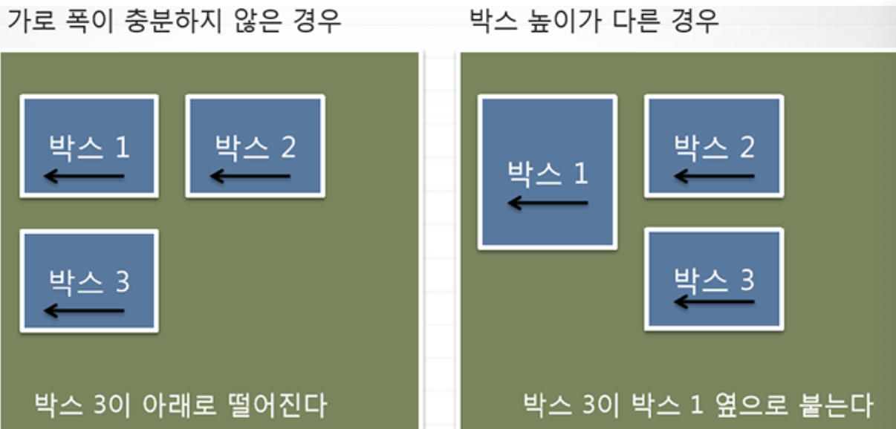
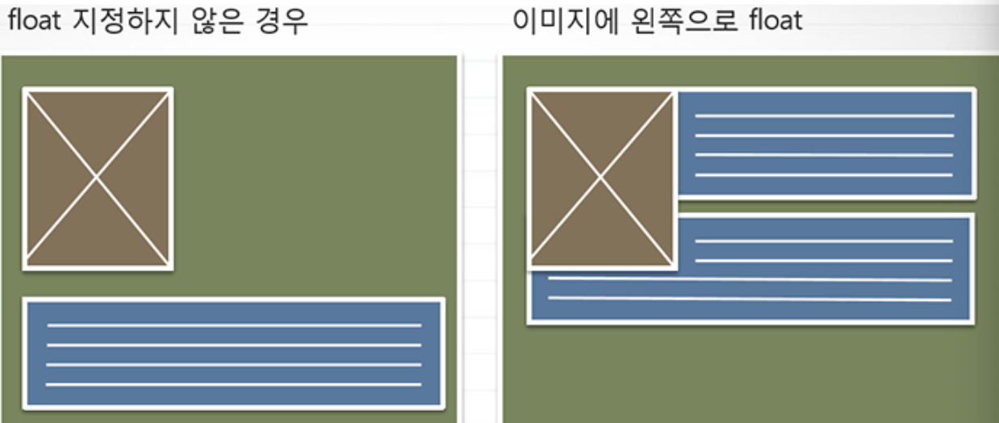
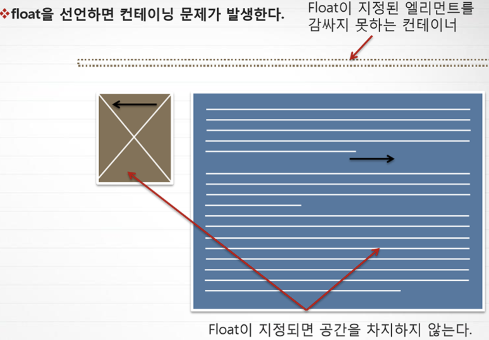
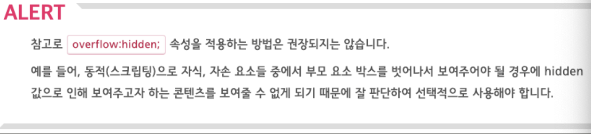

# [float](https://webclub.tistory.com/606)
- float는 일반적인 흐름에서 분리된 요소를 부모 영역을 기준으로 배치하는 속성입니다.
- float 속성 값을 "left"나 "right"로 지정하면, 해당 요소는 일반적인 흐름을 벗어나 부모 요소의 왼쪽이나 오른쪽에 배치됩니다.
- 이렇게 float로 지정된 요소는 다른 요소의 배치에 영향을 끼칩니다.

---
## float의 속성값
- left: 요소를 왼쪽 방향으로 부유하게 설정
- right: 요소를 오른쪽 방향으로 부유하게 설정
- none: 기본값(default) 요소를 띄우지 않는다.

```css
.box { float: left; }
```

---



---
## 예제들 


---


---


---


---


---
# float 해제
- 플로팅한 요소는 문서의 흐름상에서 벗어난 상태이기 때문에 레이아웃을 무너뜨리게 되는 현상을 보게 될 것입니다.
- 이는 플롯을 사용하면 발생되는 현상이며 이러한 문제를 해결하기 위해서는 float 을 해제해 주어야 합니다.
- 여기서 "float 을 해제한다" 는 의미는 float 이 적용된 요소를 해제하는 것이 아니라
clear 속성을 적용해 float 의 영향을 받지 않도록 한다는 의미입니다.

다시 말해, float 이 적용된 자식 요소를 부모 요소가 감싸 안지 못하는 현상을 해결하기 위해서는 여러 방법들을 소개하겠습니다.

---


---


---
## 1. clear
- 플롯을 해제하는 방법 중에 전 세계적으로 통용되는 이름(관용적인 기법의 이름)으로 `clearfix` 라는 방법이 있습니다.
- float 을 사용해 레이아웃을 잡다보면 clear 가 필요해지기 때문에 가급적 `플롯된 요소의 부모 요소에 clearfix 방법을 적용하는 것을 권장하고 있습니다.`

clear 속성들
- `left` : 왼쪽에 floating 된 요소를 지정 해제
- `right` : 오른쪽에 floating 된 요소를 지정 해제
- `both` : 왼쪽 오른쪽 모두 floating 된 요소를 지정 해제
- `none` : 기본값(default), floating 을 해제하지 않음

```css
.clearfix { clear: both; }
```

---
## 2. display: inline-block;
- 이 방법 역시 부모 요소에 적용하는데 display: inline-block; 속성을 사용하는 방법이 있습니다.
- 부모 요소는 자식 요소의 높이를 인지하게 되지만 되지만 부모 요소에 정의된 인라인블럭 속성 특성 때문에 본인 영역만큼만 너비를 가지게 됩니다.

```css
.parent { display: inline-block; }
```

---
## 3. overflow:hiddne;
- 이 속성 역시도 부모 요소에 적용해야 하며, 이 속성의 특징은 자식 요소가 부모 요소 박스보다 클 경우에 자식 요소 박스의 콘텐츠를 숨기고 보이지 않게 해주는 속성입니다.
- overflow: auto;를 적용해도 되지만 자식 요소 박스의 너비가 부모 요소 박스의 너비보다 클 경우에 스크롤이 생기기 때문에 권장되지 않습니다.

```css
.parent { overflow: hidden; }
```




