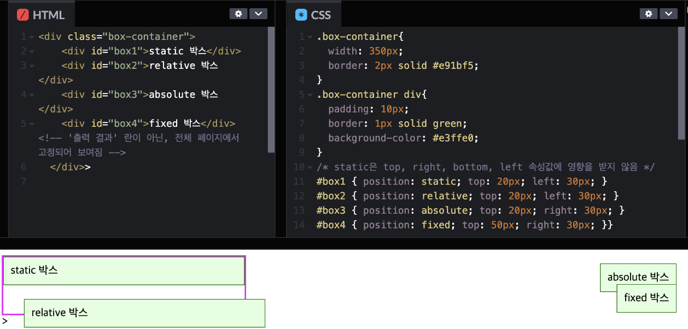
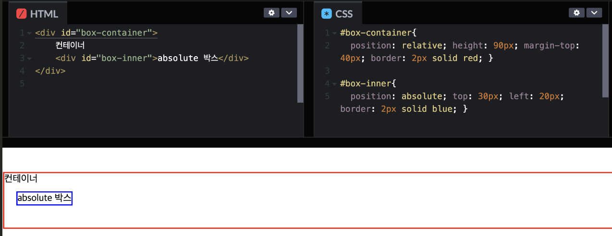
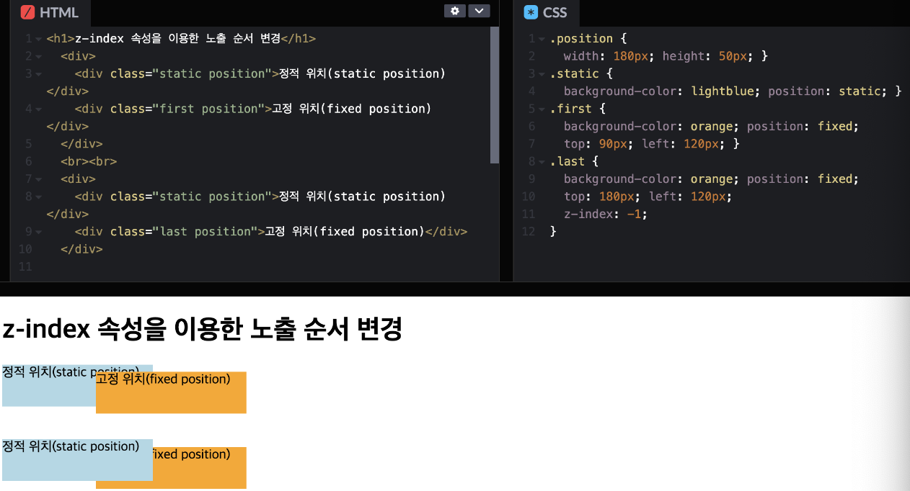

# [position](http://www.tcpschool.com/css/css_position_position)
position 속성은 태그를 어떻게 위치시킬지를 정의하며, 아래의 5가지 값을 갖습니다.
- `static`: 기본값, 다른 태그와의 관계에 의해 자동으로 배치되며 위치를 임의로 설정해 줄 수 없습니다.
- `absolute`: 절대 좌표와 함께 위치를 지정해 줄 수 있습니다.
- `relative`: 원래 있던 위치를 기준으로 좌표를 지정합니다.
- `fixed`: 스크롤과 상관없이 항상 문서 최 좌측상단을 기준으로 좌표를 고정합니다.
  - 좌표를 지정 해주기 위해서는 left, right, top, bottom 속성과 함께 사용합니다.
  - position을 absolute나 fixed로 설정시 가로 크기가 100%가 되는 block 태그의 특징이 사라지게 됩니다.

---
```css
#box1 { position:static; top: 20px; left: 30px; }
#box2 { position:absolute; top: 20px; left: 30px; }
#box3 { position:relative; top: 20px; left: 30px; }
#box4 { position:fixed; top: 20px; left: 30px; }
```



---
# absolute와 relative
relative 인 컨테이너 내부에 absolute인 객체가 있으면 절대 좌표를 계산할 때, relative 컨테이너를 기준점으로 잡게 됩니다. (없다면 전체 문서가 기준)



---
# rop, right, bottom, left
- static은 적용되지 않는다!!!
- top, right, bottom, left 속성은 position 속성 값이 static이 아닌 경우, 해당 요소의 위치를 지정할 때 사용할 수 있는 offset 관련 속성입니다.

```css
/* 예시 */
div {
 position : absolute ;
 top : 100px ;
 left : 100px ;
}
```

---
# z-index
- z-index는 position 속성 값이 static이 아닌 요소의 offset 관련 속성 값과 겹쳤을 경우, 겹치는 순서를 지정하는 속성입니다.
- 기본 값은 auto이며, 마크업 순서에 따라 가장 나중에 선언된 요소 박스가 맨 위에 배치됩니다.
- number 속성 값의 경우 단위가 없는 숫자로 작성하며, 높은 숫자가 지정된 요소가 맨 위에 배치됩니다.
- 이때 z-index 속성 값으로 음수 값도 사용할 수 있습니다.

---


---



