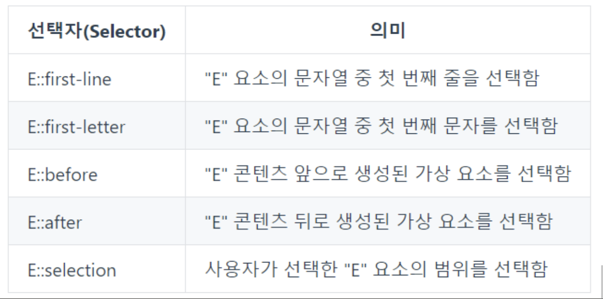

# css 선택자
- [전체 선택자](https://developer.mozilla.org/ko/docs/Web/CSS/Universal_selectors)
```css
/* Selects all elements */
* {
  color: green;
}
```
- [태그 선택자](https://developer.mozilla.org/ko/docs/Web/CSS/Type_selectors)
```css
/* All <a> elements. */
a {
  color: red;
}
```

---
- [ID 선택자](https://developer.mozilla.org/ko/docs/Web/CSS/ID_selectors)
```css
/* id="demo" 요소 선택 */
#demo {
  border: red 2px solid;
}
```
- [그룹 선택자](https://developer.mozilla.org/ko/docs/Web/CSS/Selector_list)

```css
/* 모든 span과 div 요소 선택 */
span,
div {
  border: red 2px solid;
}

#main,
.content,
article {
  font-size: 1.1em;
}
```

---
- [클래스 선택자](https://developer.mozilla.org/ko/docs/Web/CSS/Class_selectors)
```css
/* All elements with class="spacious" */
.spacious {
  margin: 2em;
}

/* All <li> elements with class="spacious" */
li.spacious {
  margin: 2em;
}

/* All <li> elements with a class list that includes both "spacious" and "elegant" */
/* For example, class="elegant retro spacious" */
li.spacious.elegant {
  margin: 2em;
}
```

---
- [속성 선택자](https://developer.mozilla.org/ko/docs/Web/CSS/Attribute_selectors)
```css
/* <a> elements with a title attribute */
a[title] {
  color: purple;
}

/* <a> elements with an href matching "https://example.org" */
a[href="https://example.org"] {
  color: green;
}

/* <a> elements with an href containing "example" */
a[href*="example"] {
  font-size: 2em;
}

/* <a> elements with an href ending ".org" */
a[href$=".org"] {
  font-style: italic;
}

/* <a> elements whose class attribute contains the word "logo" */
a[class~="logo"] {
  padding: 2px;
}
```

---
# 결합 선택자 
- [인접 형제 결합자](https://developer.mozilla.org/ko/docs/Web/CSS/Adjacent_sibling_combinator): `A + B`
요소 A와 B가 같은 부모를 가지며 B가 A를 바로 뒤따라야 하도록 지정합니다.
```css
/* Paragraphs that come immediately after any image */
img + p {
  font-weight: bold;
}
```
- [일반 형제 결합자](https://developer.mozilla.org/ko/docs/Web/CSS/General_sibling_combinator): `A ~ B`
요소 A와 B가 같은 부모를 가지며 B가 A를 뒤따라야 하도록 지정합니다. 그러나 B가 A의 바로 옆에 위치해야 할 필요는 없습니다.
```css
/* 서로 형제인 문단 중 이미지 뒤쪽인 경우에만 선택 */
img ~ p {
  color: red;
}
```

---
- [자식 결합자](https://developer.mozilla.org/ko/docs/Web/CSS/Child_combinator): `A > B`
요소 B가 A의 바로 밑에 위치해야 하도록 지정합니다.
```css
/* List items that are children of the "my-things" list */
ul.my-things > li {
  margin: 2em;
}
```
- [자손 결합자](https://developer.mozilla.org/ko/docs/Web/CSS/Descendant_combinator): `A B`
요소 B가 A의 밑에 위치해야 하도록 지정합니다. 그러나 B가 A의 바로 아래에 있을 필요는 없습니다.
```css
/* List items that are descendants of the "my-things" list */
ul.my-things li {
  margin: 2em;
}
```

---
# 가상 선택자 
- [가상 클래스 선택자](https://developer.mozilla.org/ko/docs/Web/CSS/Pseudo-classes)
```css
/* Any button over which the user's pointer is hovering */
button:hover {
  color: blue;
}

button:focus {
  color: red;
}
```

---
- [가상 요소 선택자](https://developer.mozilla.org/ko/docs/Web/CSS/Pseudo-elements)

```css
/* The first line of every <p> element. */
p::first-line {
  color: blue;
  text-transform: uppercase;
}
```

---



