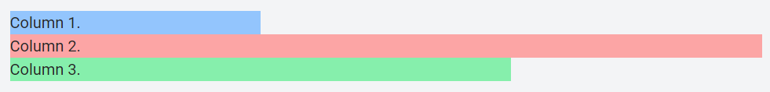
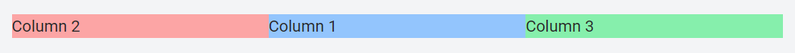
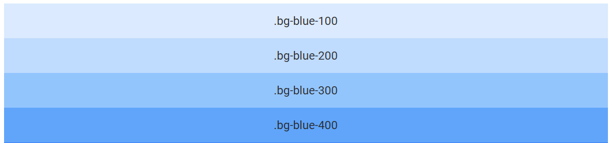
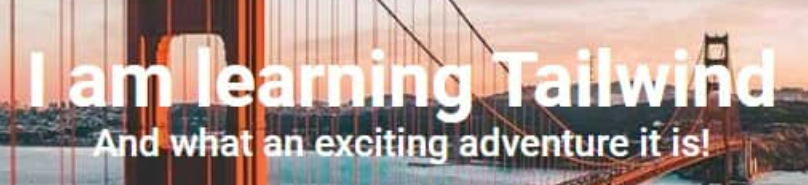
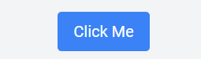
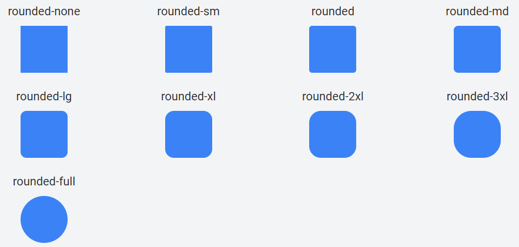
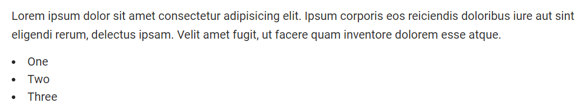

# [tailwindcss](https://tailwindcss.com/)
### [Samples](https://www.tailwindtoolbox.com/starter-templates)
### [설치방법](https://tailwindcss.com/docs/installation) 
1. CDN  
```html
<script src="https://cdn.tailwindcss.com"></script>
```
2. npm 
```shell
npm install -D tailwindcss
```
---
# [Tutorial](https://tw-elements.com/learn/te-foundations/tailwind-css/about/)
### [Grid system](https://tw-elements.com/learn/te-foundations/tailwind-css/advanced-grid/) 
```html
<div class="grid lg:grid-cols-3">
  <div class="bg-blue-300"><h5>Column 1.</h5></div>
  <div class="col-span-3 bg-red-300"><h5>Column 2.</h5></div>
  <div class="col-span-2 bg-green-300"><h5>Column 3.</h5></div>
</div>
```


---
### [Reorder columns](https://tw-elements.com/learn/te-foundations/tailwind-css/reorder-columns/)
```html
<div class="grid grid-cols-3">
  <div class="order-2 bg-blue-300">Column 1</div>
  <div class="order-1 bg-red-300">Column 2</div>
  <div class="order-3 bg-green-300">Column 3</div>
</div>
```


---
### [Color](https://tw-elements.com/learn/te-foundations/tailwind-css/colors/)
```html
<h5 class="mb-3 text-lg text-blue-100">What exactly is beauty?</h5>
<h5 class="mb-3 text-lg text-blue-200">What exactly is beauty?</h5>
<h5 class="mb-3 text-lg text-blue-300">What exactly is beauty?</h5>
```


---
### [Text](https://tw-elements.com/learn/te-foundations/tailwind-css/text/)
```html
<!-- Call to action -->
<div class="text-center text-white">
  <h1 class="text-5xl font-semibold">I am learning Tailwind</h1>
  <h2 class="text-2xl font-medium">
    And what an exciting adventure it is!
  </h2>
</div>
```


---
### [Button](https://tw-elements.com/learn/te-foundations/tailwind-css/buttons/)
- `bg-blue-500`: This sets the button's background color to a specific shade of blue.
- `text-white`: This sets the button's text color to white.
- `px-4 py-2`: These are padding classes. px-4 applies horizontal padding and py-2 applies vertical padding.
- `rounded`: This gives the button rounded corners.

```html
<button class="rounded bg-blue-500 px-4 py-2 text-white">Click Me</button>
```


---
### [Rounded corners](https://tw-elements.com/learn/te-foundations/tailwind-css/rounded-corners/)
```html
<!-- border-radius: 0px; -->

<!-- border-radius: 0.125rem; -->

```


---
### [Lists](https://tw-elements.com/learn/te-foundations/tailwind-css/lists/)
```html
<p class="mb-3">
  Lorem ipsum dolor sit amet consectetur adipisicing elit. Ipsum corporis
  eos reiciendis doloribus iure aut sint eligendi rerum, delectus ipsam.
  Velit amet fugit, ut facere quam inventore dolorem esse atque.
</p>

<ul class="list-inside list-disc">
  <li>One</li>
  <li>Two</li>
  <li>Three</li>
</ul>
```


---
### [Forms](https://tw-elements.com/learn/te-foundations/tailwind-css/forms/)


