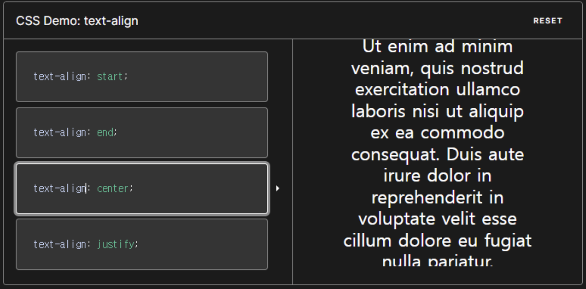
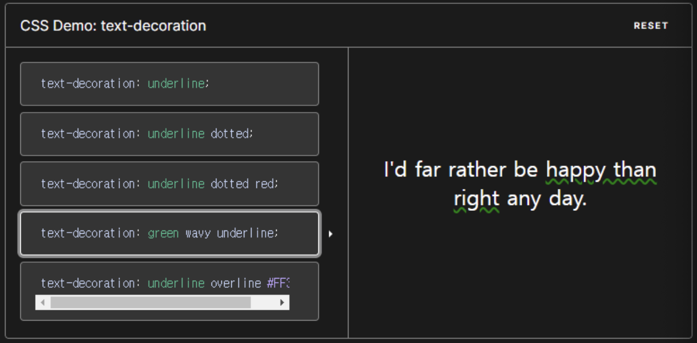

# font
### [font-family](https://aboooks.tistory.com/144):
- font-family는 텍스트의 폰트를 지정하는 속성으로, 속성 값은 복수로 지정할 수 있으며, 지정된 순서대로 표시할 수 있는 폰트를 찾게 됩니다.
- 웹 브라우저가 표시할 수 있는 폰트를 찾으면 이후에 지정된 속성 값들은 무시됩니다.

font-family은 다시 family-name과 generic family로 나누어집니다.
- family-name(글꼴 이름): arial, verdana, 나눔고딕, 궁서, 굴림 등
- generic family(글꼴들의 그룹): serif(바탕체), sans-serif(고딕체)

```css
/* 예시 */
div {
 font-family : "맑은 고딕", "돋움", sans-serif;
}
```

---
### font-style:
- font-style은 폰트의 표시 형태를 지정하는 속성으로, 폰트의 기본 형태로 표시하는 normal 값과 이탤릭체 또는 기울임꼴로 표시하는 italic과 oblique가 있습니다.

```css
/* 예시 */
div { font-style : italic ; }
```
### [@font–face(웹폰트)](https://velog.io/@jehjong/CSS%EC%97%90-%ED%8F%B0%ED%8A%B8-%EC%A0%81%EC%9A%A9%ED%95%98%EA%B8%B0-%EC%9B%B9%ED%8F%B0%ED%8A%B8-%ED%8F%B0%ED%8A%B8-%ED%8C%8C%EC%9D%BC)
- @font-face는 사용자의 환경에 설치된 폰트 또는 제작자가 서버에서 제공한 폰트를 다운로드하여 사용할 수 있도록 해줍니다.
```css
/* 예시 */
@font-face {
    font-family : 'SDSamliphopangche_Outline' ;
    src: url('https://cdn.jsdelivr.net/gh/projectnoonnu/noonfonts-20-12@1.0/SDSamliphopangche_Outline.woff') format('woff');
    font-weight: normal;
    font-style: normal;
}
h3 {
    color: blue;
    font-family : 'SDSamliphopangche_Outline' ;
    text-decoration: underline;
}
```

---
### font-size:
- font-size는 폰트의 크기를 지정하는 속성으로, xx-small, x-small, small, medium, large, x-large, xxlarge과 같은 절대 크기와 smaller, larger와 같은 상대 크기 등을 사용할 수 있습니다.
- 이때 절대 크기의 기준은 medium으로 정해진 크기가 아니라 사용자 환경의 기본 값 크기를 의미합니다.
```css
/* 예시 */
body { font-size : 18px ; }
div { font-size : 2em ; }
div p { font-size : small ; }
```


---
### [text-align](https://developer.mozilla.org/en-US/docs/Web/CSS/text-align)
단락 내 텍스트의 가로 방향 정렬 방법을 지정하는 속성입니다.
- left : 박스의 왼쪽을 기준으로 텍스트를 정렬합니다.
- right : 박스의 오른쪽을 기준으로 텍스트를 정렬합니다.
- center : 박스의 중앙을 기준으로 텍스트를 정렬합니다.

```css
/* Keyword values */
div { text-align: left; }
div { text-align: center; }
```
---


---
### [text-decoration](https://developer.mozilla.org/en-US/docs/Web/CSS/text-decoration)
```css
dev { text-decoration: underline; }
dev { text-decoration: underline dotted red; }
dev { text-decoration: green wavy underline; }
```

---


