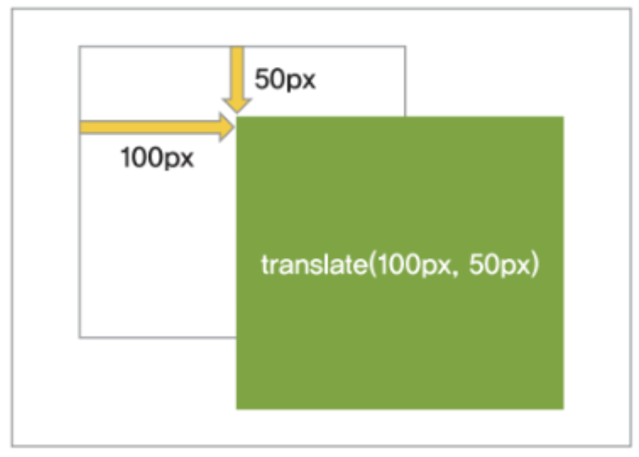
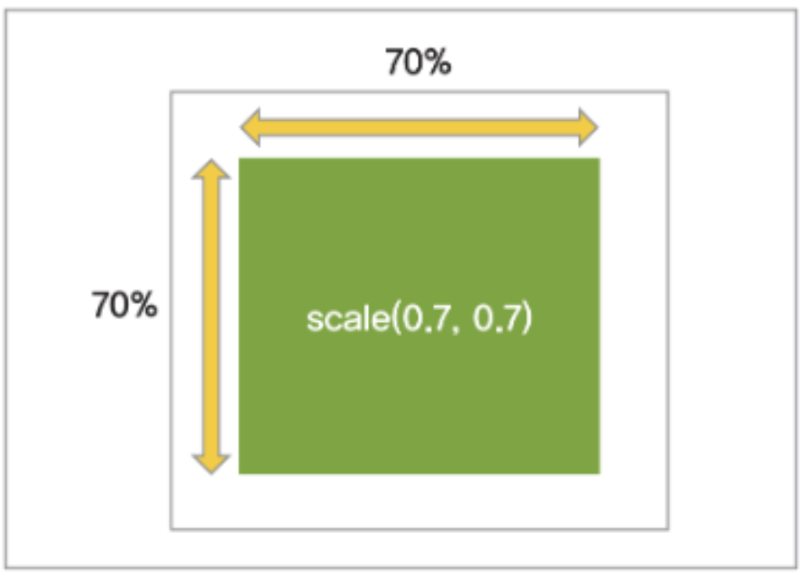
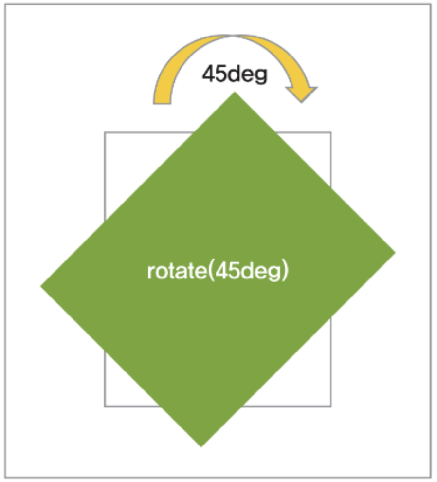

# translate
```css
/* 예시 */
div { transform : translate(50px, 50px) ; }
div { transform : translateX(50px) ; }
div { transform : translateY(50px) ; }
```
---


---
# scale

```css
/* 예시 */
div { transform : scale(0.5, 0.5) ; }
div { transform : scaleX(0.5) ; }
div { transform : scaleY(0.5) ; }
```
---


---
# rotate

```css
/* 예시 */
div { transform : rotate(45deg) ; }
```
---

