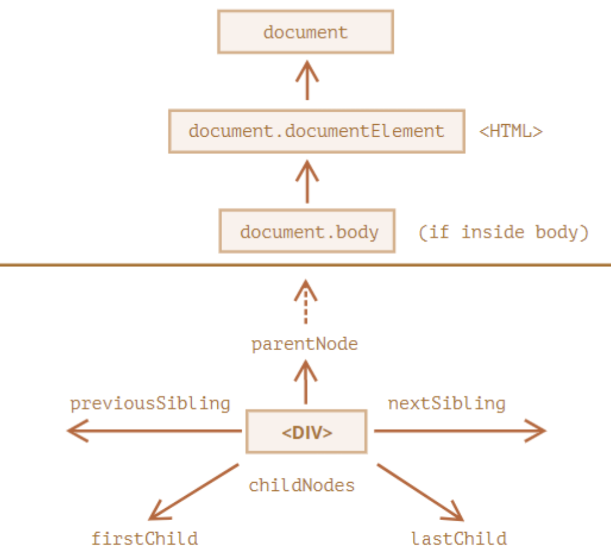
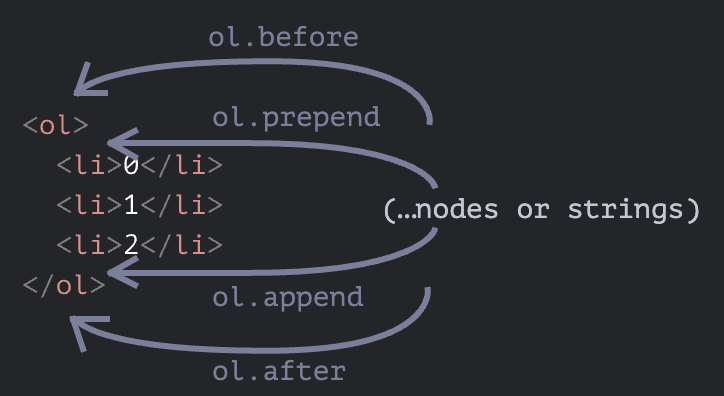

# [DOM](https://ko.javascript.info/dom-navigation)
DOM을 이용하면 요소와 요소의 콘텐츠에 무엇이든 할 수 있습니다. 하지만 무언가를 하기 전엔, 당연히 조작하고자 하는 DOM 객체에 접근하는 것이 선행되어야 합니다.

---
아래 그림은 DOM 노드 탐색이 어떤 관계를 통해 이루어지는지를 보여줍니다.



---
## 트리 상단의 documentElement와 body
DOM 트리 상단의 노드들은 document가 제공하는 프로퍼티를 사용해 접근할 수 있습니다.

- `<html> = document.documentElement`
> document를 제외하고 DOM 트리 꼭대기에 있는 문서 노드는 `<html>` 태그에 해당하는 document.documentElement입니다.
- `<body> = document.body`
> document.body는 `<body>` 요소에 해당하는 DOM 노드로, 자주 쓰이는 노드 중 하나입니다.
- `<head> = document.head`
> `<head>` 태그는 document.head로 접근할 수 있습니다.

---
## childNodes, firstChild, lastChild로 자식 노드 탐색하기
- childNodes 
> 컬렉션은 텍스트 노드를 포함한 모든 자식 노드를 담고 있습니다.

```javascript
for (let i = 0; i < document.body.childNodes.length; i++) {
    alert( document.body.childNodes[i] ); 
  }
```

```javascript
for (let node of document.body.childNodes) {
  alert(node); // 컬렉션 내의 모든 노드를 보여줍니다.
}
```
---
- firstChild와 lastChild 프로퍼티를 이용하면 첫 번째, 마지막 자식 노드에 빠르게 접근할 수 있습니다.

```javascript
let elem = document.body
elem.childNodes[0] === elem.firstChild
elem.childNodes[elem.childNodes.length - 1] === elem.lastChild
```
참고로 자식 노드의 존재 여부를 검사할 땐 함수 elem.hasChildNodes()를 사용할 수도 있습니다.

---
## parentNode, nextSibing, previousSilbing
- 다음 형제 노드에 대한 정보는 nextSibling, 이전 형제 노드에 대한 정보는 previousSibling 프로퍼티에서 찾을 수 있습니다.
- 부모 노드에 대한 정보는 parentNode 프로퍼티를 이용해 참조할 수 있습니다.

```javascript
// <body>의 부모 노드는 <html>입니다
alert( document.body.parentNode === document.documentElement ); // true

// <head>의 다음 형제 노드는 <body>입니다.
alert( document.head.nextSibling ); // HTMLBodyElement

// <body>의 이전 형제 노드는 <head>입니다.
alert( document.body.previousSibling ); // HTMLHeadElement
```

---
# [getElement, querySelector](https://ko.javascript.info/searching-elements-dom)
## getElementById
요소에 id 속성이 있으면 위치에 상관없이 메서드 document.getElementById(id)를 이용해 접근할 수 있습니다.

```html
<div id="elem">
  <div id="elem-content">Element</div>
</div>

<script>
  // 요소 얻기
  let elem = document.getElementById('elem');

  // 배경색 변경하기
  elem.style.background = 'red';
</script>
```

---
## getElementsByTagName
주어진 태그에 해당하는 요소를 찾고, 대응하는 요소를 담은 컬렉션을 반환합니다. 매개변수 tag에 "*"이 들어가면, '모든 태그’가 검색됩니다.

---
```html
<table id="table">
  <tr>
    <td>나이:</td>

    <td>
      <label>
        <input type="radio" name="age" value="young" checked> 18세 미만
      </label>
      <label>
        <input type="radio" name="age" value="mature"> 18세 이상, 60세 미만
      </label>
      <label>
        <input type="radio" name="age" value="senior"> 60세 이상
      </label>
    </td>
  </tr>
</table>

<script>
  let inputs = table.getElementsByTagName('input');

  for (let input of inputs) {
    alert( input.value + ': ' + input.checked );
  }
</script>
```
---
## getElementsByClassName
class 속성값을 기준으로 요소를 찾고, 대응하는 요소를 담은 컬렉션을 반환합니다.

```html
<form name="my-form">
  <div class="article">글</div>
  <div class="long article">내용이 긴 글</div>
</form>

<script>
  // name 속성을 이용해 검색(아주 드물게 사용)
  let form = document.getElementsByName('my-form')[0];

  // form 내에서 클래스 이름을 이용해 검색
  let articles = form.getElementsByClassName('article');
  alert(articles.length); // 2. 클래스 속성값이 'article'인 요소는 2개입니다.
</script>
```
---
## querySelectorAll
- querySelectorAll(css)은 다재다능한 요소 검색 메서드입니다. 
- 이 메서드는 elem의 자식 요소 중 주어진 CSS 선택자에 대응하는 요소 모두를 반환합니다.

```html
<ul>
  <li>1-1</li>
  <li>1-2</li>
</ul>
<ul>
  <li>2-1</li>
  <li>2-2</li>
</ul>
<script>
  let elements = document.querySelectorAll('ul > li:last-child');

  for (let elem of elements) {
    alert(elem.innerHTML); // "1-2", "2-2"
  }
</script>
```
---
# [HTML 수정하기](https://ko.javascript.info/modifying-document)

---
### 노드 생성 
```html
<style>
.alert {
  padding: 15px;
  border: 1px solid #d6e9c6;
  border-radius: 4px;
  color: #3c763d;
  background-color: #dff0d8;
}
</style>
<script>
  // 1. <div> 요소 만들기
  let div = document.createElement('div');

  // 2. 만든 요소의 클래스를 'alert'로 설정
  div.className = "alert";

  // 3. 내용 채워넣기
  div.innerHTML = "<strong>안녕하세요!</strong> 중요 메시지를 확인하셨습니다.";
</script>
```
---
### 노드 삽입 
- node.append(노드나 문자열): 노드나 문자열을 node 끝에 삽입합니다.
- node.prepend(노드나 문자열): 노드나 문자열을 node 맨 앞에 삽입합니다.
- node.before(노드나 문자열): 노드나 문자열을 node 이전에 삽입합니다.
- node.after(노드나 문자열): 노드나 문자열을 node 다음에 삽입합니다.
- node.replaceWith(노드나 문자열): node를 새로운 노드나 문자열로 대체합니다.

---


---
```html
<ol id="ol">
  <li>0</li>
  <li>1</li>
  <li>2</li>
</ol>

<script>
  ol.before('before'); // <ol> 앞에 문자열 'before'를 삽입함
  ol.after('after'); // <ol> 뒤에 문자열 'after를 삽입함

  let liFirst = document.createElement('li');
  liFirst.innerHTML = 'prepend';
  ol.prepend(liFirst); // <ol>의 첫 항목으로 liFirst를 삽입함

  let liLast = document.createElement('li');
  liLast.innerHTML = 'append';
  ol.append(liLast); // <ol>의 마지막 항목으로 liLast를 삽입함
</script>
```
---
### 노드 삭제 
```html
<style>
.alert {
  padding: 15px;
  border: 1px solid #d6e9c6;
  border-radius: 4px;
  color: #3c763d;
  background-color: #dff0d8;
}
</style>

<script>
  let div = document.createElement('div');
  div.className = "alert";
  div.innerHTML = "<strong>안녕하세요!</strong> 중요 메시지를 확인하셨습니다.";

  document.body.append(div);
  setTimeout(() => div.remove(), 1000);
</script>
```
---
# [CSS 수정](https://ko.javascript.info/styles-and-classes)
자바스크립트를 사용해 어떻게 스타일과 클래스를 다룰 수 있는지 알아보기 전에, 중요한 규칙을 하나 집고 넘어가야 할 것 같습니다. 핵심만 요약했기 때문에 충분할진 모르겠지만 꼭 언급하고 넘어가야 하기 때문입니다.

요소에 스타일을 적용할 수 있는 방법은 두 가지가 있습니다.

1. CSS에 클래스를 만들고, 요소에 `<div class="...">`처럼 클래스 추가하기
2. `<div style="...">`처럼 프로퍼티를 style에 바로 써주기

자바스크립트를 사용하면 클래스와 style 프로퍼티 둘 다를 수정할 수 있습니다.
두 방법 중 하나를 택하라면 style 보다 CSS 클래스를 수정하는 것을 더 우선시해야 합니다. style은 클래스를 '다룰 수 없을 때’만 사용해야 합니다.

---
### style
```js
let top = /* 복잡한 계산식 */;
let left = /* 복잡한 계산식 */;

elem.style.left = left; // 예시: '123px', 런타임으로 좌표를 계산할 수 있습니다.
elem.style.top = top; // 예시: '456px'
```

---
### class 
```html
<body class="main page">
  <script>
    // 클래스 추가
    document.body.classList.add('article');

    alert(document.body.className); // main page article
  </script>
</body>
```
```html
<body class="main page">
  <script>
    for (let name of document.body.classList) {
      alert(name); // main과 page가 출력됨
    }
  </script>
</body>
```
---
### 단위 주의하기 
```html
<body>
  <script>
    // 동작하지 않습니다!
    document.body.style.margin = 20;
    alert(document.body.style.margin); // '' (값이 제대로 할당되지 않았기 때문에 빈 문자열이 출력됩니다.)

    // CSS 단위(px)를 추가해봅시다. 제대로 동작하네요!
    document.body.style.margin = '20px';
    alert(document.body.style.margin); // 20px

    alert(document.body.style.marginTop); // 20px
    alert(document.body.style.marginLeft); // 20px
  </script>
</body>
```


