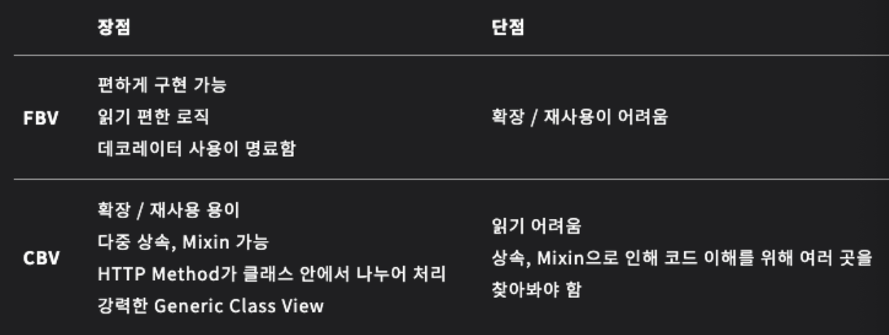
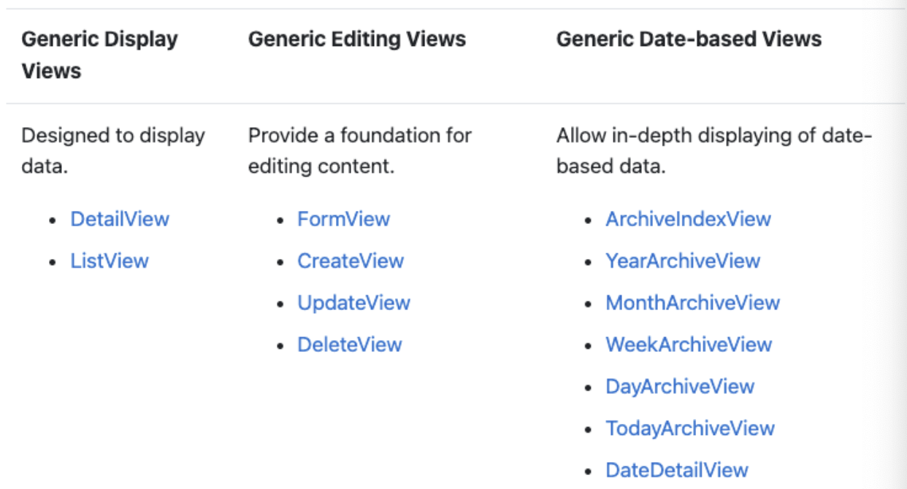

# URLconf
- URL은 view와 template을 이어주는 역할을 하고, 이 부분을 만들어 주는 작업을 URLconf라고 한다.

---
# [View](https://leffept.tistory.com/318)
- 뷰는 웹 요청을 받고, 전달받은 데이터들을 해당 어플리케이션의 로직으로 가공하여, 그 결과를 템플릿에 보내준다.
- 데이터를 가공하는 처리를 해야한다 싶으면 뷰에서 함수를 작성하면 된다.
- view를 작성하는 방법에는 두 가지가 존재한다.
  1. 함수형 뷰 (FBV; Function based view)
  2. 클래스형 뷰 (CBV; Class based view)

상속/재사용이 많이 필요한 프로젝트의 경우에는 CBV, 그렇지 않은 경우에는 FBV를 사용하면 된다.

---


---
## [FBV](https://docs.djangoproject.com/en/4.2/topics/http/views/)
뷰를 작성할 때 함수 형식으로 작성하는 방식이다.

```python
# urls.py
urlpatterns = [
  path('', views.index, name='index')
]
```
```python
# views.py
@api_view(['GET', 'POST'])
def index(request):
  if request.method == 'POST':
    return HttpResponse("Post method")
  else:
    return HttpResponse("Get method")
```
---
## [CBV](https://docs.djangoproject.com/en/4.2/ref/class-based-views/base/)
뷰를 작성할 때 클래스 형식으로 작성하는 방식이다.

```python
# urls.py
urlpatterns = [
  path('', views.IndexView.as_view(), name='index')
]
```
```python
# views.py
from django.views import View

class IndexView(View):

  def post(self, request):
    return HttpResponse("Post method")

  def get(self, request):
    return HttpResponse("Get method")
```
---
## [Generic CBV](https://testdriven.io/blog/django-class-based-vs-function-based-views/#djangos-generic-class-based-views)
- model:
defines what Django model the ivew works with.
- fields:
is used by Django to create a form (alternatively, we could provide `form_class`).
- template_name:
defines which template to use (defaults to `/<app_name>/<model_name>_form.html`).
- context_object_name:
defines the context key under which the model instance is passed to the template (defaults to `object`).
- success_url:
defines where the user gets redirected on success (alternatively, you can set `get_absolute_url` in your model).

---
```python
from django.views.generic import ListView, DetailView, DeleteView, UpdateView, CreateView

class TaskListView(ListView):
    model = Task
    context_object_name = 'tasks'

class TaskCreateView(CreateView):
    model = Task
    context_object_name = 'task'
    fields = ('name', 'description', 'is_done')
    template_name = 'todo/task_create.html'

class TaskDetailView(DetailView):
    model = Task
    context_object_name = 'task'

class TaskUpdateView(UpdateView):
    model = Task
    context_object_name = 'task'
    fields = ('name', 'description', 'is_done')
    template_name = 'todo/task_update.html'

class TaskDeleteView(DeleteView):
    model = Task
    context_object_name = 'task'
    success_url = '/'
```
---



