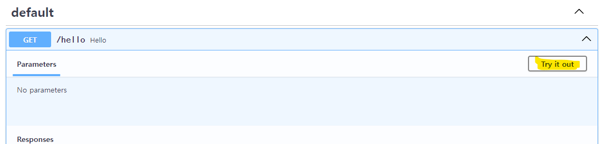
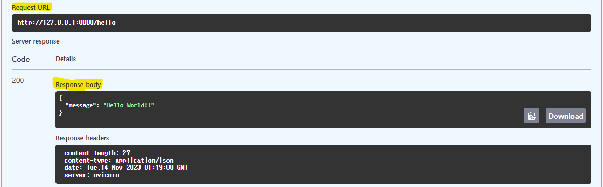

# [FastAPI](https://fastapi.tiangolo.com/ko/)
### 설치방법 
```shell
# python 가상환경 
$ py -3.11 -m venv .venv 
# python 가상환경 접속 
$ .\.venv\Scripts\activate
# pip 최신버전으로 업그레이드 
$(.venv) python -m pip install --upgrade pip
# fastapi 설치 
$(.venv) pip install fastapi
```

---
## [Uvicorn](https://velog.io/@crosstar1228/BackendFastAPI-%EC%9E%85%EB%AC%B8-1-Uvicorn-%EC%9D%B4%ED%95%B4%ED%95%98%EA%B8%B0-%EA%B0%84%EB%8B%A8%ED%95%9C-%EC%9B%B9-%EC%84%9C%EB%B2%84-%EA%B5%AC%ED%98%84) 
- 유비콘(Uvicorn)은 비동기 호출을 지원하는 파이썬용 웹 서버이다.
```shell
# 유비콘(Uvicorn) 설치 
$(.venv) pip install "uvicorn[standard]"
```

### helloworld.py
```python
from fastapi import FastAPI

app = FastAPI()

@app.get("/hello")
def hello():
    return {"message": "Hello World!!"}
```

---
### Uvicorn 서버 실행 
- `univorn`: 서버 실행을 위해 기본적으로 기재해야하는 명령어
- `main`: 실행할 초기 파이썬 파일 이름. 만약 실행 소스코드 파일 이름이 index.py였다면 index:app으로 수정해줘야 한다.
- `app`: FastAPI()모듈을 할당한 객체명을 기재한다. 만약, start=FastAPI()라고 위에서 실행했었다면 여기서도 main:start라고 기재해줘야 정상 실행한다.
- `reload`: 소스코드가 변경되었을 시, 서버를 자동으로 재시작해주는 옵션
```shell
# uvicorn 서버 실행 
$(.venv) uvicorn helloworld:app --reload
```


---
### Uvicorn 서버 실행 결과 
- localhost:8000


### Uvicorn 서버 Stop 
- `Ctrl + c`


---
### [Swagger](https://swagger.io/)
- Swagger 는 REST API를 설계, 빌드, 문서화 및 사용하는 데 도움이되는 OpenAPI 사양을 중심으로 구축 된 오픈 소스 도구 세트입니다.
- 접속: localhost:8000/docs


---
- 실행 




---
- 실행 결과 



---
# FastAPI 예제들 
- [FastAPI Tutorial](https://fastapi.tiangolo.com/ko/tutorial/first-steps/)
    - [연습용 예제파일들](./samples/tutorial/README.md)
- [FastAPI with DB](https://wikidocs.net/175950)
    - [연습용 예제파일들](./samples/database/README.md)
- [FastAPI with Sklearn and Docker](https://medium.com/analytics-vidhya/serve-a-machine-learning-model-using-sklearn-fastapi-and-docker-85aabf96729b)
- [FastAPI with pytorch Model](https://velog.io/@rapidrabbit76/FastAPI%EB%A1%9C-Model-serving-%ED%95%98%EA%B8%B0-with-Micro-Batching)

