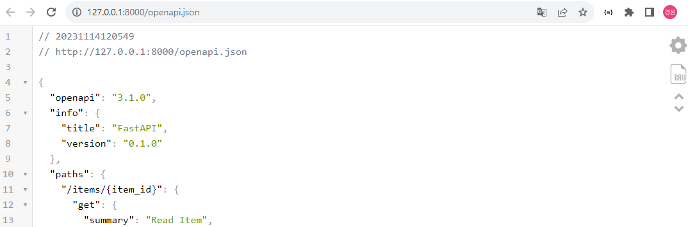

# [경로 매개변수](https://fastapi.tiangolo.com/ko/tutorial/path-params/)
> 예제 파일: ex01.py
- http://127.0.0.1:8000/docs

---
- http://127.0.0.1:8000/redoc

---
- http://127.0.0.1:8000/openapi.json

---
# [쿼리 매개변수](https://fastapi.tiangolo.com/ko/tutorial/query-params/)
> 예제 파일: ex02.py

---
# [Request Body](https://fastapi.tiangolo.com/ko/tutorial/body/#__tabbed_2_1)
> 예제 파일: ex03.py

---
# [Query Parameters and String Validations](https://fastapi.tiangolo.com/ko/tutorial/query-params-str-validations/#__tabbed_12_1)
> 예제 파일: ex04.py

