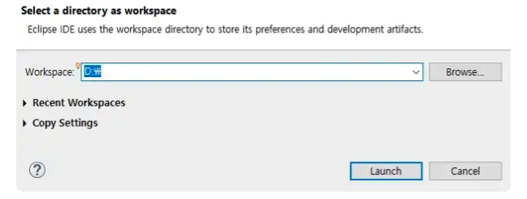
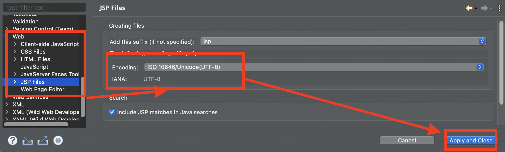
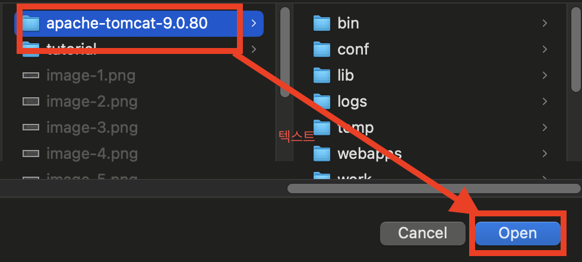
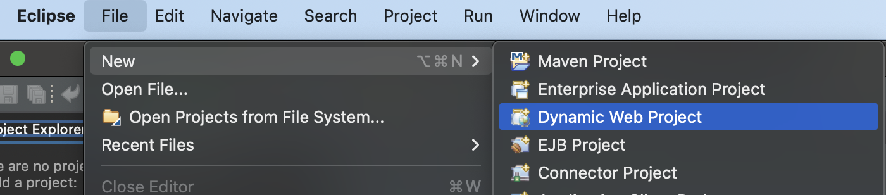
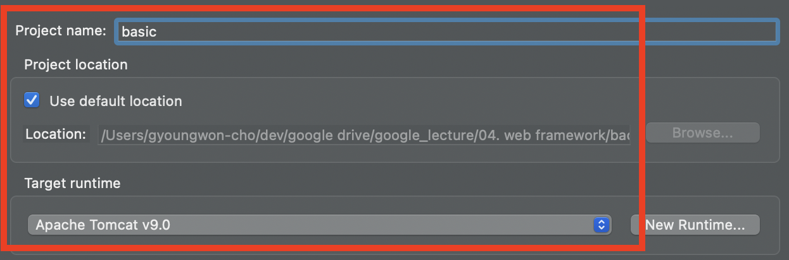
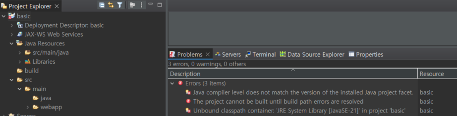
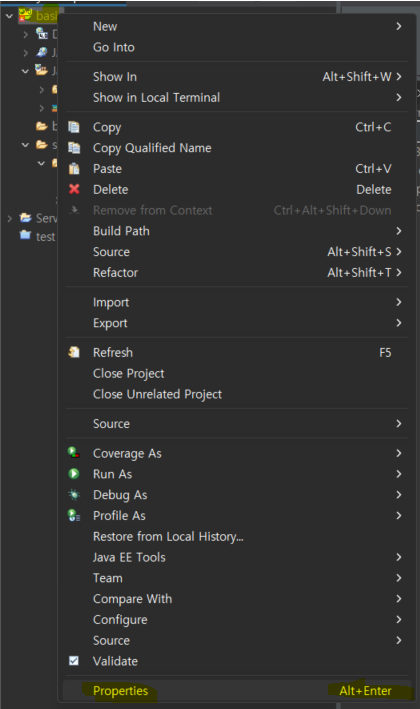
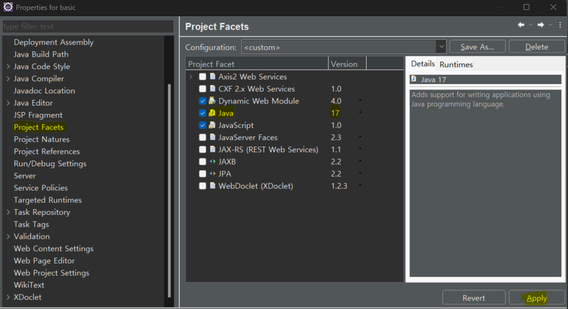
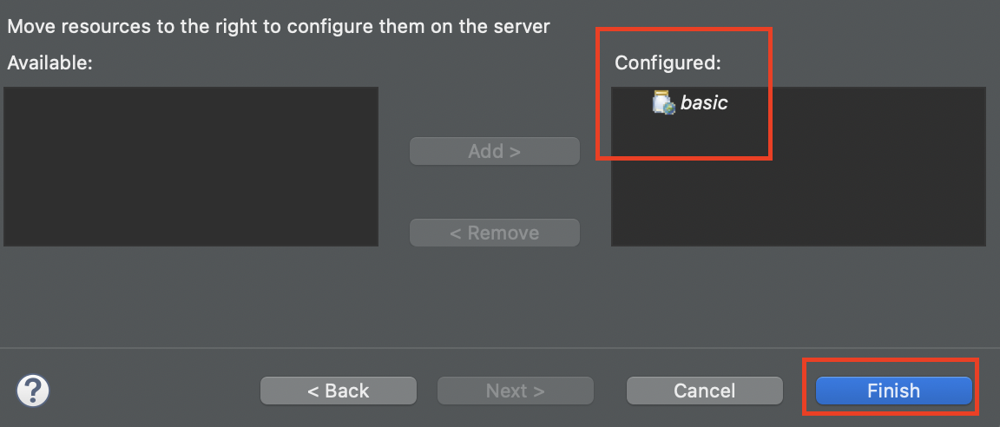

# [이클리스 EE 설치](https://www.eclipse.org/downloads/packages/) 
- [참고문서](https://www.snugarchive.com/blog/java-eclipse-setup/)

---
- 이클립스 다운로드 


---
- 학습용 폴더 이동 > 압출을 풀고 eclipse 실행 


---
- workspace(jsp 공부폴더) 선택 후 lanche 실행 



---
- 아래와 같이 `Eclipse IDE for Enterprise Java`와 같이 나와야 함  


---
- 이클립스 구조 


---
# 이클립스 세팅 


---
## UTF-8로 인코딩 세팅
- General > workspace


---
- Web > CSS


---
- Web > HTML


---
- Web > JSP


---
## 톰켓 서버 세팅 


---


---


---


---


---


---
## 기본 브라우저 크롬으로 설정 


---
# Dynamic Web Project 생성


---


---


---


---


---


---
- [[Error] Java compiler level does not match the version of the installed Java project facet 해결방법](https://hermeslog.tistory.com/248)


---


---
- 설치된 Java버전으로 변경!!



---
- 설치된 Java버전으로 변경!!


---
- 설치된 Java버전으로 변경!!


---
## jsp 파일 생성 


---


---
```html
<%@ page language="java" contentType="text/html; charset=UTF-8"
    pageEncoding="UTF-8"%>
<!DOCTYPE html>
<html>
<head>
<meta charset="UTF-8">
<title>Insert title here</title>
</head>
<body>
안녕하세요~ 첫 번째 예제입니다.
현재시간은 <%= new java.util.Date() %> 입니다.
</body>
</html>
```

---
## 톰캣 서버 실행 

---


---


---


---


---
