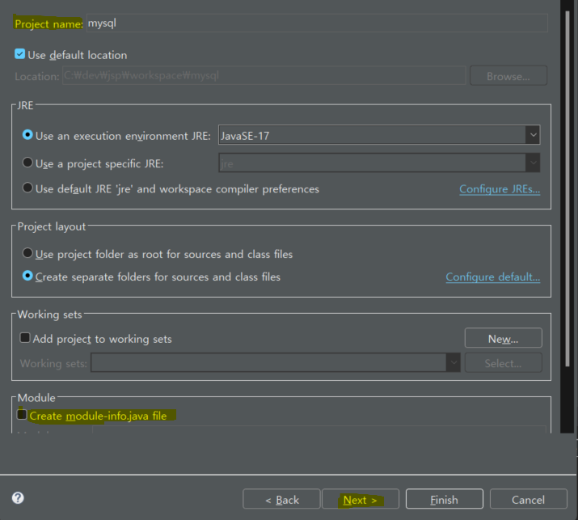
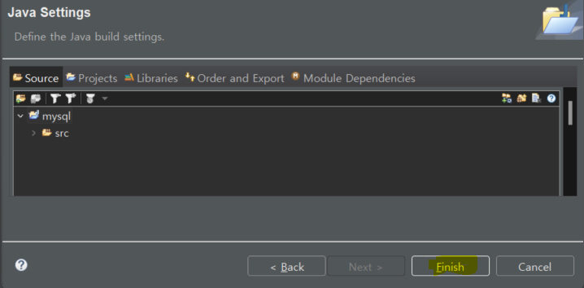
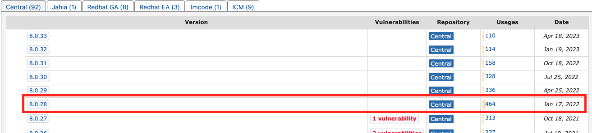
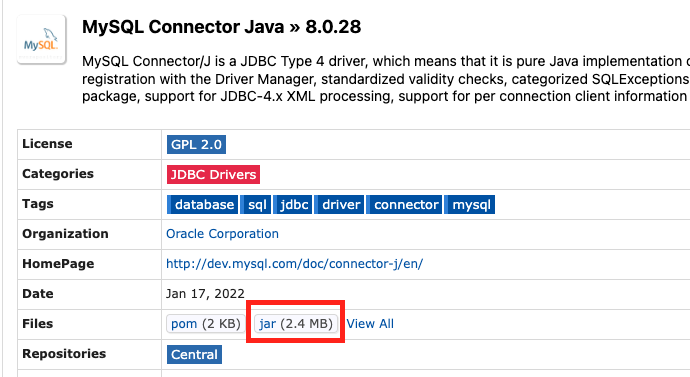
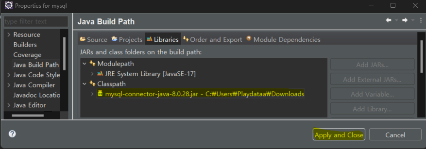

# [Java Project 생성](https://kadosholy.tistory.com/78) 

---

---

---
## [MySQL Connector 다운로드](https://mvnrepository.com/search?q=mysql+jdbc)

---

---
# 프로젝트에 MySQL 라이브러리 추가 

---

---

---

---
# 예제 프로젝트
- javaWithMySQL
    - `ex01.java`: MySQL 접속!!!
    - `ex02.java`: JdbcUtil를 이용하여 MySQL 커낵션 풀 재사용!!!
    - `ex03.java`: 데이터 삽입!!!
    - `ex04.java`: 데이터 조회!!!
    - `ex05.java`: 데이터 수정!!!

