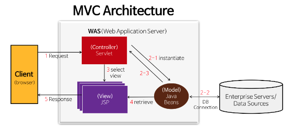
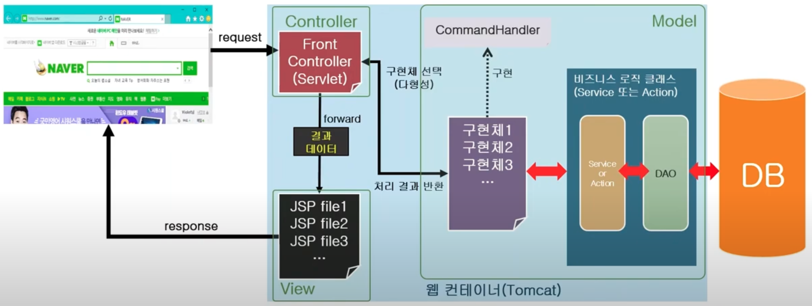

# [Servlet vs JSP](https://gmlwjd9405.github.io/2018/11/04/servlet-vs-jsp.html)
기능의 차이는 없고 역할의 차이만 있다. 

---
## Servlet과 JSP의 개념 
### JSP
- Java 언어를 기반으로 하는 Server Side 스크립트 언어
- HTML 코드 안에 Java 코드
### Servlet
- 웹 기반의 요청에 대한 동적인 처리가 가능한 Server Side에서 돌아가는 Java Program
- Java 코드 안에 HTML 코드 (하나의 클래스)

---
## JSP만을 이용한 모델 

- 특징
  - 배우기 쉽고, 개발 속도가 빠르다.
  - View(화면)와 Controller(비지니스 로직)가 혼재되어 있어 유지 보수가 어렵다. 

---
## Servlet과 JSP를 이용한 MVC 모델

- 특징 
  - JSP와 Servlet을 이용하여 View와 Controller를 분리할 수 있다.
  - MVC 페턴을 통해 유지보수가 편리하다.

---
# [MVC Architecture](https://www.essenceandartifact.com/2012/12/the-essence-of-mvc.html)
기존 하나의 파일에서 구현했던 복잡한 로직을 각 기능(역할)에 맞춰서 파일(또는 클래스)을 분리한 구조입니다.
- 컨트롤러
  - 사용자의 다양한 요청을 받아서 알맞은 모델 또는 뷰에 해당 요청을 전달하는 역할을 합니다. 
- 모델
  - 사용자의 요청에 의해 데이터베이스에서 조회/수정/삭제/저장을 하는 역할을 합니다.
- 뷰
  - 컨트롤러에서 받은 요청에 따라 사용자에게 화면을 전달하는 역할을 합니다.

---


---


---
# Servlet 코드 예제
- web.xml

```xml
<servlet>
  	<!-- 서브릿 이름 -->
    <servlet-name>frontController</servlet-name>
    <!-- 서블릿 컨드롤러 클래스 위치 -->
  	<servlet-class>controller.FrontController</servlet-class> 
  </servlet>
  <servlet-mapping>
    <!-- 메핑될 서브릿 이름 -->
  	<servlet-name>frontController</servlet-name>
    <!-- url 페턴 -->
  	<url-pattern>/</url-pattern>
  </servlet-mapping>
```

---
- Controller class 

```java
public class FrontController extends HttpServlet { // 컨드롤러 클래스는 HttpServlet을 상속받는다!!
	
	private Map<String, CommandHandler> commandHandlerMap = new HashMap<>();

	@Override
	public void init() throws ServletException {
		// 컨트롤러가 관리하고 있는 요청들을 정의한다.
		commandHandlerMap.put("/add", new AddHandler());
		commandHandlerMap.put("/min", new MinHandler());
	}

	@Override
	public void service(HttpServletRequest req, HttpServletResponse resp) throws ServletException, IOException {
		// 사용자의 요청을 받아서 처리하는 함수이다. 
		System.out.println("Controller가 요청 분석 ");
		String requestURI = req.getRequestURI().toString();
		System.out.println("요청 URI: "+requestURI);
		
		String command = requestURI.substring(req.getContextPath().length());
		System.out.println("command: "+command);
		
		CommandHandler handler = null; 
		String viewPage = null; 
		
		if (requestURI.indexOf(req.getContextPath()) == 0) {
			handler = commandHandlerMap.get(command);
			viewPage = handler.handlerAction(req,  resp);
			System.out.println("Model관련 로직 동작 ");
		}
		
		System.out.println("View관련 로직 동작 ");
		req.getRequestDispatcher(viewPage).forward(req, resp);
	}

}
```

---
- 전체 흐름도 




---
# 참고문서
- https://youtu.be/zmt9iMjhx64?si=jY2y28z-ZViRVYm9

