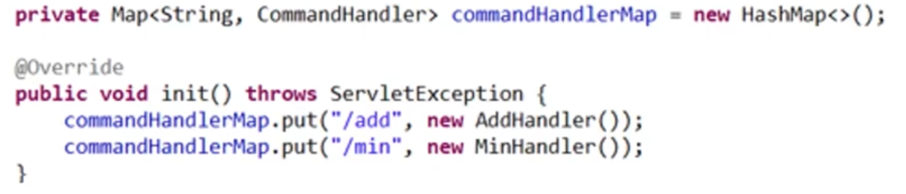

# properties 적용 

---
## 기존 코드 분석 

아래와 같은 경우에는 컨트롤러가 복잡해지고 자주 컴파일을 해야하는 문제가 발생할 수 있다. 
- 만약 컨트롤러가 관리해야할 요청(/add, /min)들이 많아진다면, 
- 또는 컨트롤러에 요청(기능)들을 자주 추가해야 한다면, 

---
## properties 적용 

위와 같이 URL과 핸들러 매핑 정보를 properties파일에서 관리를 한다면, 컨트롤러의 코드 복잡도가 낮아지게 된다. 

---
# 코드 예제 

---
- web.xml 

```xml
  <servlet>
  	<servlet-name>frontController</servlet-name>
  	<servlet-class>controller.FrontController</servlet-class>
  	<init-param>
    <!-- FrontController의 생성함수에서 사용할 이름 -->
  		<param-name>handlerProperties</param-name>
      <!-- properties 파일명과 위치  -->
  		<param-value>/META-INF/handler.properties</param-value>
  	</init-param>
  </servlet>
  <servlet-mapping>
  	<servlet-name>frontController</servlet-name>
  	<url-pattern>/</url-pattern>
  </servlet-mapping>
```

---
- handler.properties 

```properties
/add=controller.AddHandler
/min=controller.MinHandler
```

---
- Controller class 생성함수 

```java
@Override
	public void init() throws ServletException {
		// TODO Auto-generated method stub
		
		// 초기화 파라미터를 이용하여 Properties 불러오기 
		String contextconfigFile = this.getInitParameter("handlerProperties"); // web.xml에 정의된 이름 사용!!
		System.out.println("properties 파일의 상대경로: "+contextconfigFile);
		Properties properties = new Properties();
		FileInputStream fis = null;
		
		try {
			
			// 파일 절대경로 
			String contextConfigFilePath = this.getServletContext().getRealPath(contextconfigFile);
			System.out.println("properties 파일의 절대경로: "+contextConfigFilePath);
			fis = new FileInputStream(contextConfigFilePath);
			properties.load(fis);
		}catch(IOException e) {
			e.printStackTrace();
		}finally {
			if(fis != null) {
				try {
					fis.close();
				} catch (IOException e) {
					e.printStackTrace();
				}
			}
		}
		
		// 핸들러 객체 생성 및 Map에 등록 
		Iterator<Object> propIt = properties.keySet().iterator();
		while(propIt.hasNext()) {
			String command = (String)propIt.next();
			String handlerClassName = properties.getProperty(command);
			
			try {
				Class<?> handlerClass = Class.forName(handlerClassName);
				commandHandlerMap.put(command, (CommandHandler)handlerClass.getDeclaredConstructor().newInstance());
			}catch(Exception e) {
				e.printStackTrace();
			}
		}
```

---
# 전체 코드 구조 


---
# 참고문서 
- https://youtu.be/rovLN4wadCA?si=ZGmiEQnYACT7qCIj