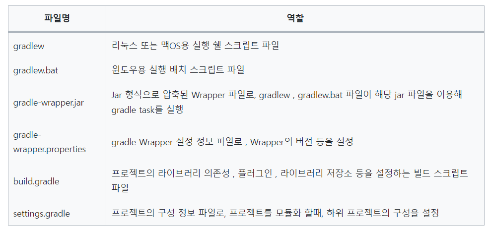
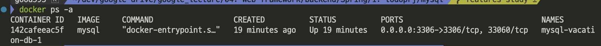
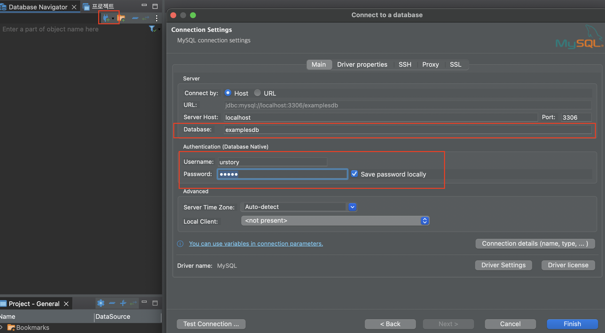
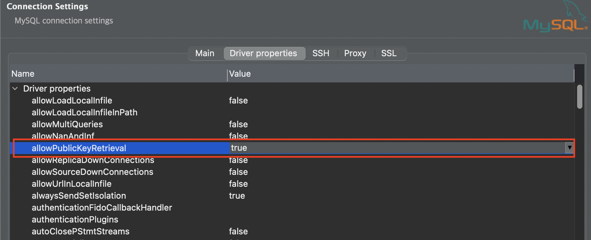

# Spring Boot
- [ToDo App 만들기](https://www.youtube.com/watch?v=A_foK6PnsPs)

---
- spring boot 생성


---

- 설치된 라이브러리 확인


---
## MySQL 설치전 사전작업 
- dbeaver 설치 
- Docker 설치
- mysql 설치 폴더 생성
    - mkdir ./mysql
    - mkdir ./mysql/database 

---
- ./mysql/docker-compose.yml 파일 생성 
```
version: "2"

services:
  vacation-db:
    image: mysql
    restart: always
    environment:
      MYSQL_ROOT_PASSWORD: "root1234"
      MYSQL_DATABASE: "examplesdb"
      MYSQL_USER: "urstory"
      MYSQL_PASSWORD: "u1234"
    command:
      - --character-set-server=utf8mb4
      - --collation-server=utf8mb4_unicode_ci
    volumes:
      - ./database/init/:/docker-entrypoint-initdb.d/
      - ./database/datadir/:/var/lib/mysql
    platform: linux/x86_64
    ports:
      - 3306:3306

```
---

## MySQL 설치
```
> cd ./mysql # docker-compose.yml이 있는 폴더로 이동 
> docker-compose up -d # mysql 생성 및 실행 
> docker ps # 생성된 mysql 확인 
```


---
## MySQL 접속 
- dbeaver를 이용하여 mysql 접속 


---


---
## spring boot에 mysql 설정 
- ./src/resources/application.yml 생성 (application.properties 파일 삭제!!)
```
# Spring Data Source 설정 
spring:
  datasource:
    url: jdbc:mysql://127.0.0.1:3306/examplesdb?userSSL=false&allowPublicKeyRetrieval=true&serverTimezone=Asia/Seoul
    username: urstory
    password: u1234
    driver-class-name: com.mysql.cj.jdbc.Driver

```
