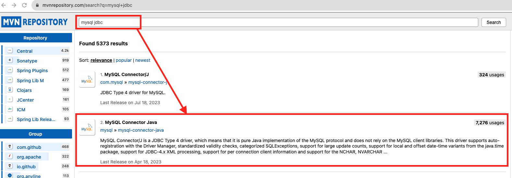
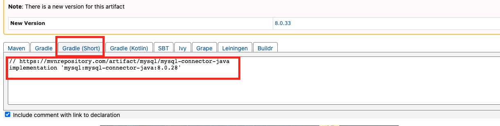

# [Gradle](https://velog.io/@appti/Spring-boot%EC%97%90%EC%84%9C%EC%9D%98-Gradle)
- Gradle은 유연한 오픈 소스 빌드 자동화 도구이다.

---
## Gradel Overview 
- 고성능(High performance)
  - Gradle은 변경 사항으로 인해 다시 실행해야 할 작업들만 실행하여 불필요한 작업을 방지합니다.
  - 빌드 캐시를 사용하여 이전 실행 또는 다른 시스템(공유 빌드 캐시 사용)의 작업 출력을 재사용할 수 있습니다.
- JVM(JVM foundation)
  - Gradle은 JVM에서 실행되므로 JDK(Java Development Kit)가 설치되어 있어야 합니다.
  - 다양한 플랫폼에서 Gradle을 실행할 수 있습니다.

---
- 관례(Conventions)
  - Maven의 규칙 일부를 가져오고 이를 구현하여 Java 프로젝트와 같은 일반적인 유형의 프로젝트를 쉽게 구축할 수 있습니다.
  - Gradle에서 기본으로 제공하는 플러그인을 사용하면 간단하게 빌드 스크립트를 작성할 수 있고, 필요하다면 사용자 정의 플러그인을 생성하는 것 또한 가능합니다.
- 확장성(Extensibility)
  - Gradle을 확장하여 고유한 작업 유형을 제공하거나 모델을 빌드할 수 있습니다.
  - Android 빌드 지원 참조

---
- IDE 지원
  - Android Studio, IntelliJ IDEA, Eclipse 및 NetBeans와 같은 여러 주요 IDE를 사용하여 Gradle 빌드를 가져와 상호 작용할 수 있습니다.
- 통찰력(Insight)
  - Build scan을 통해 빌드 문제를 식별하는 데 사용할 수 있는 빌드 실행에 대한 광범위한 정보를 제공합니다.
  - 빌드 성능과 관련된 문제를 식별하는 데 유용하며, 다른 사람과 공유도 가능합니다.

---
## Gradle 파일 구조 
```
├── build.gradle
├── .gradle
├── gradle 
│     └── wrapper 
│           ├── gradle-wrapper.jar 
│           └── gradle-wrapper.properties
├── gradlew 
├── gradlew.bat 
├── settings.gradle 
```
- build.gradle
  - 프로젝트의 라이브러리 의존성, 플러그인, 라이브러리 저장소 등을 설정할 수 있는 빌드 스크립트 파일이다.
- .gradle 디렉토리
  - 작업(Task) 파일이 생성된다.
---
- gradlew
  - 리눅스 또는 맥OS용 실행 쉘 스크립트 파일이다.
- gradlew.bat
  - 윈도우용 실행 배치 스크립트 파일이다.
- gradle-wrapper.jar
  - JAR 형식으로 압축된 Wrapper 파일이다. gradlew나 gradlew.bat 파일이 프로젝트 안에 설치되는 이 파일을 사용하여 Gradle task를 실행한다.
- gradle-wrapper.properties
  - Gradle Wrapper 설정 정보 파일이다. Wrapper의 버전 등을 설정할 수 있다.
- settings.gradle
  - 프로젝트의 구성 정보 파일이다. 멀티 프로젝트를 구성하여 프로젝트를 모듈화할 경우, 하위 프로젝트의 구성을 설정할 수 있다.

---
# [build.gradle 주요 메서드](https://kotlinworld.com/321)


---
## 라이브러리 추가 방법
1. [maven repository 접속 및 조회](https://mvnrepository.com/search?q=mysql+jdbc)


---
2. 라이브러리 버전 선택 


---
3. 라이브러리 Gradle 복사 


---
4. build.gradle 파일에 라이브러리 적용
```gradle
// 버전은 생략 가능
dependencies {
  ...
  implementation 'mysql:mysql-connector-java'
  ...
}

```


---
# [Gradle build](https://velog.io/@franc/Gradle-%EA%B8%B0%EB%B3%B8%EC%82%AC%EC%9A%A9%EB%B2%95)
```shell
> cd [프로젝트 폴더] # 프로젝트 폴더로 이동 
> gradle clean build  # gradle build
> java -jar ./build/libs/basic-0.0.1-SNAPSHOT.jar # 프로젝트 실행 
```

---
- gradle build


---
- 프로젝트 실행 


