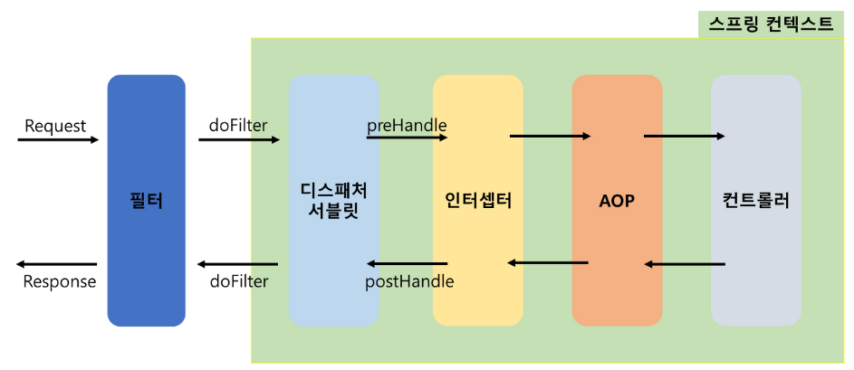

# [Interceptor란?](https://devhj.tistory.com/60)
- Interceptor(인터셉터)는 스프링 프레임워크에서 제공하는 기능으로, 웹 애플리케이션의 요청 처리 과정에서 컨트롤러 호출 전후에 추가적인 작업을 수행할 수 있도록 해줍니다. 

---
### Spring MVC Request Lifecycle

---
### Interceptor를 사용하면 다음과 같은 작업을 수행할 수 있습니다
- 요청 전/후에 공통적으로 처리해야 할 작업, 예를 들어 인증 및 권한 검사, 세션 관리 등을 수행할 수 있습니다.
- 컨트롤러 실행 전/후에 로깅, 성능 측정, 트랜잭션 관리 등의 부가적인 작업을 수행할 수 있습니다.
- 컨트롤러의 결과를 가공하거나 추가 데이터를 주입할 수 있습니다.

---
### Interceptor 주요 메서드
- preHandle():
  - 컨트롤러 실행 전에 호출되는 메서드입니다.
  - 주로 요청 전에 수행해야 하는 사전 처리 작업을 구현합니다.

- postHandle():
  - 컨트롤러 실행 후 뷰가 렌더링되기 전에 호출되는 메서드입니다.
  - 컨트롤러가 실행된 이후에 추가적인 처리 작업을 수행할 수 있습니다.

- afterCompletion():
  - 뷰가 렌더링된 후에 호출되는 메서드입니다.
  - 요청의 완료 후에 처리해야 하는 작업을 구현할 수 있습니다.

---
### Filter와 차이점
- Filter
  - Filter는 서블릿 컨테이너에서 동작하므로, 웹 애플리케이션 전체에 대해 적용됩니다. 따라서 Filter는 모든 요청과 응답에 대해 적용됩니다.
- Interceptor
  - Interceptor는 Spring MVC 프레임워크에서 동작하므로, Spring MVC 컨텍스트에만 영향을 미칩니다. 즉, 요청이 Spring MVC 컨트롤러로 라우팅될 때만 Interceptor가 적용됩니다.

---
# [spring initializr](https://start.spring.io/)

