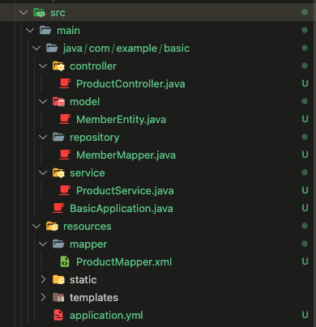

## 1. 테이블 생성 
```sql
create table member (
	member_id bigint auto_increment primary key,
	member_name varchar(10) not null,
	member_add varchar(100),
	member_age int
);
```
---
## 2. model 생성 
```java
@Getter
@Setter
@NoArgsConstructor
@AllArgsConstructor
@ToString
public class MemberEntity {

  private int memberId;
  private String memberName;
  private String memberAddr;
  private int memberAge;

}
```

---
## 3. repository 생성 
```java
@Mapper
public interface MemberMapper {

  List<MemberEntity> selectEntityAll(@Param("memberName") String memberName, @Param("memberAddr") String memberAddr);
  MemberEntity selectEntityById(@Param("memberId") String memberId);
  int insertEntity(MemberEntity memberEntity);
  int updateEntity(MemberEntity memberEntity);
  int deleteEntity(@Param("memberId") String memberId);
}
```

---
## 4. mapper.xml 생성 
```xml
<?xml version="1.0" encoding="UTF-8" ?>
<!DOCTYPE mapper PUBLIC "-//mybatis.org//DTO Mapper 3.0//EN" "http://mybatis.org/dtd/mybatis-3-mapper.dtd">

<mapper namespace="com.example.basic.repository.MemberMapper">  
  <select id="selectEntityById" resultType="MemberEntity">
    ...
  </select>

  <insert id="insertEntity" parameterType="MemberEntity">
    ...
  </insert>

  <update id="updateEntity" parameterType="MemberEntity">
    ...
  </update>

  <delete id="deleteEntity">
    ...
  </delete>

</mapper>
```

---


