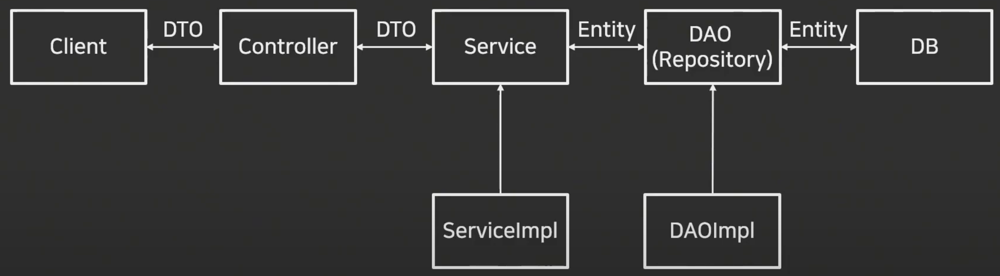

# MySQL 설치
- dbeaver 설치 
- Docker 설치
- mysql 설치 폴더 생성
    - mkdir ./mysql
    - mkdir ./mysql/database 

---
- ./mysql/docker-compose.yml 파일 생성 
```
version: "2"

services:
  vacation-db:
    image: mysql
    restart: always
    environment:
      MYSQL_ROOT_PASSWORD: "root1234"
      MYSQL_DATABASE: "examplesdb"
      MYSQL_USER: "urstory"
      MYSQL_PASSWORD: "u1234"
    command:
      - --character-set-server=utf8mb4
      - --collation-server=utf8mb4_unicode_ci
    volumes:
      - ./database/init/:/docker-entrypoint-initdb.d/
      - ./database/datadir/:/var/lib/mysql
    platform: linux/x86_64
    ports:
      - 3306:3306
```

---
### MySQL 실행
```
> cd ./mysql # docker-compose.yml이 있는 폴더로 이동 
> docker-compose up -d # mysql 생성 및 실행 
> docker ps # 생성된 mysql 확인 
```
### Spring Boot에 MySQL 적용
- ./src/resources/application.yml 생성 (application.properties 파일 삭제!!)
```
# Spring Data Source 설정 
spring:
  datasource:
    url: jdbc:mysql://127.0.0.1:3306/examplesdb?userSSL=false&allowPublicKeyRetrieval=true&serverTimezone=Asia/Seoul
    username: urstory
    password: u1234
    driver-class-name: com.mysql.cj.jdbc.Driver

```

---
# DTO, DAO, Repository, Entity
- Spring Boot 서비스 구조 



---
### Entity(Domain)
- 데이터베이스에 쓰일 컬럼과 여러 엔티티 간의 연관관계를 정의
- 데이터베이스의 테이블을 하나의 엔티티로 생각해도 무방함
- 이 클래스의 필도는 각 테이블 내부의 컬럼(Column)을 의미

### Repository
- Entity에 의해 생성된 데이터베이스에 접근하는 메소드를 사용하기 위한 인터페이스
- Service와 DB를 연결하는 고리의 역할을 수행
- 데이터베이스에 적용하고자 하는 CRUD를 정의하는 영역 

---
### DAO(Data Access Object)
- 데이터베이스에 접근하는 객체를 의미
- Service가 DB에 연결할 수 있게 해주는 역할 
- DB를 사용하여 데이터를 조회하거나 조작하는 기능을 전담 

### DTO(Data Transfer Object)
- DTO는 VO(Value Object)로 불리기도 하며, 계층간 데이터 교환을 위한 객체를 의미 
- VO의 경우 Read Only의 개념을 가지고 있음 

---
# ORM(Object Relational Mapping)
- 어플리케이션의 객체와 관계형 데이터베이스의 데이터를 자동으로 매핑해주는 것을 의미 
  - Java의 데이터 클래스와 관계형 데이터베이스의 테이블을 매핑 
- 객체지향 프로그래밍과 관계형 데이터베이스의 차이로 발생하는 제약사항을 해결해주는 역할을 수행 
- 대표적으로 JPA가 있음 

---


---
## ORM의 장점 
- SQL 쿼리가 아닌 직관적인 코드로 데이터를 조작할 수 있음
  - 개발자가 보다 비즈니스 로직에 집중할 수 있음
- 재사용 및 유지보수가 편리
  - ORM은 독립적으로 작성되어 있어 재사용이 가능
  - 매핑정보를 명확하게 설계하기 때문에 따로 데이터베이스를 볼 필요가 없음
- DBMS에 대한 종속성이 줄어듬
  - DBMS를 교체하는 작업을 비교적 적은 리스크로 수행 가능 

---
## ORM의 단점
- 복잡성이 커질 경우 ORM만으로 구현하기 어려움
  - 직접 쿼리를 구현하지 않아 복잡한 설계가 어려움
- 잘못 구현할 경우 속도 저하 발생
- 대형 쿼리는 별도의 튜닝이 필요할 수 있음 

---
## JPA(Java Persistance API)
- JPA는 ORM과 관련된 인터페이스의 모음
- Java 진영에서 표준 ORM으로 채택되어 있음
- ORM이 큰 개념이라고 하면, JPA는 더 구체화 시킨 스펙을 포함하고 있음 

---
### Hibernate
- ORM Framework 중 하나
- JPA의 실제 구현체 중 하나이며, 현재 JPA 구현체 중 가장 많이 사용됨 


---
### Spring Data JPA
- Spring Framework에서 JPA를 편리하게 사용할 수 있게 지원하는 라이브러리
  - CRUD 처리용 인터페이스 제공 
  - Repository 개발 시 인터페이스만 작성하면 구현 객체를 동적으로 생성해서 주입 
  - 데이터 접근 계층 개발시 인터페이스만 작성해도 됨 


---
### [JPA Query Method](https://velog.io/@seongwon97/Spring-Boot-Query-Method)
스프링 데이터 JPA는 메소드 이름으로 쿼리 생성을 하는 쿼리 메소드 기능을 제공하는데
- 쿼리 메서드는 메서드의 이름을 분석해서 JPQL 쿼리를 실행한다.
- 쿼리 메서드를 활용하면 쉽게 쿼리문을 만들어 사용할 수 있다. 

---
#### Select
```java
    User findByEmail(String email);
    User getByEmail(String email);
    User readByEmail(String email);
    User queryByEmail(String email);
    User searchByEmail(String email);
    User streamByEmail(String email);
    User findUserByEmail(String email);
```

---
#### And, Or 
```java
    List<User> findByNameAndEmail(String name, String email);
    List<User> findByNameOrEmail(String name, String email);
```

#### is(Not)Empty, is(Not)Null
```java
    List<User> findByIdIsNotNull();  // Id값에 Null값이 없는지?
    List<User> findByAddressIsNotEmpty();
```

---
#### in 
```java
 List<User> findByNameIn(List<String> name);
```
#### StringWith/EndingWith/Contains 
```java
    List<User> findByNameStartingWith(String name);
    List<User> findByNameEndingWith(String name);
    List<User> findByNameContains(String name);
    List<User> findByNameLike(String name);
```

---
#### Is, Equals 
```java
    Set<User> findUserByNameIs(String name);
    Set<User> findUserByName(String name);
    Set<User> findUserByNameEquals(String name);
```
#### Sorting
```java
    List<User> findTop1ByNameOrderByIdDesc(String name); 
    // Id로 내림차순으로 정렬 후 입력 name과 같은 것의 맨 위의 있는 값을 뽑아온다.
    
    List<User> findFirst2ByNameOrderByIdDescEmailAsc(String name);
    // 여러개의 조건으로 find하는 경우는 And를 사용하였으나 정렬 조건으로 여러개의 값을 사용하는 경우는 And를 사용하지 않고 조건을 이어서 붙인다.

    List<User> findFirstByName(String name, Sort sort);
```

---
# 소스
- https://github.com/Around-Hub-Studio/AroundHub_SpringBoot/tree/master

# 참고자료
- [1편](https://www.youtube.com/watch?v=7t6tQ4KV37g&t=498s)
- [2편](https://www.youtube.com/watch?v=1Jc-SD9YrV4)

# 단축키
- Override 단축키
  - 컨트롤러 + .


