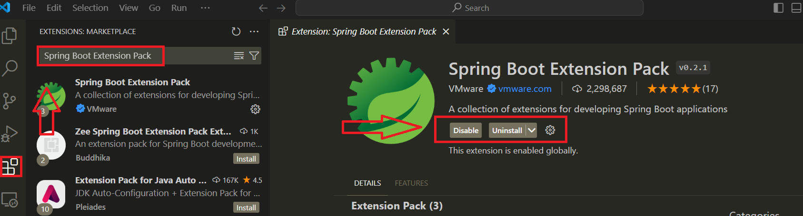
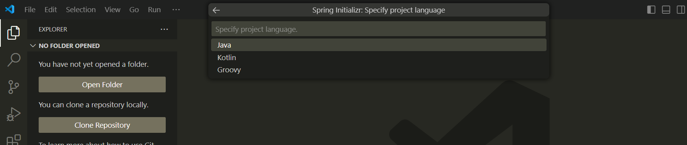
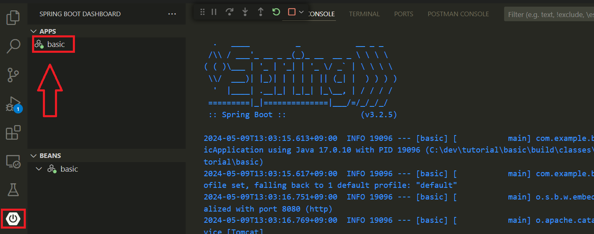

# Spring Boot 생성하기 

---
### 단계1: [Spring Boot Initializr 확인](https://start.spring.io/)


---
### 단계2: Install SpringBoot Extension Pack By VSCode
```shell
Spring Boot Extension Pack
```


---
### 단계3: Spring Boot Initializr By VSCode
```shell
ctrl + shift + p
Spring Initializr # 입력
```


---
### 단계4: Spring Boot version


---
### 단계5: Project Language


---
### 단계6: Group Id


---
### 단계7: Actifact Id(프로젝트명)


---
### 단계8: Packaging type


---
### 단계8: Java version


---
### 단계9: Dependencies


---
### 단계10: 생성될 프로젝트가 포함될 폴더 선택 


---
### 단계11: Java: Ready될때까지 대기 


---
### 단계12: SpringBoot Start!!


---
# logging
- @Slf4j

# 단축키
- Override 단축키
  - Ctr + .

- 자동 import 단축키 
  - Alt + Shift + o

---
# 참고문서
### marp with markdown
- https://velog.io/@oen/Marp-for-VS-Code-%EB%A7%88%ED%81%AC%EB%8B%A4%EC%9A%B4%EC%9C%BC%EB%A1%9C-%EC%9E%91%EC%84%B1%ED%95%B4%EC%84%9C-PPT-%EB%A7%8C%EB%93%A4%EA%B8%B0
### vscode 세팅
- https://www.youtube.com/watch?v=XfWn-L-lgDg
### Springboot Security
- https://www.youtube.com/watch?v=GEv_hw0VOxE&list=PL93mKxaRDidERCyMaobSLkvSPzYtIk0Ah