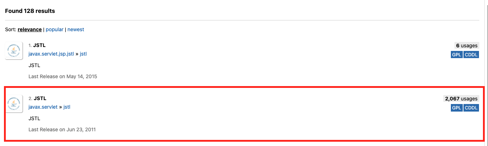
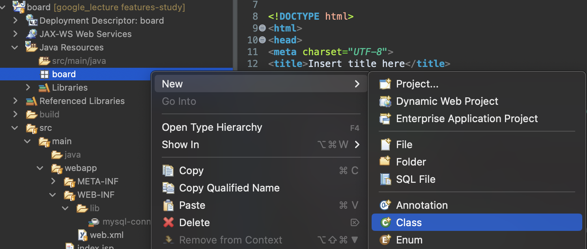
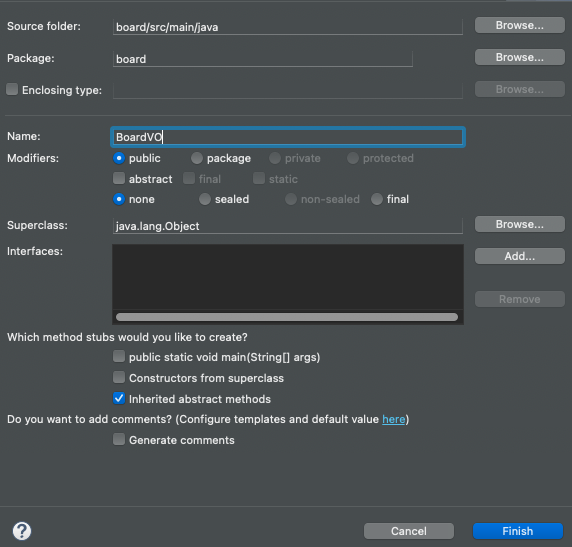

# [JSTL 사용법](https://daesuni.github.io/jstl/)
- JSTL은 사용하기 전에 JSP에 추가해줘야 한다.
```jsp
<% @taglib uri="http://java.sun.com/jstl/core" prefix="c" %>
```

- 사용법 예시 
```jsp
<c:if test="${param.loginFail eq 'true'}">
  <div class="login-fail">아이디 혹은 비밀번호가 일치하지 않습니다.</div>
</c:if>
```

---
## JSTL 태그 


---
## [JSTL 라이브러리 추가](https://mvnrepository.com/search?q=jstl) 


---
# BoardVO 생성 

---


---


---


---
- BoardVO.java 

```java
package board;

import java.util.Date;

public class BoardVO {

	private int num;
	private String title;
	private String writer;
	private String content;
	private Date reg_date;
	private int cnt;
  
  // 생성자 추가 

  // getter/setter 메소드 추가 

  // toString 메소드 추가 
}
```

---
# [Connection Pool](https://youtu.be/Jc9UTY_lcrY?si=mBqd9SwL3orkn1aC)

- META-INF/context.xml

```xml
<?xml version="1.0" encoding="UTF-8"?>
<Context>
  <Resource name="jdbc/board" auth="Container" type="javax.sql.DataSource"
               maxActive="100" maxIdle="30" maxWait="10000"
               username="urstory" password="u1234" driverClassName="com.mysql.jdbc.Driver"
               url="jdbc:mysql://localhost:3306/examplesdb"/>
</Context>

```

- WEB-INF/web.xml

```xml
<?xml version="1.0" encoding="UTF-8"?>
<web-app xmlns:xsi="http://www.w3.org/2001/XMLSchema-instance" xmlns="http://xmlns.jcp.org/xml/ns/javaee" xsi:schemaLocation="http://xmlns.jcp.org/xml/ns/javaee http://xmlns.jcp.org/xml/ns/javaee/web-app_4_0.xsd" id="WebApp_ID" version="4.0">
  <display-name>board</display-name>
  
  <welcome-file-list>
    <welcome-file>index.jsp</welcome-file>
  </welcome-file-list>
  
  <resource-ref>
	<description>DB Connection</description>
	<res-ref-name>jdbc/board</res-ref-name>
	<res-type>javax.sql.DataSource</res-type>
	<res-auth>Container</res-auth>
  </resource-ref>
</web-app>

```

---
- common/JdbcUtil.java

```java

import java.sql.*;
import javax.naming.*;

public class JdbcUtil {

	private static JdbcUtil instance = new JdbcUtil();
	private static DataSource ds;
	
	static {
		try {
			
			Class.forName("com.mysql.jdbc.Driver");
			System.out.println("드라이버 로딩 성공 ");
			
			InitialContext ctx = new InitialContext();
			Context envContext  = (Context)ctx.lookup("java:/comp/env");
			ds = (DataSource)envContext.lookup("jdbc/board");
			System.out.println("Connection Pool 생성 ");
		} catch(ClassNotFoundException e) {
			e.printStackTrace();
		} catch(NamingException e) {
			e.printStackTrace();
		}
	}
	
	private JdbcUtil() {}
	
	public static JdbcUtil getInstance() {
		return instance;
	}
	
	public Connection getConnection() throws SQLException {
		return ds.getConnection(); //Pool에서 커넥션 반환 
	}
}

```

---
- board/list.jsp 

```jsp
<%@ page language="java" contentType="text/html; charset=UTF-8"
    pageEncoding="UTF-8" import="board.*, java.util.List" %>
    
<%@ taglib uri="http://java.sun.com/jsp/jstl/core" prefix="c" %>
<%
	BoardDao dao = new BoardDao();
	List<BoardVO> lst = dao.selectAll();
	
	pageContext.setAttribute("boards", lst);
%>

<!DOCTYPE html>
<html>
<head>
<meta charset="UTF-8">
<title>게시글 목록</title>
</head>
<body>
	<h2>게시글 목록</h2>
	<c:forEach var="board" items="${boards}">
		<p>${board}</p>
	</c:forEach>
</body>
</html>
```

---

