# [JSP(Java Server Pages)](https://devlog-wjdrbs96.tistory.com/152)
- JSP는 Java Server Pages 의 약자이며 HTML 코드에 JAVA 코드를 넣어 동적 웹페이지를 생성하는 웹어플리케이션 도구이다. 
- JSP가 실행되면 자바 서블릿(Servlet)으로 변환되며 웹 어플리케이션 서버에서 동작되면서 필요한 기능을 수행하고 
	- 그렇게 생성된 데이터를 웹페이지와 함께 클라이언트로 응답한다.


---
# JSP 파일 구조

---
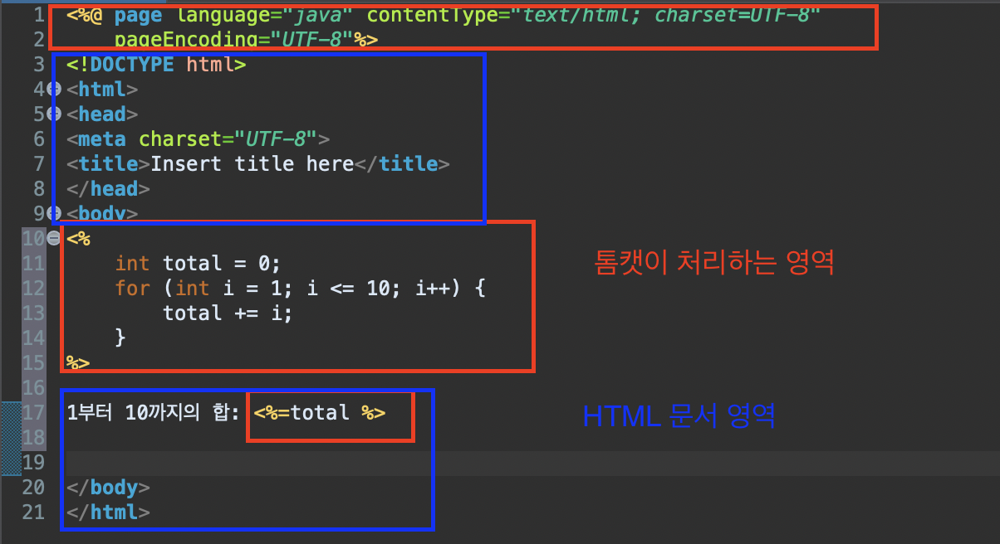

---
- 결과 확인 


---
# JSP 기본문법 

```jsp
<%@ page language="java" contentType="text/html; charset=UTF-8"
    pageEncoding="UTF-8"%>
<!DOCTYPE html>
<html>
<head>
<meta charset="UTF-8">
<title>JSP 기본문법</title>
</head>
<body>
<%
	//Scriptlet: 자바코드를 작성할 수 있는 영역(연산, 처리 기능 정의)
	String str = "스크립틀릿 입니다.";
	String comment = "주석";
%>

<!-- 표현식: 값을 출력(처리, 연산 코드 사용 불가)  -->
선언문: <%= declration %> <br/>
스크립틀릿: <%= str %> <br/>
<!-- <%= comment %>  -->  
<%-- <%= comment %> --%>

<%!
	// 선언문 (멤버필드, 멤버 메서드 정의)
	String declration = "선언문";
%>

</body>
</html>
```

---
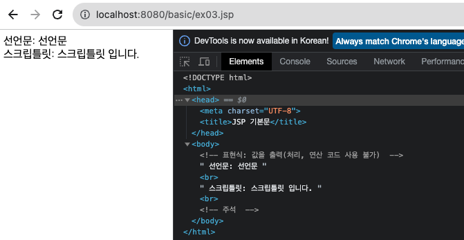

---
# [JSP Life Cycle](https://youtu.be/R2nQxGVH80w?si=BJeh_Q23EidpRrH0)

---

## 1. 작동 원리 설명
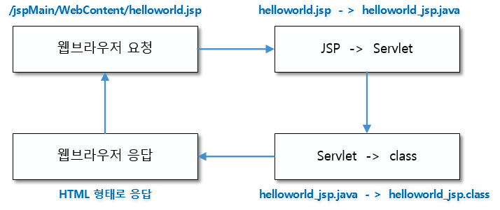


---
### 1-1. 브라우저(클라이언트)에서 서버로 요청 
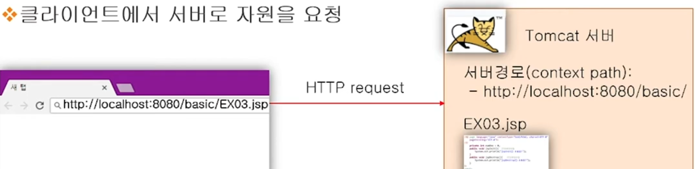

---
### 1-2. 서버에서 jsp파일을 java파일로 생성 
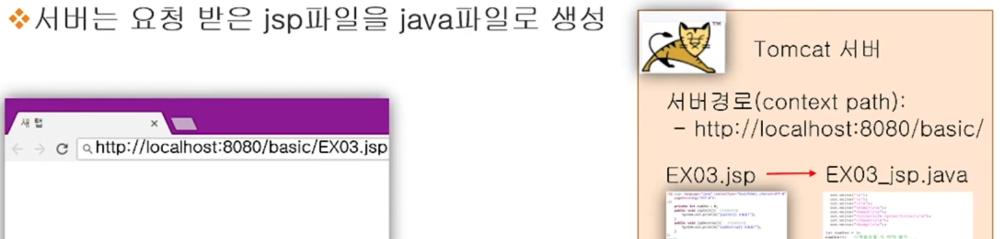

---
- jsp 선언문 영역 -> java


---
- jsp Scriptlet 영역 -> java

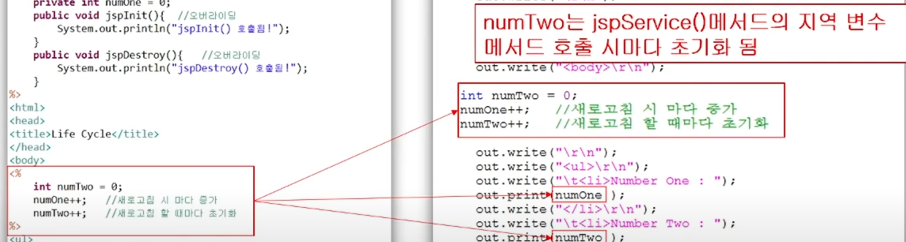

---
### 1-3. java파일을 컴파일 (class 파일 생성)


---
### 1-4. class file을 메모리에 load(서블릿 객체 생성)


---
### 1-5. 톰캣 객체 생성 후 jsplnit() 메서드 호출 
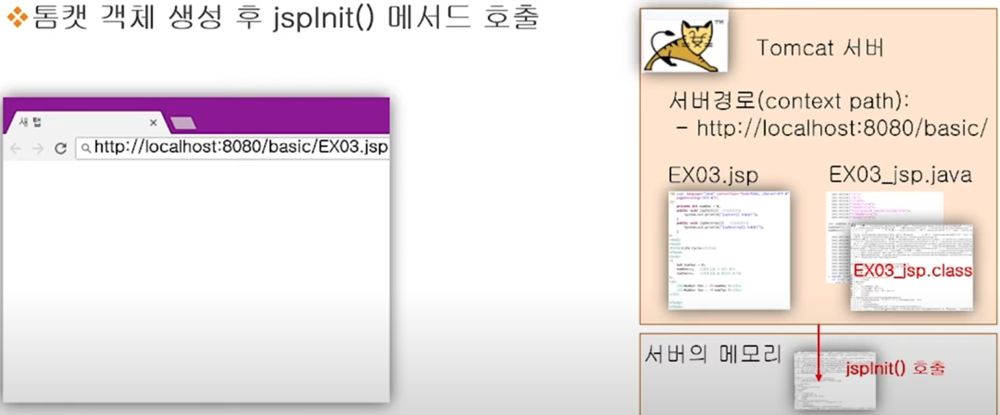

---
### 1-6. jspService() 메서드 호출 


---
### 1-7. 다시 HTTP request 요청한 경우 
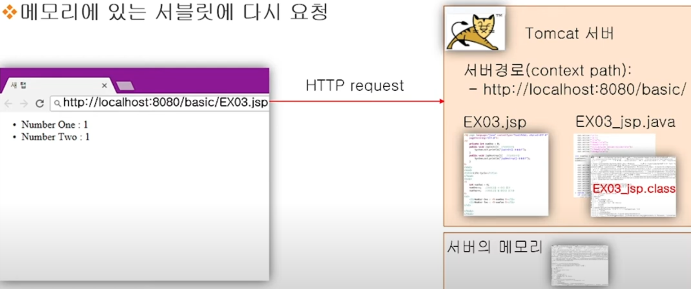

---
- java파일의 수정이 없는 경우 
  - jspService() 메서드만 호출 


---
- java파일의 수정이 있는 경우 
  - jspDestroy() 메서드 호출 > 메모리에 있는 객체 삭제 

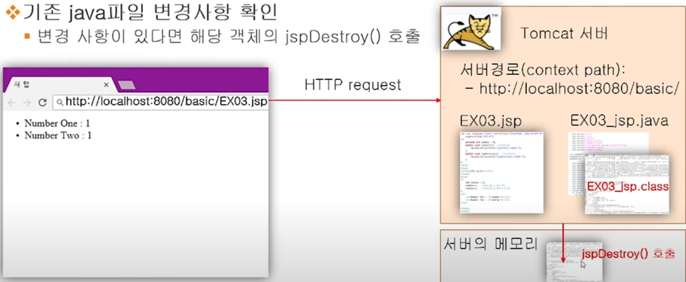

---
- 객체 삭제 후 다시 jsp -> java -> class 등 작업 진행 

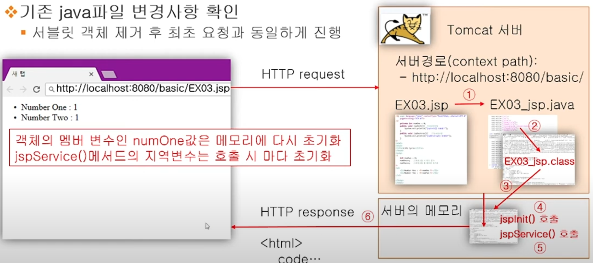

---
## 2. 테스트 

---
### 2-1. jsp 테스트 파일 
```jsp
<body>
<%!
	// 선언문 영역 

	private int num1 = 0;
	public void jspInit() { // 오바라이딩 
		System.out.println("jspInit() 호출됨");
	}
	
	public void jspDestroy() { // 오바라이딩 
		System.out.println("jspDestroy() 호출됨");
	}
%>

<%
	// 연산 영역 

	int num2 = 0;
	num1++;
	num2++;
	
	// 서버톰캣에서 확인 
	System.out.println("num1: "+num1);
	System.out.println("num2: "+num2);
%>

<!-- 브라우저 영역  -->
<ul>
	<li>>num1: <%= num1 %></li>
	<li>>num2: <%= num2 %></li>
</ul>

</body>
```

---
### 2-2. 실행 결과(java 파일 수정하지 않은 경우) 
- num1은 요청을 할 때마다 값이 증가함 
  - 선언문 영역에 선언된 변수는 메모리에 올라감 
- num2는 요청을 여러번 하더라도 값이 변하지 않음 
  - 연산 영역에는 매번 요청을 할 때 새롭게 연산함 

---
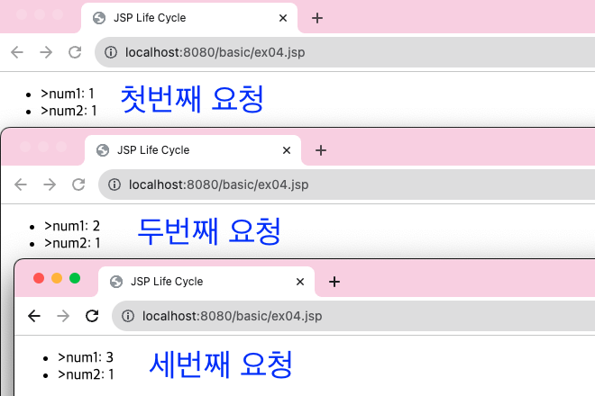

---
- 서버 호출 메세지 


---
### 2-3. 실행 결과(java 파일 수정한 경우)
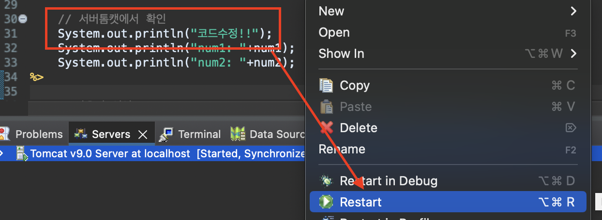

---


---
## 3. 톰캣 서버에서 java, class 파일 확인 


---
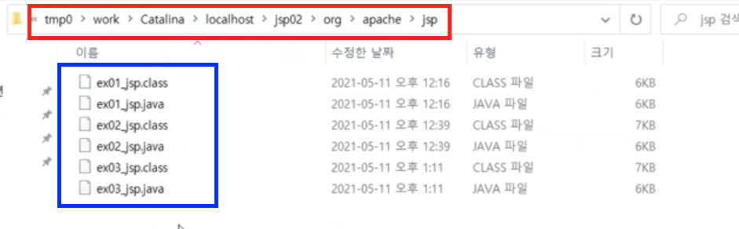


