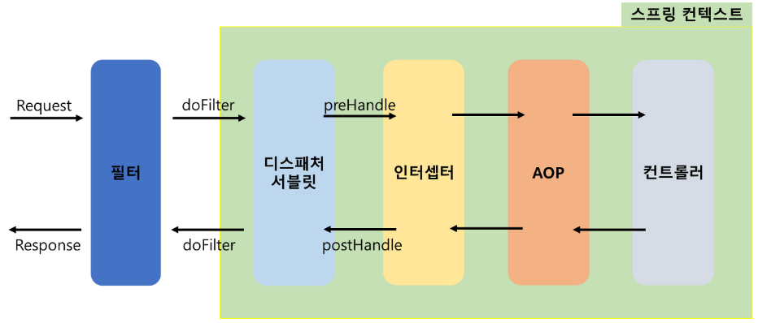
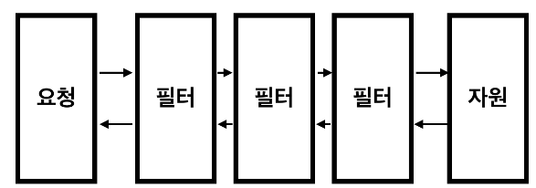

# [Filter란](https://devhj.tistory.com/59)
- 필터는 디스패처서블릿에 요청이 전달되기 전/후 에 url 패턴에 맞는 모든 요청에 대해 부가작업을 처리 할 수 있는 기능을 제공합니다.
- 필터는 Request와 Response를 조작할 수 있지만, 인터셉터는 조작 불가능

---
- Filter는 FilterChain(필터 체인)을 통해 여러 필터가 연쇄적으로 동작하게 할 수 있습니다.

---
### 필터 사용법 
- 요청/응답 로깅: 요청 및 응답 내용을 기록하거나 모니터링하는 용도로 사용할 수 있습니다.
- 인증 및 권한 부여: 요청에 대한 인증 및 권한 부여 작업을 수행할 수 있습니다.
- 데이터 변환: 요청 데이터나 응답 데이터를 변환하거나 형식을 조작할 수 있습니다.
- 캐싱: 응답을 캐시하여 성능을 향상시킬 수 있습니다.
예외 처리: 예외 상황에 대한 처리를 수행할 수 있습니다.

---
### 주요 메소드
- init(): 필터 인스턴스 초기화 시 실행되는 메서드
- doFilter(): 클라이언트의 요청/응답 처리 시 실행되는 메서드
- destroy(): 필터 인스턴스가 제거될 때 실행되는 메서드

---
# [spring initializr](https://start.spring.io/)

