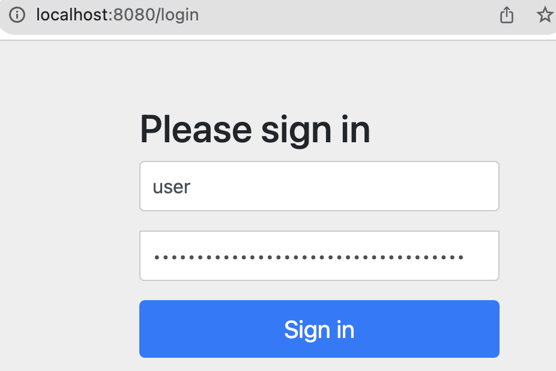
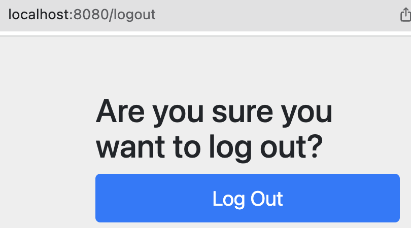

# [인증(Authorization)과 인가(Authentication)](https://velog.io/@djaxornwkd12/%EC%9D%B8%EC%A6%9DAuthentication%EC%9D%B8%EA%B0%80Authorization%EB%9E%80-%EB%AC%B4%EC%97%87%EC%9D%B8%EA%B0%80)
- 인증(Authorization)
  - 해당 사용자가 본인이 맞는지를 확인하는 절차
- 인가(Authorization)
  - 인증된 사용자가 요청한 자원에 접근 가능한지를 결정하는 절차 


---

# [Spring Security](https://nahwasa.com/entry/%EC%8A%A4%ED%94%84%EB%A7%81%EB%B6%80%ED%8A%B8-30%EC%9D%B4%EC%83%81-Spring-Security-%EA%B8%B0%EB%B3%B8-%EC%84%B8%ED%8C%85-%EC%8A%A4%ED%94%84%EB%A7%81-%EC%8B%9C%ED%81%90%EB%A6%AC%ED%8B%B0)
- Spring Security는 Spring 기반의 `애플리케이션의 보안(인증과 권한, 인가 등)을 담당하는 스프링 하위 프레임워크`이다. 
- Spring Security는 `인증과 권한에 대한 부분을 Filter 흐름에 따라 처리`하고 있다. 
- Spring Security는 보안과 관련해서 쳬계적으로 많은 옵션을 제공해주기 때문에 개발자 입장에서 일일이 보안관련 로직을 작성하지 않아도 된다는 장점이 있다. 

---
## 초기 화면 및 비번 

### 초기 보안 비밀번호 확인 


---
### 초기 로그인 화면


---
### 초기 로그아웃 화면 


---
## [Spring Security Configuration(스프링 보안 설정)](https://docs.spring.io/spring-security/reference/migration-7/configuration.html#_use_the_lambda_dsl)

---
### SecurityConfig

```java

@Configuration
@EnableWebSecurity  // 스프링 시큐리티 필터가 스프링 필터체인에 등록이 됩니다.
@EnableMethodSecurity(securedEnabled = true, prePostEnabled = true) // @Secured 어노테이션 활성화, @PreAuthorize 어노테이션 활성화  
public class SecurityConfig {
  
  @Bean // 해당 메서드의 리턴되는 오브젝트를 IoC로 등록해준다.
  public BCryptPasswordEncoder encodePwd() {
    return new BCryptPasswordEncoder();
  }

  // Configuring HttpSecurity
  @Bean
  public SecurityFilterChain filterChain(HttpSecurity http) throws Exception {

    http.csrf(AbstractHttpConfigurer::disable);
    http
      .authorizeHttpRequests(authorize -> authorize
        .requestMatchers("/user/**").authenticated() // 인증이되면 접근 가능 
        .requestMatchers("/manager/**").hasAnyAuthority("ADMIN", "MANAGER") // 인증&인가가 되면 접근 가능 
        .requestMatchers("/admin/**").hasAnyAuthority("ADMIN") // 인증&인가가 되면 접근 가능 
        .anyRequest().permitAll() // 누구나 접근 가능 
      )
      .formLogin(formLogin -> formLogin
        .loginPage("/loginForm")
        .loginProcessingUrl("/login") // login 주소가 호출이 되면, 시큐리티가 로그인 진행 
        .defaultSuccessUrl("/") // 시큐리티 로그인 성공시 해당 url 주소로 이동 
        .permitAll()
      );

    return http.build();
  }
  
}

```

---
### UserDetails
- Security Sessio -> Authentication -> UserDetails(정의) 

```java
public class PrincipalDetails implements UserDetails {

  private User user;

  public PrincipalDetails(User user) {
    this.user = user;
  }

  @Override
  public Collection<? extends GrantedAuthority> getAuthorities() {
    // TODO Auto-generated method stub
    Collection<GrantedAuthority> collect = new ArrayList<>();
    collect.add(new GrantedAuthority() {

      @Override
      public String getAuthority() {
        // TODO Auto-generated method stub
        return user.getRole();
      }
      
    });

    return collect;
  }
 ...
}
```

---
### UserDetailsService
- Security Sessio -> Authentication -> UserDetails(생성)

```java
@Service
public class PrincipalDetailsService implements UserDetailsService {

  @Autowired
  private UserRepository userRepository;

  // 시큐리티 session -> Authentication -> UserDetails 
  @Override
  public UserDetails loadUserByUsername(String username) throws UsernameNotFoundException {
    // TODO Auto-generated method stub
    User userEntity = userRepository.findByUsername(username);
    log.info("[PrincipalDetailsService][loadUserByUsername] start");
    if (userEntity != null) {
      log.info(userEntity.toString());
      return new PrincipalDetails(userEntity);
    }

    return null;
  }
  
}
```


---

# logging
- @Slf4j
