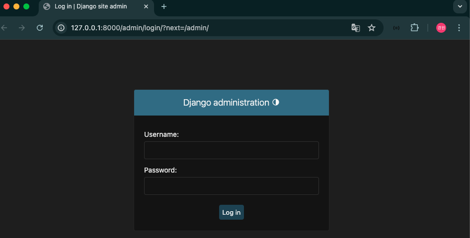

### 단계1: Create Django
1. 가상환경 만들자
2. 장고 프로젝트 생성
3. 장고 앱 생성 
4. templates 설정
5. static 설정

---
### 단계2: 서버 기동
- 마이그레이션(migration)
    - 테이블 및 필드의 생성, 삭제, 변경 등과 같은 스키마 정보에 대한 변경사항을 저장(기억)
    - app 폴더 아래에 migrations 폴더에 마이그레이션 정보 저장 
```shell
$ (.venv) python manage.py makemigrations 
```
- Database에 마이그레이션 정보 반영 
    - 마이크레이션에 저장된 스키마 정보를 이용하여 Database의 테이블 생성/삭제/변경 진행 
```shell
$ (.venv) python manage.py migrate
```
- server 실행 
```shell
$ (.venv) python manage.py runserver
``` 
---
### 단계3: 관리자 페이지 접속하기 
- config.urls.py
  - 관리자 페이지 접속 정보를 확인할 수 있음
```python
from django.contrib import admin
from django.urls import path

urlpatterns = [
    path("admin/", admin.site.urls),
]
```

---
- [관리자 페이지 접속](http://127.0.0.1:8000/admin/)



---
### 단계4: 관리자 계정 생성을 위한 테이블 생성 
- Database에 마이그레이션 정보 반영 
    - 마이크레이션에 저장된 스키마 정보를 이용하여 Database의 테이블 생성/삭제/변경 진행 
```shell
$ (.venv) python manage.py migrate
```


---


---
### [단계4: Superuser 만들기](https://developer.mozilla.org/ko/docs/Learn/Server-side/Django/Admin_site#superuser_%EB%A7%8C%EB%93%A4%EA%B8%B0)
- 관리자 사이트에 로그인하기 위해서는, 직원(Staff) 상태가 활성화 된 사용자 계정이 있어야 합니다. 
- 레코드들을 보고 생성하기 위해서는 이 사용자가 모든 객체들을 관리하기 위한 허가가 있어야 합니다. 
- 사이트에 대한 모든 접속 권한과 필요한 허가를 가진 "superuser" 계정을 manage.py를 사용해서 만들 수 있습니다.
```shell
(.venv) python manage.py createsuperuser
```


