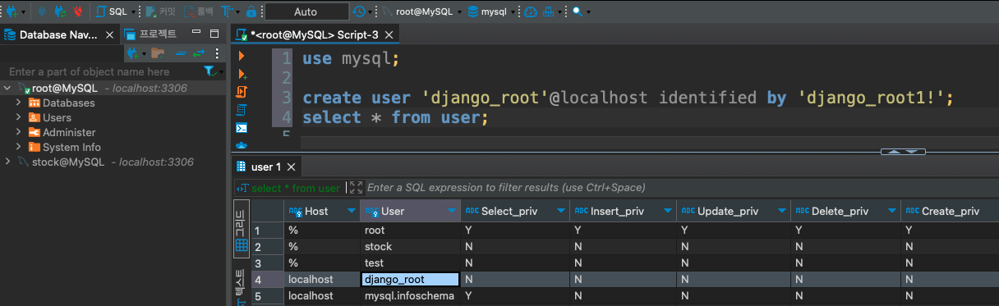
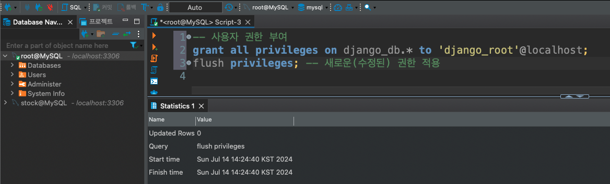
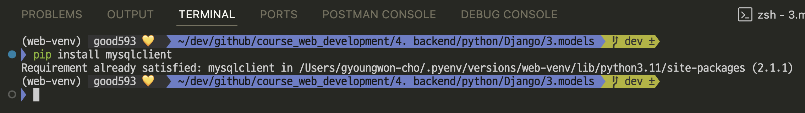

# MySQL 적용
- create_db_user_of_mysql.sql 참고 

---
### 단계1: 데이터베이스 생성
```sql
create database django_db;
show databases;
```


---
### 단계2: 사용자 계정 생성
```sql
use mysql;

create user 'django_root'@localhost identified by 'django_root1!';
select * from user;
```


---
### 단계3: 사용자 권한 부여
```sql
grant all privileges on django_db.* to 'django_root'@localhost;
flush privileges; -- 새로운(수정된) 권한 적용 
```


---
### 단계4: mysql 드라이버 설치
```shell
$ (.venv) pip install mysqlclient
```


---
### 단계5: django with mysql
- config/settings.py에 mysql 설정 추가 
```python
DATABASES = {
    "default": {
        "ENGINE": "django.db.backends.mysql",
        "NAME": "django_db", # 데이터베이스 이름 
        "USER": "django_root", # 유저 아이디
        "PASSWORD": "django_root1!", # 유저 비번
        "HOST": "localhost", # host 주소
        "PORT": "3306" # port 번호 
    }
}
```

---
# Django 관리자 페이지 

---
### Admin 계정 
- admin 생성 
```shell
python manage.py createsuperuser 
```
- admin 계정 비번 변경 
```shell
python manage.py changepassword admin
```
### Model 등록 
- 생성한 app의 admin.py
```python
from django.contrib import admin
from .models import todo

# Register your models here.
admin.site.register(todo)
```


# 참고문서 
### 유튜브 동영상
- https://www.youtube.com/watch?v=EpqVtxTyTT8&list=PL8Loxdz4U5rqhjG3xAeE5SAmeeJJ5zQY0&index=2
### github
- https://github.com/deji12/todo_tutorial

