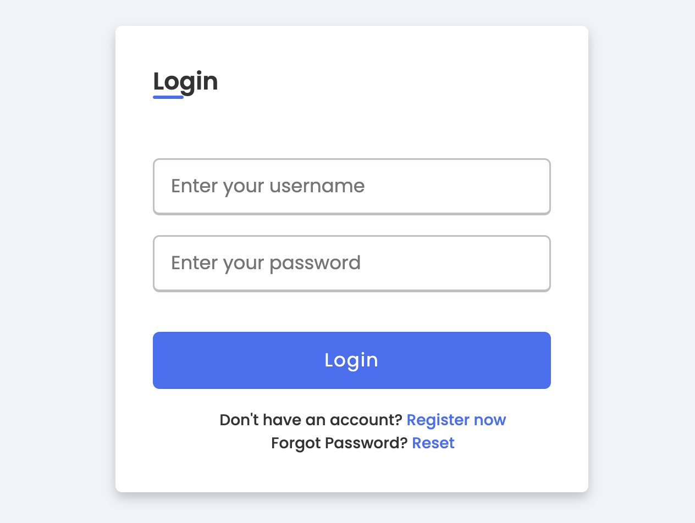

# Django 인증/인가 

---
### [사용자 생성하기](https://docs.djangoproject.com/ko/5.0/topics/auth/default/#creating-users)
```python
from django.contrib.auth.models import User

user = User.objects.create_user("john", "lennon@thebeatles.com", "johnpassword")

# At this point, user is a User object that has already been saved
# to the database. You can continue to change its attributes
# if you want to change other fields.
user.last_name = "Lennon"
user.save()
```

---
### [사용자 인증하기](https://docs.djangoproject.com/ko/5.0/topics/auth/default/#authenticating-users)
```python
from django.contrib.auth import authenticate

user = authenticate(username="john", password="secret")
if user is not None:
    # A backend authenticated the credentials
    ...
else:
    # No backend authenticated the credentials
    ...
```

---
### [웹요청 인증하기](https://docs.djangoproject.com/ko/5.0/topics/auth/default/#authentication-in-web-requests)
```python
if request.user.is_authenticated:
    # Do something for authenticated users.
    ...
else:
    # Do something for anonymous users.
    ...
```

---
### [로그인한 사용자의 접근 제한하기](https://docs.djangoproject.com/ko/5.0/topics/auth/default/#the-login-required-decorator)
- 기본 방법
```python
from django.conf import settings
from django.shortcuts import redirect

def my_view(request):
    if not request.user.is_authenticated:
        return redirect(f"{settings.LOGIN_URL}?next={request.path}")
    # ...
```
- 데코레이션 방법 
```python
from django.contrib.auth.decorators import login_required

@login_required
def my_view(request): ...
```

---
### [사용자 로그인 방법](https://docs.djangoproject.com/ko/5.0/topics/auth/default/#how-to-log-a-user-in)
```python
from django.contrib.auth import authenticate, login


def my_view(request):
    username = request.POST["username"]
    password = request.POST["password"]
    user = authenticate(request, username=username, password=password)
    if user is not None:
        login(request, user)
        # Redirect to a success page.
        ...
    else:
        # Return an 'invalid login' error message.
        ...
```
---
### [사용자 로그아웃 방법](https://docs.djangoproject.com/ko/5.0/topics/auth/default/#how-to-log-a-user-out)
```python
from django.contrib.auth import logout


def logout_view(request):
    logout(request)
    # Redirect to a success page.
```

---
# 프로젝트 실행 

---
### 단계1: 마이그레이션(migration)
```shell
$ (.venv) python manage.py makemigrations 
```
### 단계2: Database에 마이그레이션 정보 반영 
```shell
$ (.venv) python manage.py migrate
```

---
### 단계3: Superuser 만들기
```shell
(.venv) python manage.py createsuperuser
```
### 단계4: server 실행 및 관리자 페이지 접속 
```shell
$ (.venv) python manage.py runserver
``` 

---


