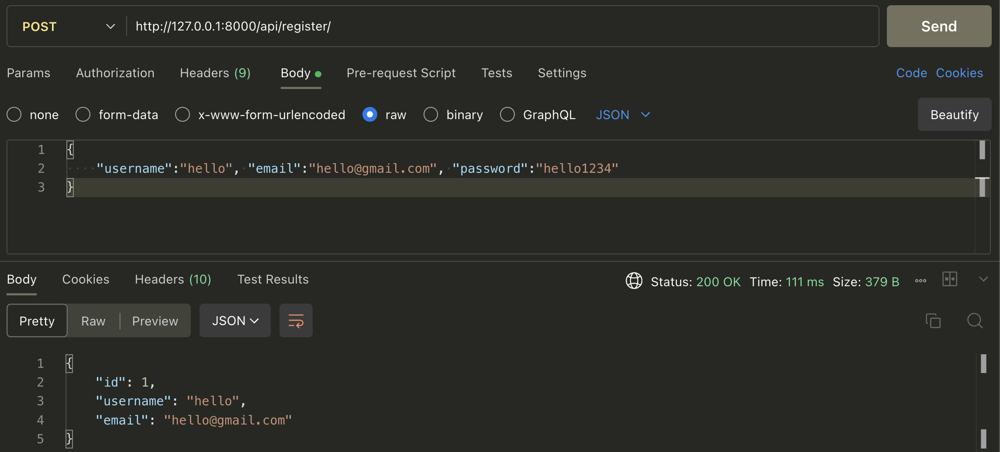
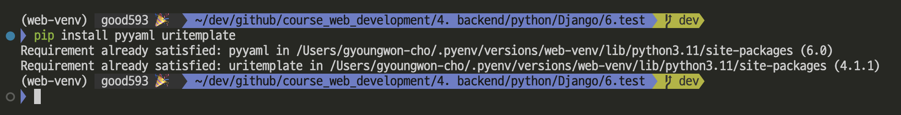
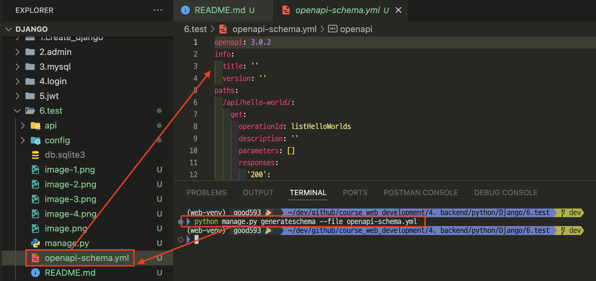
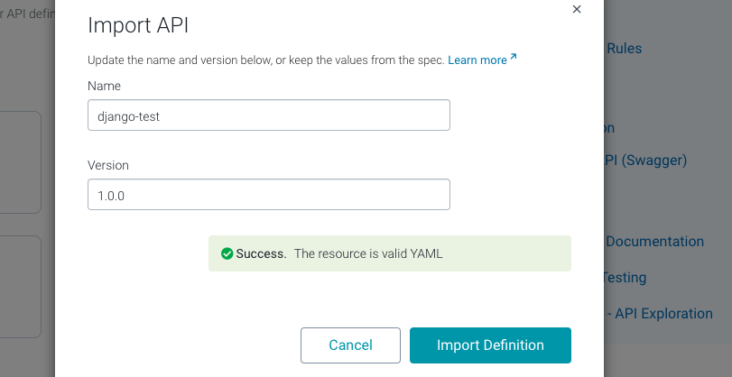
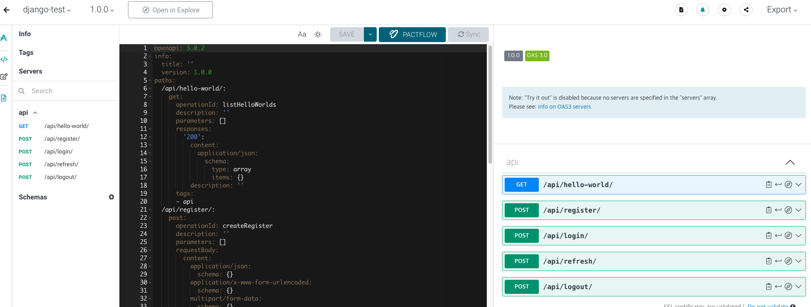

# 프로젝트 생성
- [참고영상](https://www.youtube.com/watch?v=BmOKr-cMhVA)

---
### 단계1: 모듈 추가 설치
```shell
pip install django
pip install djangorestframework
pip install django-cors-headers
pip install PyJWT
```
### 단계2: 프로젝트 & 앱 생성
```shell
django-admin startproject config . 
python manage.py startapp api
```

---
### 단계3: settings.py
- 앱 추가 
```python
INSTALLED_APPS = [
    ...,
    "rest_framework", 
    "corsheaders",
    "api"
]
```
---
- CORS 크로스 도메인 설정
```python
MIDDLEWARE = [
    "corsheaders.middleware.CorsMiddleware", # 맨위에 추가!!
    ...
]

CORS_ORIGIN_ALLOW_ALL = True
CORS_ALLOW_CREDENTIALS = True
```
- Django REST Framework 설정 
```python
REST_FRAMEWORK = {
    'EXCEPTION_HANDLER': 'api.exceptions.status_code_handler'
}
```
---
### 단계4: serializers
- 생성: api.serializers.py
```python
from rest_framework import serializers 
from django.contrib.auth.models import User 

class UserSerializer(serializers.ModelSerializer):
    class Meta:
        model = User 
        fields = ['id', 'username', 'email', 'password']
        ...
```

---
### 단계5: exceptions 처리 
- 생성: api.exceptions.py
```python
from rest_framework.views import exception_handler 

def status_code_handler(exc, context):
    response = exception_handler(exc, context)

    if response is not None:
        response.status_code = 777
    ...
```

---
### 단계6: Json Web Token
- 생성: api.authentication.py
```python
import jwt 
import datetime 
import enum 

from rest_framework.exceptions import AuthenticationFailed

class JWT_KEY(enum.Enum):
    RANDOM_OF_ACCESS_KEY = (enum.auto(), 'access_secret', datetime.timedelta(seconds=120), 'HS256', '랜덤한 조합의 키')
    RANDOM_OF_REFRESH_KEY = (enum.auto(), 'refresh_secret', datetime.timedelta(days=2), 'HS256', '랜덤한 조합의 키')

...
```

---
### 단계7: api.views.py 
```python
from rest_framework.authentication import get_authorization_header
from rest_framework.views import APIView 
from rest_framework.response import Response 
from rest_framework.exceptions import AuthenticationFailed , APIException

from django.contrib.auth.models import User 

from .serializers import UserSerializer
from .authentication import create_access_token, create_refresh_token, decode_access_token, decode_refresh_token


# Create your views here.
class Register(APIView):
    def post(self, request):
        serializer = UserSerializer(data=request.data)
        ...
```

---
### 단계8: api.urls.py 
```python
from django.urls import path
from .views import Register, LoginView, HelloWorldView, RefreshView, Logoutview

urlpatterns = [
    path('register/', Register.as_view(), name='register'),
    path('login/', LoginView.as_view(), name='login'),
    path('hello-world/', HelloWorldView.as_view(), name='hello-world'),
    path('refresh/', RefreshView.as_view(), name='refresh'),
    ...
```

---
### 단계9: config.urls.py 
```python
from django.contrib import admin
from django.urls import path, include 

urlpatterns = [
    path("admin/", admin.site.urls),
    path("api/", include("api.urls"))
]
```
---
# 실행

---
### 단계1: 마이그레이션(migration)
```shell
$ (.venv) python manage.py makemigrations 
```
### 단계2: Database에 마이그레이션 정보 반영 
```shell
$ (.venv) python manage.py migrate
```
### 단계3: server 실행 및 관리자 페이지 접속 
```shell
$ (.venv) python manage.py runserver
``` 
---
### 단계4: register
- http://127.0.0.1:8000/api/register/
```json
{
    "username":"hello", "email":"hello@gmail.com", "password":"hello1234"
}
```


---
### 단계5: login
- http://127.0.0.1:8000/api/login/
```json
{
    "username":"hello", "password":"hello1234"
}
```


---
# [test](https://developer.mozilla.org/en-US/docs/Learn/Server-side/Django/Testing)

---
### 단계1: api.tests.py
- 테스트 함수들이 실행하기 전에 호출되는 함수 
- 테스트하기전에 필요한 변수들을 미리 생성 
```python
def setUp(self) -> None:
    self.user = User.objects.create_user("tester", "test@email.com", "tester")
    self.client = APIClient()
    self.login_url = reverse('login')
    ...
```
---
- login test
```python
def test_login_return_jwt(self):
    """
    The login view return an acceess token and a refresh token
    """
    credentials = {
        "username": "tester",
        "password": "tester"
    }

    response = self.client.post(self.login_url, credentials)
    ...
```
---
- bad login test
```python
def test_exceptions_with_bad_login(self):
    """
    The login view doesn't return tokens if we use bad credentials
    """
    credentials = {
        "username": "bad tester",
        "password": "bad tester"
    }
    ...
```
---
- jwt test
```python
def test_with_jwt_return(self):
        
    self.client.credentials(HTTP_AUTHORIZATION='Bearer '+self.access_token)
    response = self.client.get(self.hello_world_url)
    print("------ test_with_jwt_return ------")
    print(response.status_code)
    print(response.json())
    ...
```
---
### 단계2: run tests.py
- test_login_return_jwt 실행 
```shell
python manage.py test api.tests.AuthenticatorTestCase.test_login_return_jwt
```


---
- 전체 테스트 함수 실행 
```shell
python manage.py test api.tests.AuthenticatorTestCase
```


---
# Swagger

---
### 단계1: install
```shell
pip install pyyaml uritemplate
```


---
### 단계2: openapi-schema.yml 생성 
```shell
python manage.py generateschema --file openapi-schema.yml
```


---
### 단계3: [SwaggerHub 적용](https://app.swaggerhub.com/home)
- 로그인 후 사용


---
- upload openapi-schema.yml


---
- import api 



---


