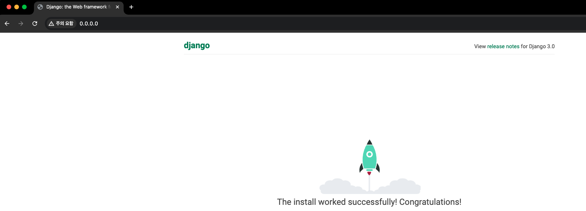

# [Hosting Django application with Nginx and Gunicorn](https://medium.com/@ganapriyakheersagar/hosting-django-application-with-nginx-and-gunicorn-in-production-99e64dc4345a)


---
### Django
- Django 내장 서버는 보안과 성능테스트를 거치지 않았기에 개발용으로만 사용하고, 실제 운영중인 환경 구축은 wsgi와 웹서버로 서비스하도록 권장하고 있습니다.

### WSGI(WebServer Gateway Interface)
- 파이썬 애플리케이션이 웹서버와 통신하기 위한 인터페이스로 웹서버의 요청을 해석을 해서 파이썬애플리케이션에게 전달해줍니다. 
- 대표적으로 gunicorn과 uWSGI가 있습니다.

---
### Gunicorn
- 애플리케이션 웹 서버인 Gunicorn은 WSGI와 호환됩니다. Flask나 Django와 같이 WSGI(Web Server Gateway Interface)를 지원하는 다른 애플리케이션과 통신할 수 있습니다.
- Gunicorn은 로컬 Django 서버처럼 정적 파일을 자동으로 제공할 수 없습니다. 따라서 이를 위해서는 다시 nginx가 필요합니다.

### Nginx
- Nginx는 높은 성능과 안정성 그리고 현재 가장 많이 사용되고 있는 웹 서버입니다. 
- Apache 같은 웹 서버와 비교하면 더 빠르고, 대규모 애플리케이션 처리에 적합하다는 장점이 있습니다. 

---
# [1. Django Project](https://www.youtube.com/watch?v=vJAfq6Ku4cI)

---
# 2. Add Gunicorn

---
# 3. Add Nginx

---
# 실행 

---
### 단계1: docker-compose 실행 
```shell
docker-compose up --build
```


---
### 단계2: docker desktop 확인 


---
### 단계3: Django 접속 
- http://0.0.0.0/




