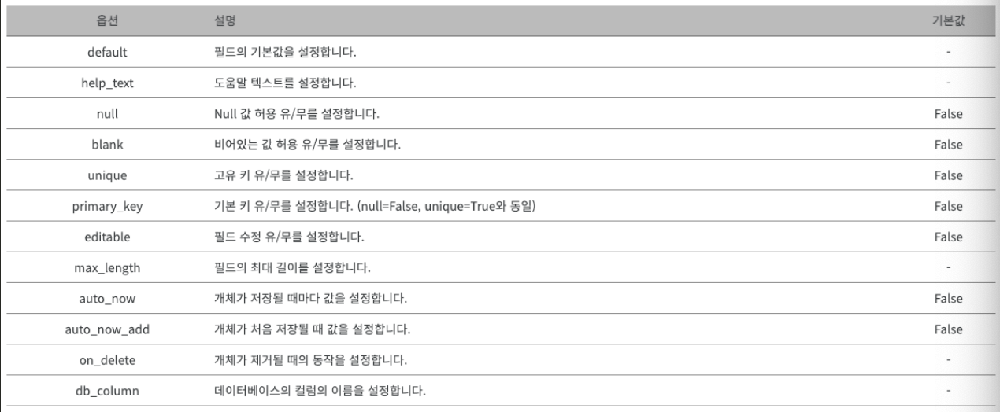
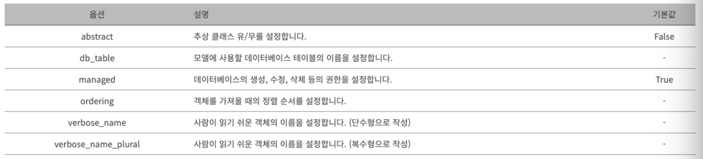

# [Model](https://076923.github.io/posts/Python-Django-5/#%ED%95%84%EB%93%9C-%EC%98%B5%EC%85%98)
- 모델은 데이터베이스에 저장되는 데이터를 의미한다.
- 원래 DB를 다루기 위해서는 SQL이라는 언어를 알아야하지만, 장고는 이 SQL을 몰라도 DB 작업을 가능하게 해주는 ORM을 제공하기 때문에 공부할 내용이 훨씬 적다.

> ORM이란?
> Object-Relational Mapping의 약자로, SQL이라는 언어 대신 데이터베이스를 쉽게 연결해주는 방법.

---
## Field Type
- ID
```python
import uuid
from django.db import models

# Create your models here.
class UserModel(models.Model):
    id = models.UUIDField(help_text="Unique key", primary_key=True, default=uuid.uuid4, editable=False)
```


---
- 문자열
```python
from django.db import models

# Create your models here.
class UserModel(models.Model):
    email = models.EmailField(help_text="User E-mail", blank=False, null=False)
    name = models.CharField(help_text="User Full Name", max_length=255, blank=False, null=False)
```


---
- 데이터
```python
from django.db import models

# Create your models here.
class UserModel(models.Model):
    age = models.PositiveIntegerField(help_text="User Age", blank=False, null=False)
```


---
- 날짜 및 시간
```python
from django.db import models

# Create your models here.
class UserModel(models.Model):
    created_date = models.DateTimeField(help_text="Created Date time", auto_now_add=True)
    updated_date = models.DateTimeField(help_text="Updated Date time", auto_now=True)
```


---
- 관계
```python
from django.db import models

class Manufacturer(models.Model):
    # ...
    pass

class Car(models.Model):
    manufacturer = models.ForeignKey(Manufacturer, on_delete=models.CASCADE)
    # ...
```


---
## Field Option

```python
import uuid
from django.db import models

# Create your models here.
class UserModel(models.Model):
    id = models.UUIDField(help_text="Unique key", primary_key=True, default=uuid.uuid4, editable=False)
    email = models.EmailField(help_text="User E-mail", blank=False, null=False)
    name = models.CharField(help_text="User Full Name", max_length=255, blank=False, null=False)
    age = models.PositiveIntegerField(help_text="User Age", blank=False, null=False)
    created_date = models.DateTimeField(help_text="Created Date time", auto_now_add=True)
    updated_date = models.DateTimeField(help_text="Updated Date time", auto_now=True)
```
---


---
## Meta Option
- 메타(Meta) 클래스는 모델 내부에서 사용할 수 있는 설정을 적용합니다.
- 정렬 순서나 관리 설정 등을 변경할 수 있습니다.

```python
import uuid
from django.db import models

# Create your models here.
class UserModel(models.Model):
    id = models.UUIDField(help_text="Unique key", primary_key=True, default=uuid.uuid4, editable=False)
    email = models.EmailField(help_text="User E-mail", blank=False, null=False)
    name = models.CharField(help_text="User Full Name", max_length=255, blank=False, null=False)
    age = models.PositiveIntegerField(help_text="User Age", blank=False, null=False)
    created_date = models.DateTimeField(help_text="Created Date time", auto_now_add=True)
    updated_date = models.DateTimeField(help_text="Updated Date time", auto_now=True)

    class Meta:
        verbose_name = "유저 정보"
        verbose_name_plural = "유저 정보"
        # name은 내림차순, age는 오름차순으로 정렬
        ordering = ["-name", "age"]
```
---


---
## [Model Attributes](https://djangojeng-e.github.io/2020/08/10/Django-Models-13%ED%8E%B8-Model-Attributes/)
- 우리가 Django 에서 해당 모델의 데이터베이스 모든 데이터를 조회할때에는, 아래와 같이 ORM 을 작성합니다.
- 이때 사용되는, objects 가 Manager의 기본 이름입니다.
  - `<model명>.objects.all()`

```python
from django.db import models

class Student(models.Model):
    name = models.CharField(max_length=50, verbose_name='학생 이름')
```
위의 Student 모델이 있다고 가정할 때에, 해당 모델의 데이터베이스를 조회하는 명령어들은 아래와 같습니다.

```python
Student.objects.all()   # Student 의 모든 객체를 조회
Student.objects.get(name='장고쟁이') # 이름이 장고쟁이인 Student 를 찾음
```

---
## [Model Methods](https://djangojeng-e.github.io/2020/08/11/Django-Models-14%ED%8E%B8-Model-Methods/)
- 모델 클래스에는, 사용자 정의 메서드를 추가할수 있습니다. (row-level, 즉, 줄 단위)
- Manager 메서드 (objects) 는, table 전체에 적용되고. 모델 메서드들은, 특정한 모델 인스턴스에 적용됩니다.
- 해당 모델의 인스턴스에 대해서, 특별한 비지니스 로직을 동작하고 싶을때에, 이런 모델 메서드를 사용해서. 하나의 모델에 모아놓고 사용할수 있습니다.

---
```python
from django.db import models


class Person(models.Model):
    first_name = models.CharField(max_length=50)
    last_name = models.CharField(max_length=50)
    birth_date = models.DateField()

    def baby_boomer_status(self):
        # "Returns the person's baby-boomer status. "
        # 해당 사람이, baby_boomer 세대인지 아닌지 판단합니다.
        import datetime
        if self.birth_date < datetime.datetime(1945, 8, 1):
            return "Pre-boomer"
        elif self.birth_date < datetime.datetime(1965, 1, 1):
            return "Baby boomer"
        else:
            return "Post-boomer"

    @property
    def full_name(self):
        # "Returns the person's full name"
        # 해당 사람의 이름을 리턴합니다
        return '%s %s' % (self.first_name, self.last_name)
```

---
```shell
In [1]: import datetime

In [2]: colin = Person.objects.create(first_name="Colin",
                                      last_name="Firth",
                                      birth_date=datetime.date(1960, 9, 10))

In [3]: colin.first_name
Out[3]: 'Colin'

In [4]: colin.last_name
Out[4]: 'Firth'

In [5]: colin.birth_date
Out[5]: datetime.date(1960, 9, 10)

In [6]: colin.baby_boomer_status
Out[6]: <bound method Person.baby_boomer_status of <Person: Person object (4)>>

In [7]: colin.full_name # @property로 인하여 메서드를 필드처럼 사용됨
Out[7]: 'Colin Firth'
```
---
## [Model Method Overriding](https://djangojeng-e.github.io/2020/08/12/Django-Models-15%ED%8E%B8-%EC%9D%B4%EB%AF%B8-%EC%A0%95%EC%9D%98%EB%90%9C-%EB%AA%A8%EB%8D%B8-%EB%A9%94%EC%84%9C%EB%93%9C-%EC%98%A4%EB%B2%84%EB%9D%BC%EC%9D%B4%EB%93%9C-%ED%95%98%EA%B8%B0/)

```python
from django.db import models


class Blog(models.Model):
    name = models.CharField(max_length=100)
    tagline = models.TextField()

    def save(self, *args, **kwargs):
        if self.name == "Yoko One's blog":
            return
        # 블로그 이름이 "Yoko One's blog" 이면, save 가 호출 되지 않고
        # 비어있는값이 return 됩니다
        # "Yoko One's blog" 가 제목이 아닐경우, else 로 넘어갑니다.
        else:
            super().save(*args, **kwargs)	# 실제 save()를 호출해서 save() 진행

```


