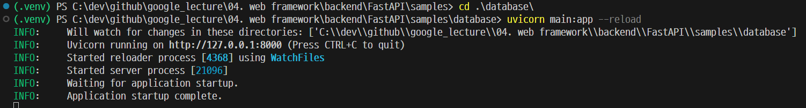

# [PyMySQL](https://yurimkoo.github.io/python/2019/09/14/connect-db-with-python.html)
- 설치
```shell
$(.venv) pip install PyMySQL
```
- 참고문서: pymysql.ipynb
---
# FastAPI with PyMySQL
- [의존성 주입](https://wikidocs.net/176223)
- 참고문서: main.py, db.py


