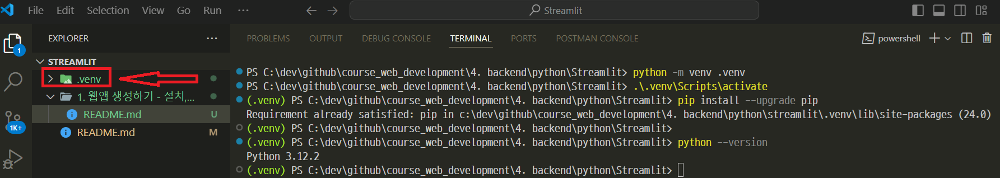
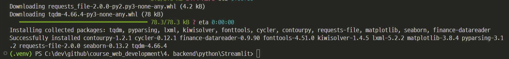
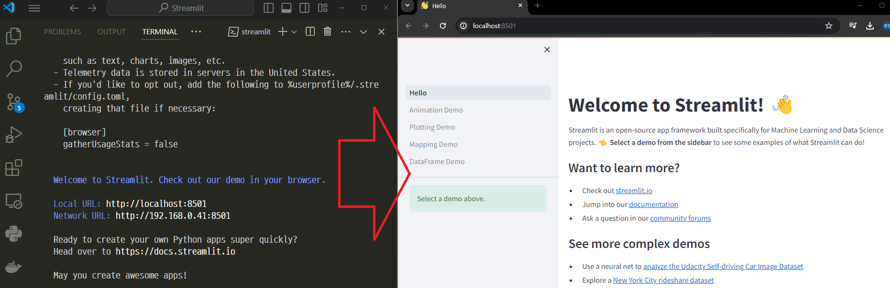
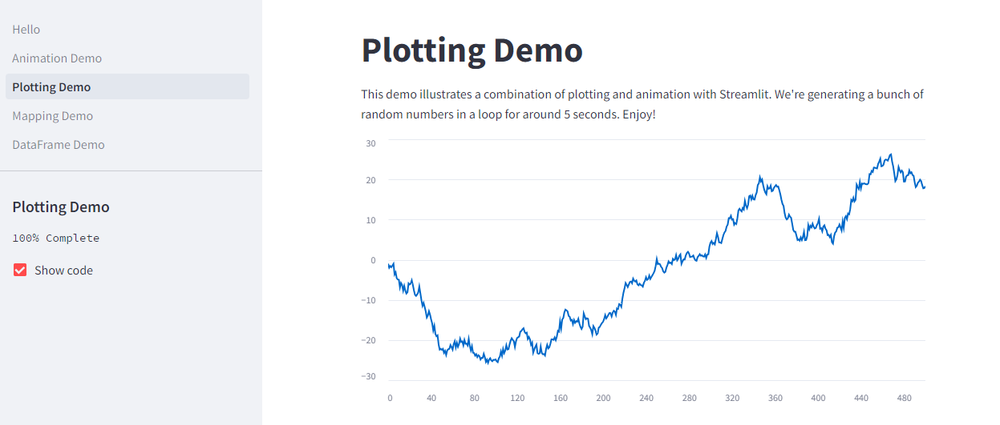
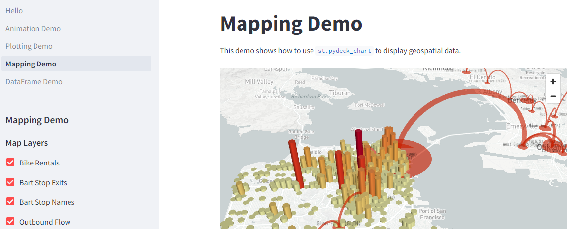
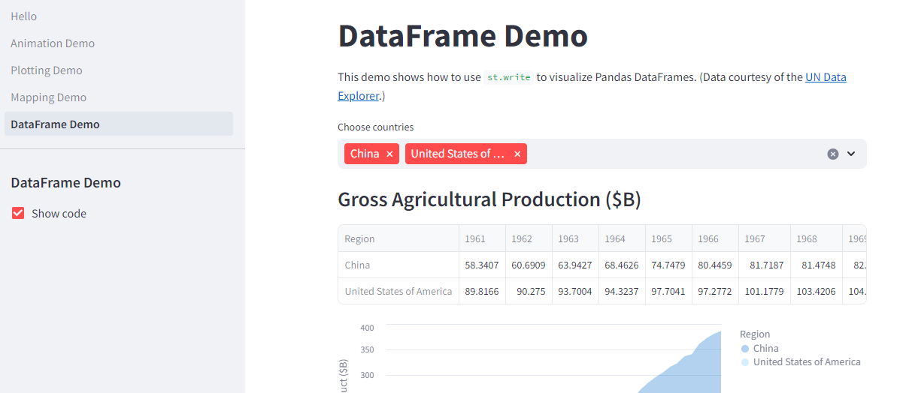
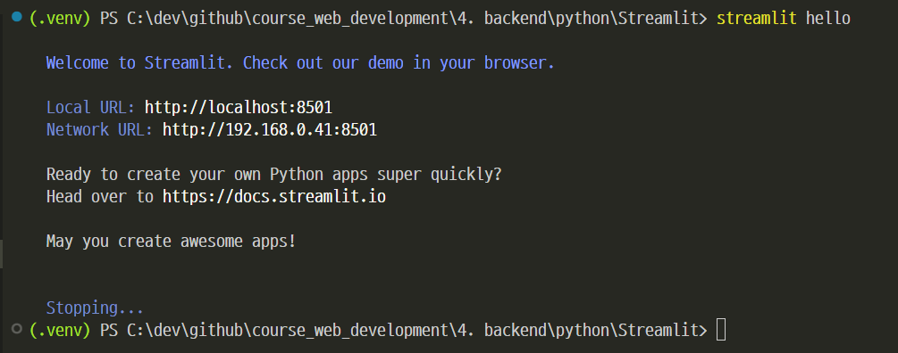

# [Installation](https://docs.streamlit.io/get-started/installation)

---
### 단계1: 가상환경 생성하기 
```shell
python -m venv .venv # 가상환경 생성 
.\.venv\Scripts\activate # 가상환경 접속 
pip install --upgrade pip # upgrade
```


---
### 단계2: Install Streamlit
```shell
pip install streamlit pandas numpy matplotlib seaborn finance-datareader
```


---
### 단계3: Validate the installation by running our Hello app
```shell
streamlit hello
```


---
- Plotting Demo



---
- Mapping Demo



---
- DataFrame Demo



---
### 단계4: Stop server
- 명령어(시간이 좀 걸림): `ctrl + c` 




