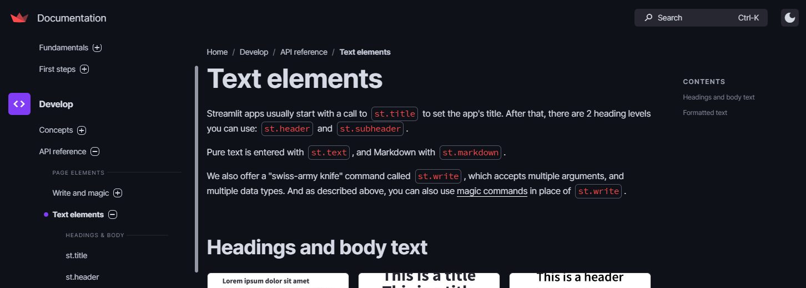
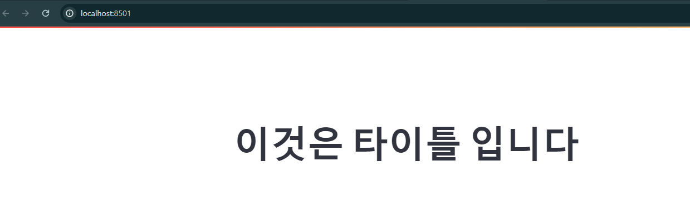
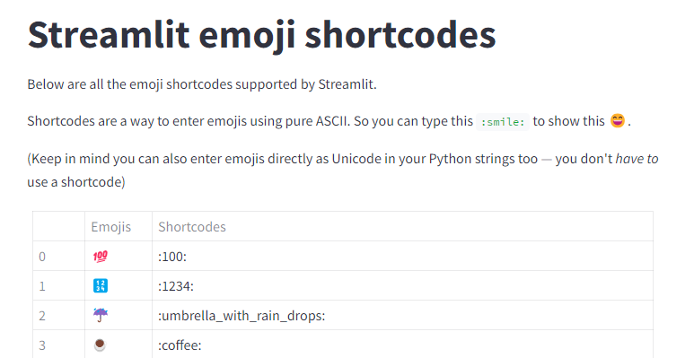
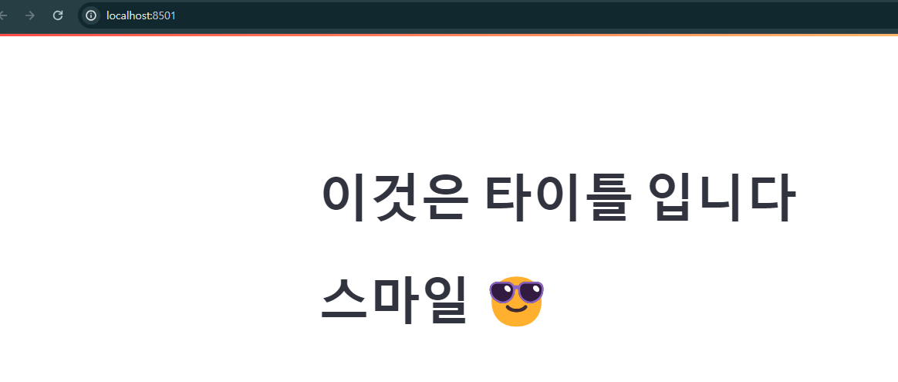
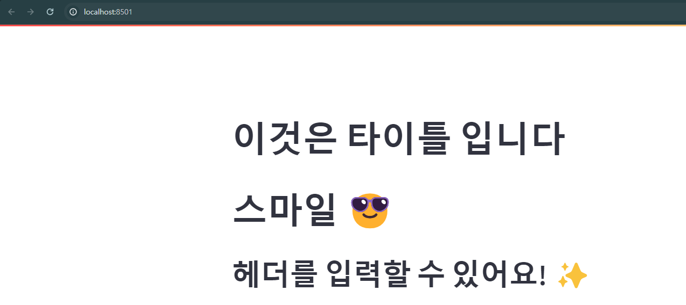
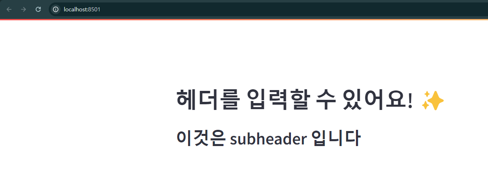
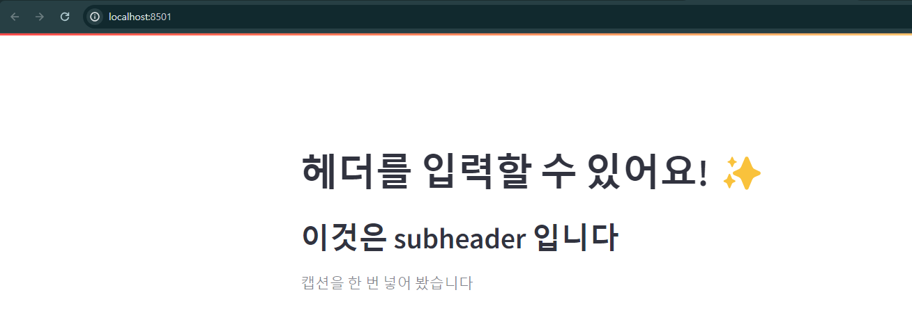
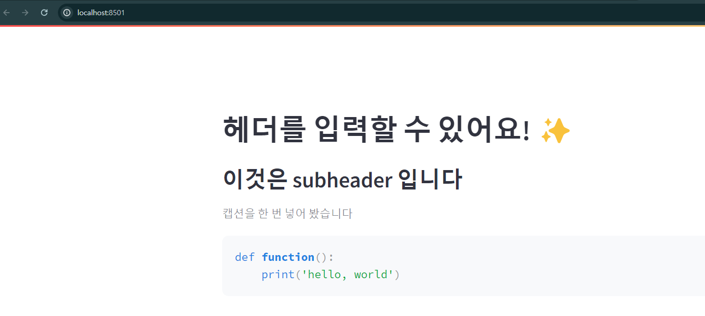
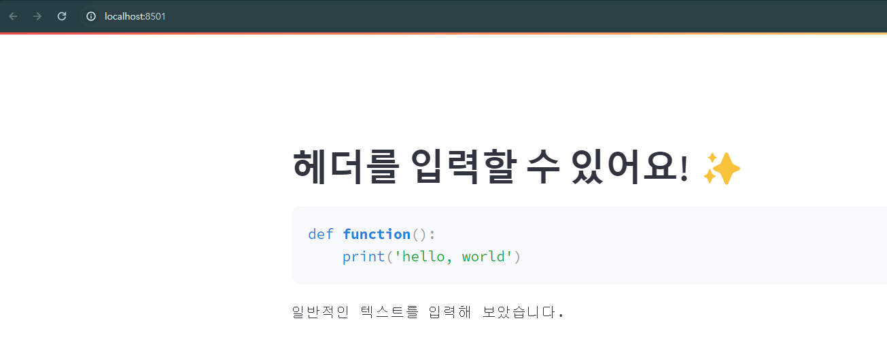
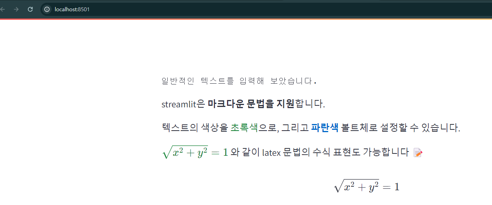

# [Text elements](https://docs.streamlit.io/develop/api-reference/text)


---
### 단계1: [타이틀 > ex-01.py](https://docs.streamlit.io/develop/api-reference/text/st.title) 
```shell
streamlit run ex-01.py
```


---
### 단계2: [streamlit에서 지원하는 이모지](https://streamlit-emoji-shortcodes-streamlit-app-gwckff.streamlit.app/)


---
```shell
streamlit run ex-02.py
```


---
### 단계3: [Header > ex-03.py](https://docs.streamlit.io/develop/api-reference/text/st.header)
```shell
streamlit run ex-03.py
```


---
### 단계4: [Sub Header > ex-04.py](https://docs.streamlit.io/develop/api-reference/text/st.subheader)
```shell
streamlit run ex-04.py
```


---
### 단계5: [caption > ex-05.py](https://docs.streamlit.io/develop/api-reference/text/st.caption)
```shell
streamlit run ex-05.py
```


---
### 단계6: [code > ex-06.py](https://docs.streamlit.io/develop/api-reference/text/st.code)
```shell
streamlit run ex-06.py
```


---
### 단계7: [text > ex-07.py](https://docs.streamlit.io/develop/api-reference/text/st.text)
```shell
streamlit run ex-07.py
```


---
### 단계8: [markdown > ex-08.py](https://docs.streamlit.io/develop/api-reference/text/st.markdown)
```shell
streamlit run ex-08.py
```

