# [Data elements](https://docs.streamlit.io/develop/api-reference/data)
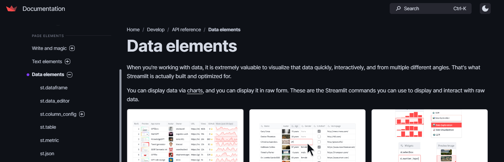

---
## [dataframe](https://docs.streamlit.io/develop/api-reference/data/st.dataframe)
- 컬럼을 클릭하면, 컬럼 기준으로 데이터 정렬이 가능하다. 

---
### 단계1: show dataframe
```shell
streamlit run ex-01.py
```
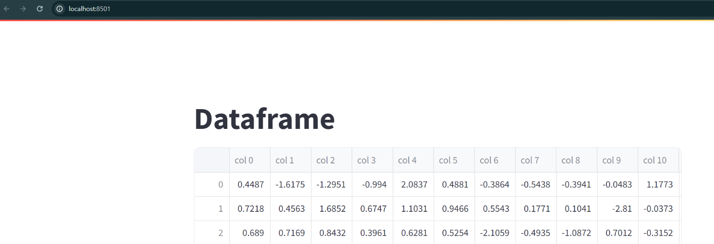

---
### 단계2: a Pandas Styler object to change the style of the rendered DataFrame
```shell
streamlit run ex-02.py
```
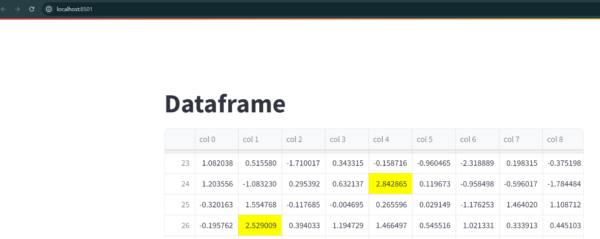

---
### 단계3: column_config
```shell
streamlit run ex-03.py
```


---
### 단계4: use_container_width
```shell
streamlit run ex-04.py
```
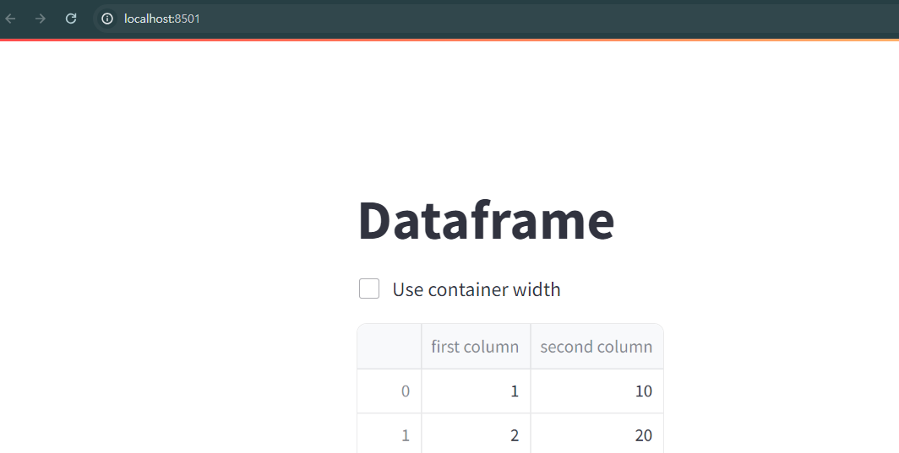

---
## [table](https://docs.streamlit.io/develop/api-reference/data/st.table)
- DataFrame과는 다르게 interactive 한 UI 를 제공하지 않습니다.
- 즉, 컬럼 기준으로 데이터 정렬이 불가능하다. 

---
### 단계1: table
```shell
streamlit run ex-05.py
```
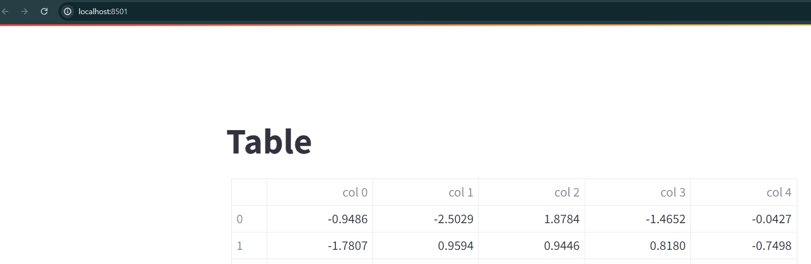

---
### 단계2: element.add_rows
- Concatenate a dataframe to the bottom of the current one.
```shell
streamlit run ex-06.py
```


---
### 단계3: add more data to a line chart
```shell
streamlit run ex-07.py
```
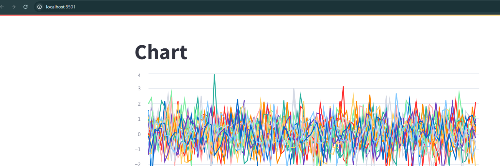

---
## [Data editor](https://docs.streamlit.io/develop/api-reference/data/st.data_editor)
- The data editor widget allows you to edit dataframes and many other data structures in a table-like UI.

---
### 단계1: data editor
```shell
streamlit run ex-08.py
```
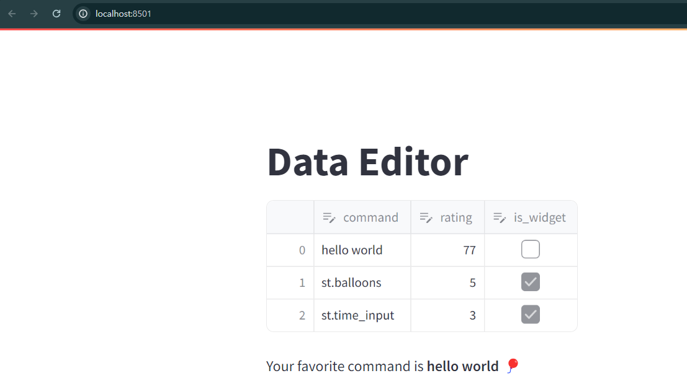

---
### 단계2: add and delete rows by setting num_rows to "dynamic"
```shell
streamlit run ex-09.py
```
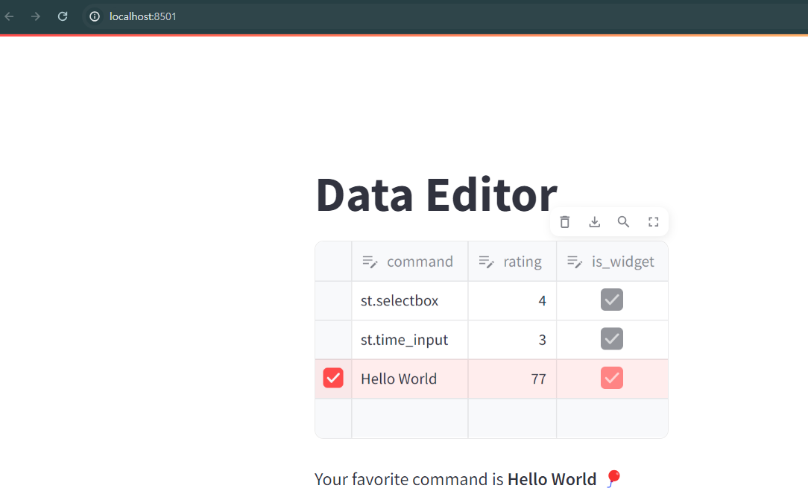

---
### 단계3: disabled > 수정불가
```shell
streamlit run ex-10.py
```
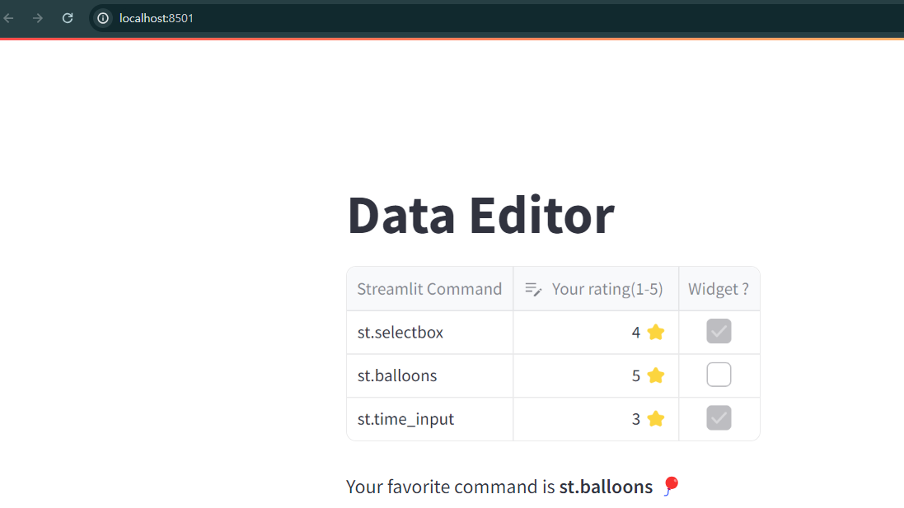

---
## [metric](https://docs.streamlit.io/develop/api-reference/data/st.metric)
- Display a metric in big bold font, with an optional indicator of how the metric changed.

---
```shell
streamlit run ex-11.py
```


---
## [json](https://docs.streamlit.io/develop/api-reference/data/st.json)
- Display object or string as a pretty-printed JSON string.

---
```shell
streamlit run ex-12.py
```
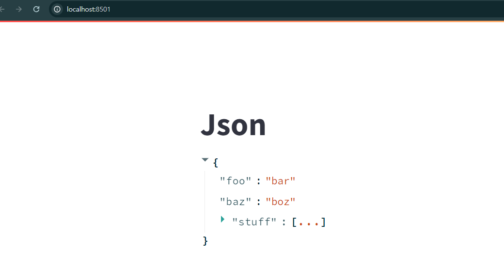

---
## [Column configuration](https://docs.streamlit.io/develop/api-reference/data/st.column_config)
- Streamlit에서 데이터 작업을 할 때 st.column_config클래스는 데이터 표시 및 상호 작용을 구성하는 강력한 도구입니다. 

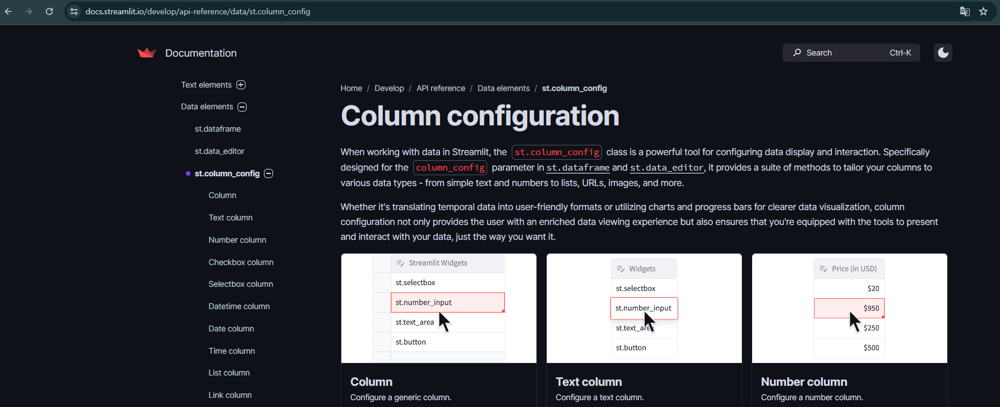

