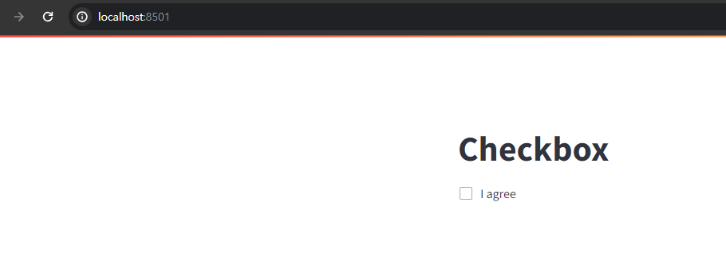
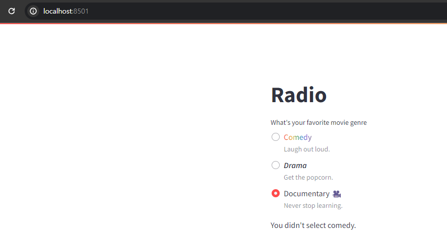
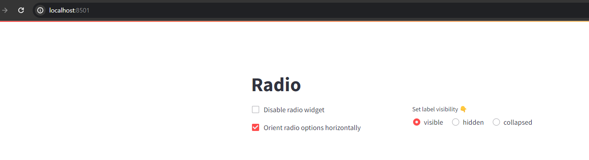
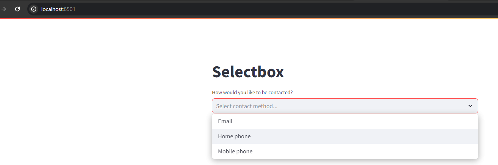
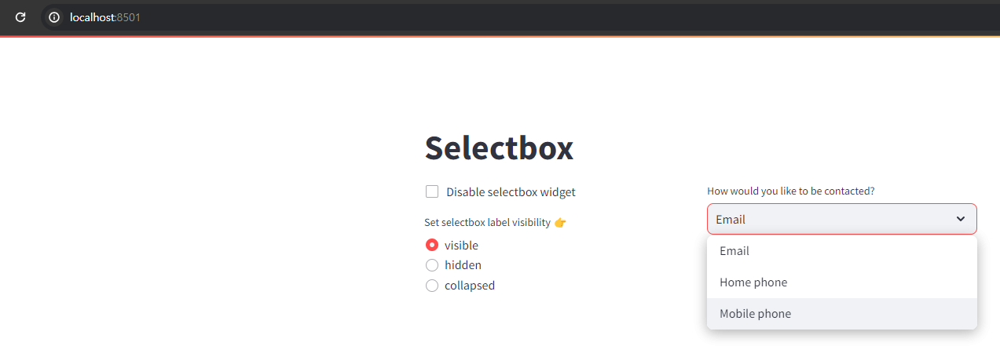

# [Input widgets](https://docs.streamlit.io/develop/api-reference/widgets)
- With widgets, Streamlit allows you to bake interactivity directly into your apps with buttons, sliders, text inputs, and more.


---
## [Button elements](https://docs.streamlit.io/develop/api-reference/widgets#button-elements)

---
### 단계1: button 
```shell
streamlit run ex-01.py
```


---
### 단계2: download button 
```shell
streamlit run ex-02.py
```


---
### 단계3: [form button](https://blog.streamlit.io/introducing-submit-button-and-forms/) 
```shell
streamlit run ex-03.py
```


---
### 단계4: link button 
```shell
streamlit run ex-04.py
```


---
### 단계5: Page Link 
- `pages 폴더`가 존재하면, 자동으로 Multi Page로 인식을 함 
```shell
your-repository/
├── pages/
│   ├── page-1.py
│   └── page-2.py
└── ex-05.py
```

---
```shell
streamlit run ex-05.py
```


---
## [Selection elements](https://docs.streamlit.io/develop/api-reference/widgets#selection-elements)

---
### 단계1: checkbox 
```shell
streamlit run ex-06.py
```


---
### 단계2: toggle 
```shell
streamlit run ex-07.py
```


---
### 단계3: radio 
```shell
streamlit run ex-08.py
```


---
### 단계4: radio > label_visibility
- Widgets can customize how to hide their labels with the `label_visibility` parameter.
```shell
streamlit run ex-09.py
```


---
### 단계5: selectbox
```shell
streamlit run ex-10.py
```


---
### 단계6: selectbox > label_visibility
```shell
streamlit run ex-11.py
```


---
### 단계7: multiselect
```shell
streamlit run ex-12.py
```


---
## [Numeric input elements](https://docs.streamlit.io/develop/api-reference/widgets#numeric-input-elements)

---
### 단계1: number_input
```shell
streamlit run ex-13.py
```


---
### 단계2: slider
```shell
streamlit run ex-14.py
```


---
## [Date and time input elements](https://docs.streamlit.io/develop/api-reference/widgets#date-and-time-input-elements)

---


