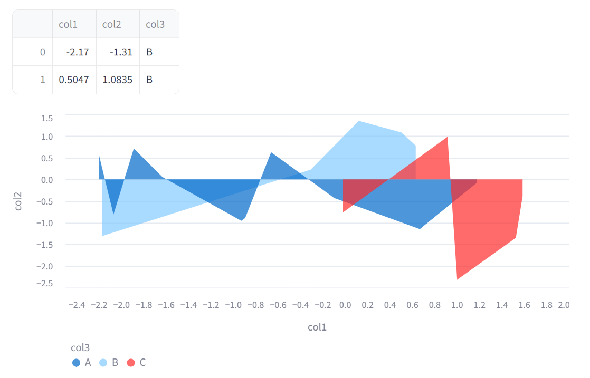
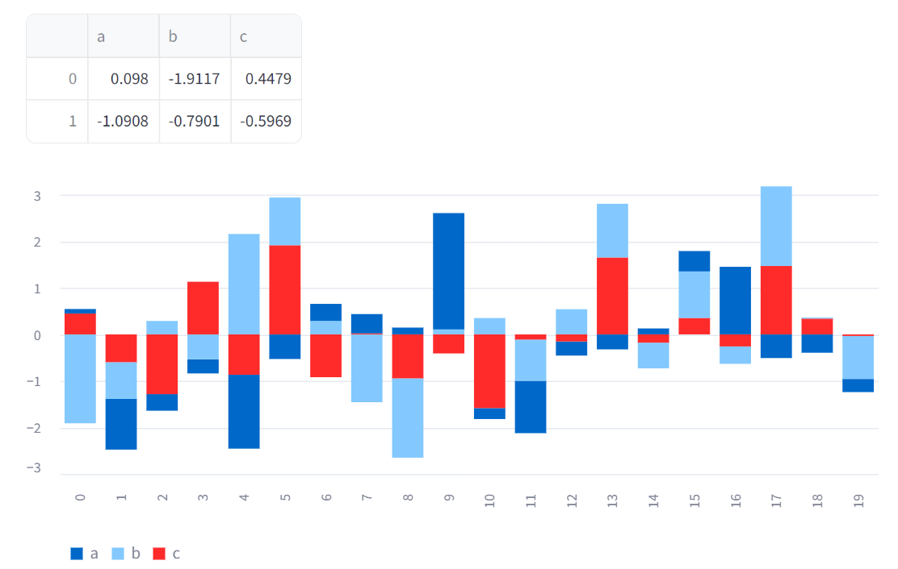
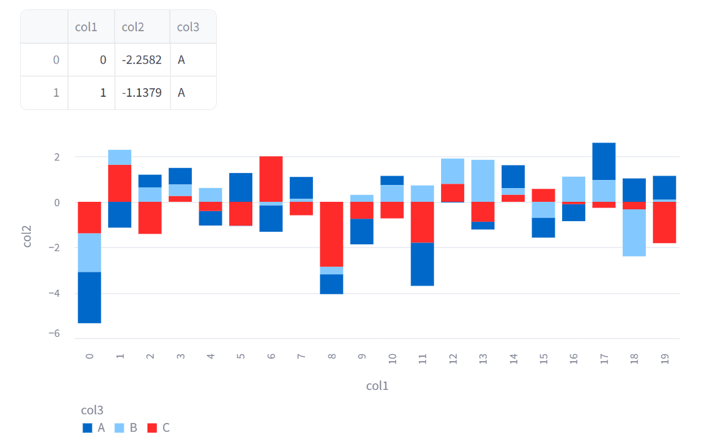
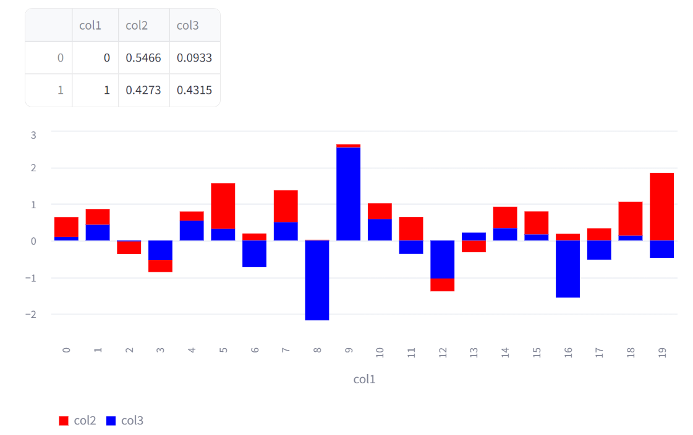
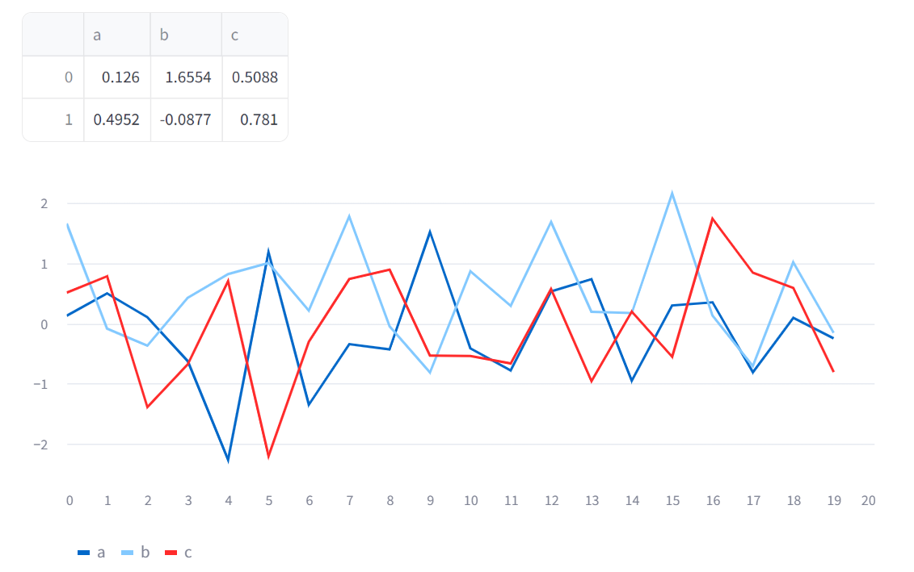
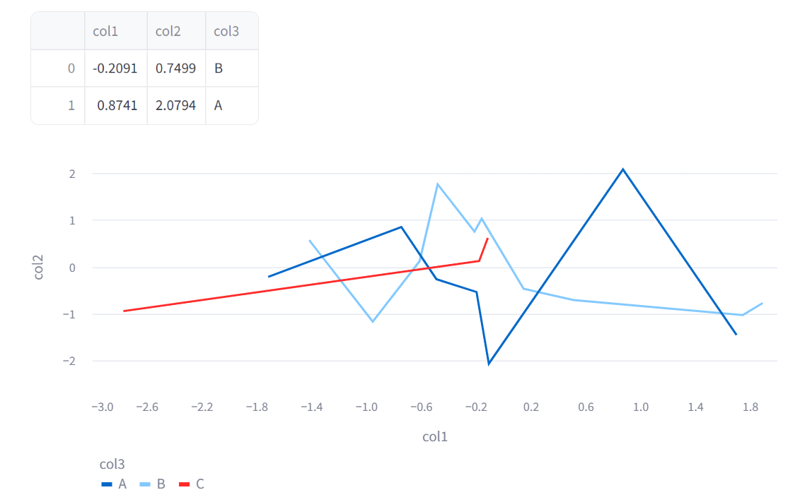
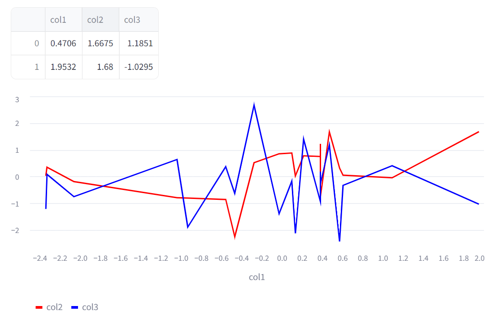

# [Chart elements](https://docs.streamlit.io/develop/api-reference/charts)
- Streamlit supports several different charting libraries, and our goal is to continually add support for more. 
- the most basic library in our arsenal is Matplotlib. 


---
## [area_chart](https://docs.streamlit.io/develop/api-reference/charts/st.area_chart)

---
### 예제1
```shell
streamlit run ex-01.py
```


---
### 예제2 > axis
```shell
streamlit run ex-02.py
```


---
### 예제3 > color
```shell
streamlit run ex-03.py
```


---
## [bar_chart](https://docs.streamlit.io/develop/api-reference/charts/st.bar_chart)

---
### 예제1
```shell
streamlit run ex-04.py
```


---
### 예제2 > axis
```shell
streamlit run ex-05.py
```


---
### 예제3 > color
```shell
streamlit run ex-06.py
```


---
## [line_chart](https://docs.streamlit.io/develop/api-reference/charts/st.line_chart)

---
### 예제1
```shell
streamlit run ex-07.py
```


---
### 예제2 > axis
```shell
streamlit run ex-08.py
```


---
### 예제3 > color
```shell
streamlit run ex-09.py
```


---
## [Advanced chart elements](https://docs.streamlit.io/develop/api-reference/charts#advanced-chart-elements)


