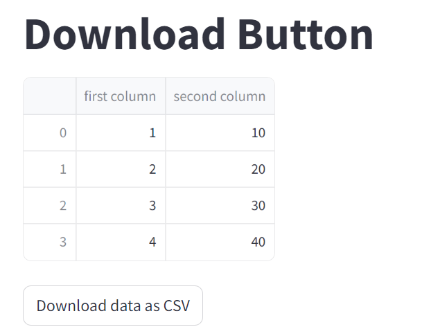
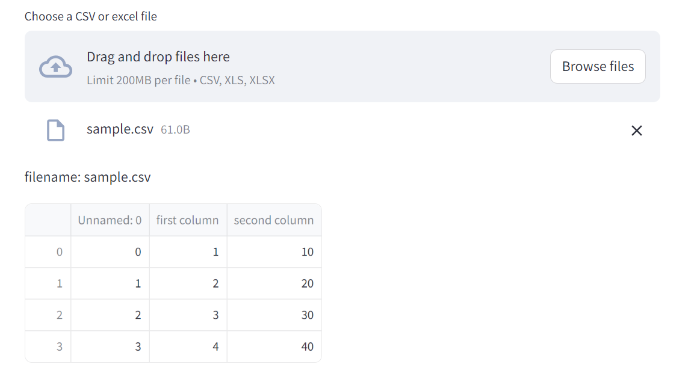

### 단계1: [download file](https://docs.streamlit.io/develop/api-reference/widgets/st.download_button)
```shell
streamlit run ex-01.py
```


---
### 단계2: [upload file](https://docs.streamlit.io/develop/api-reference/widgets/st.file_uploader)
```shell
streamlit run ex-02.py
```



