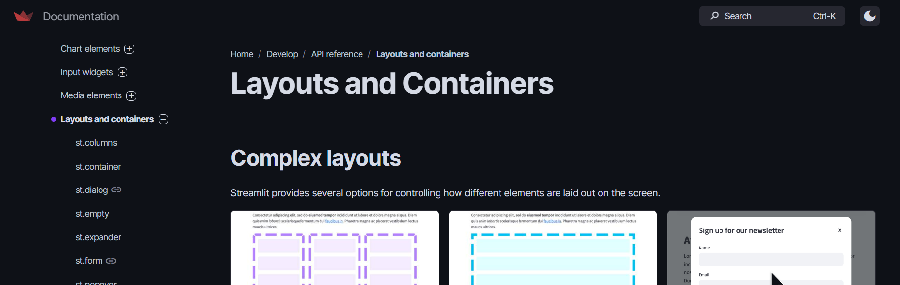
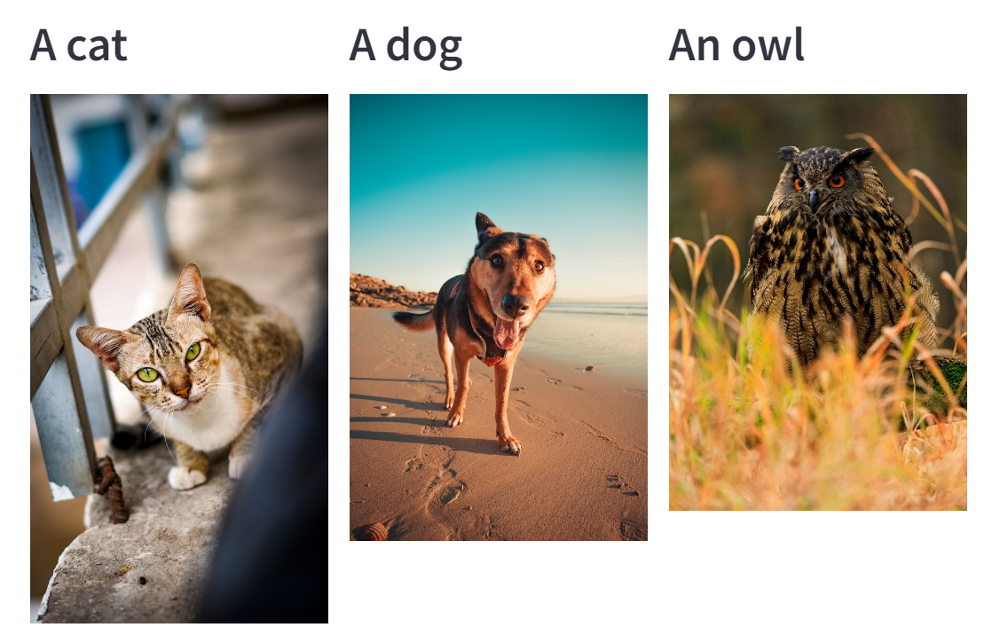
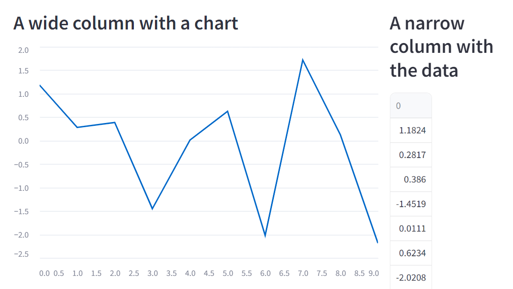
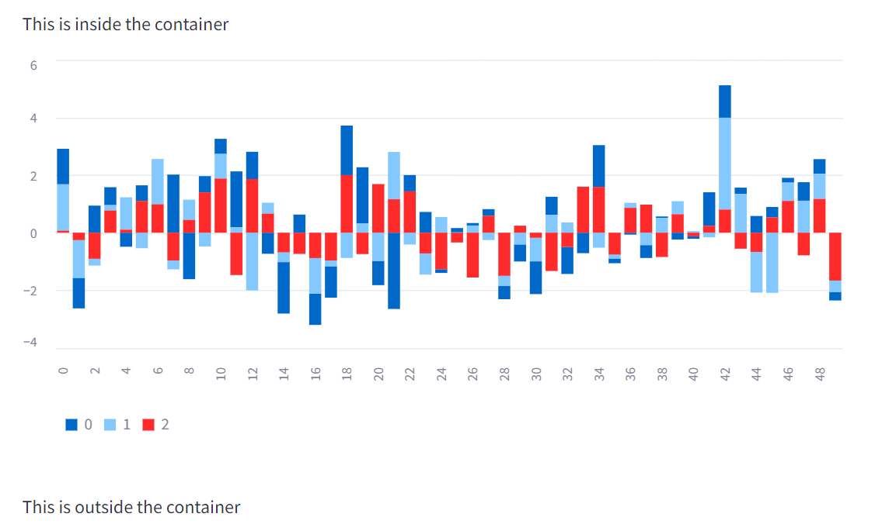
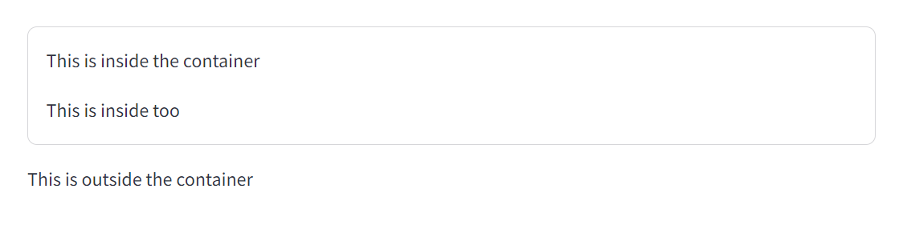
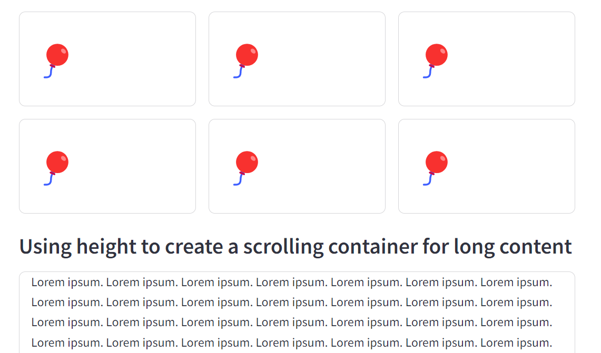
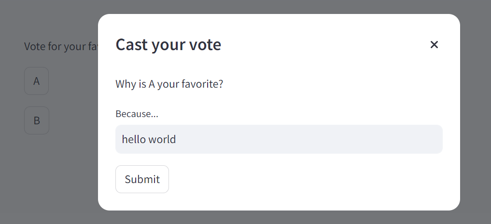
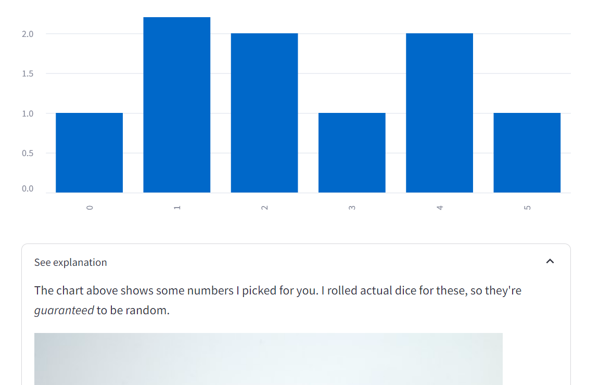
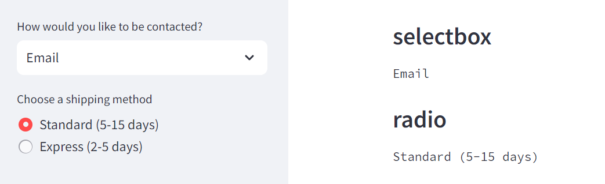
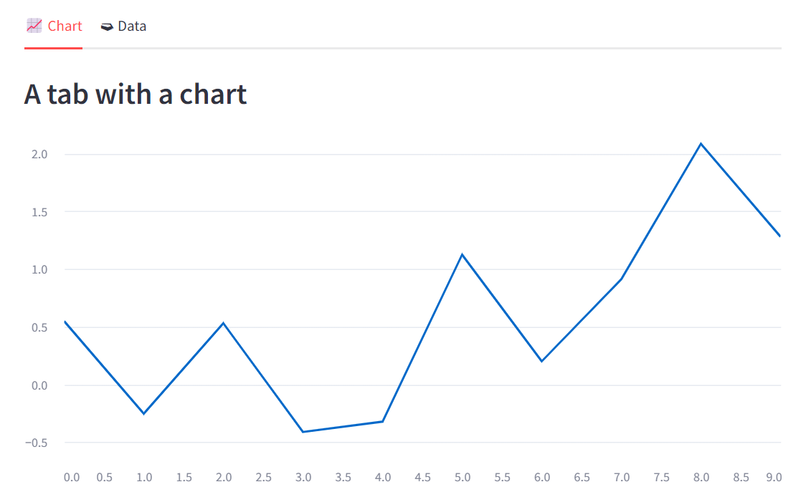

# [Layouts and Containers](https://docs.streamlit.io/develop/api-reference/layout)


---
## [columns](https://docs.streamlit.io/develop/api-reference/layout/st.columns)

---
### 예제1
```shell
streamlit run ex-01.py
```


---
### 예제2 > 컬럼간의 크기 조절
```shell
streamlit run ex-02.py
```


---
## [container](https://docs.streamlit.io/develop/api-reference/layout/st.container)

---
### 예제1
```shell
streamlit run ex-03.py
```


---
### 예제2 > border
```shell
streamlit run ex-04.py
```


---
### 예제3 > height
```shell
streamlit run ex-05.py
```


---
## [dialog](https://docs.streamlit.io/develop/api-reference/execution-flow/st.dialog)
```shell
streamlit run ex-06.py
```


---
## [expander](https://docs.streamlit.io/develop/api-reference/layout/st.expander)
```shell
streamlit run ex-07.py
```


---
## [sidebar](https://docs.streamlit.io/develop/api-reference/layout/st.sidebar)
```shell
streamlit run ex-08.py
```


---
## [tabs](https://docs.streamlit.io/develop/api-reference/layout/st.tabs)
```shell
streamlit run ex-09.py
```



